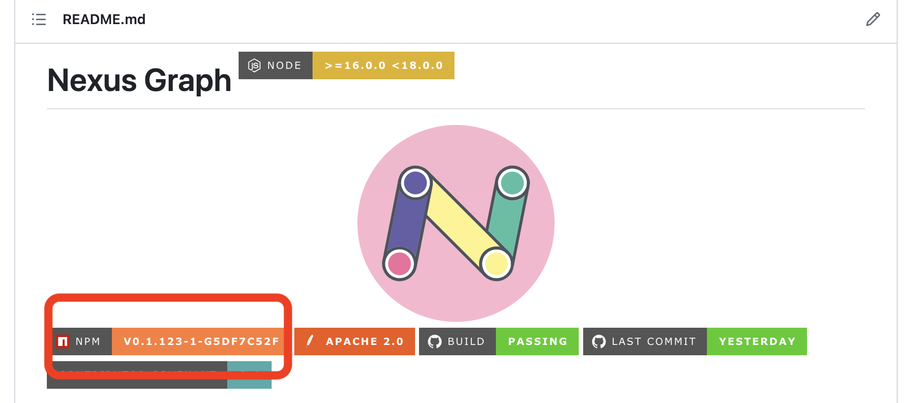
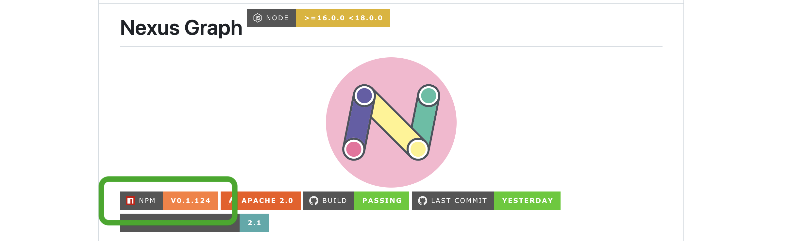

 
_[Open Innovation](https://github.com/stealth-tech-startup)_ as [Career](https://github.com/paion-data)
=======================================================================================================

[![Rapid API](https://img.shields.io/badge/Rapid%20API-brightgreen?style=for-the-badge&logo=data:image/png;base64,iVBORw0KGgoAAAANSUhEUgAAACAAAAAgCAMAAABEpIrGAAAABGdBTUEAALGPC/xhBQAAACBjSFJNAAB6JgAAgIQAAPoAAACA6AAAdTAAAOpgAAA6mAAAF3CculE8AAACMVBMVEUAAAAAVdkAVdkAVdkAVdkAVdkAVdkAVdkAVdkAVdkAVdkAVdkAVdkAVdkAVdkAVdkAVdkAVdkAVdkAVdkAVdkAVdkAVdkAVdkAVdkAVdkAVdkAVdkAVdkAVdkAVdkAVdkAVdkAVdkAVdkAVdkAVdkAVdkAVdkAVdkAVdkAVdkAVdkAVdkAVdkAVdkAVdkAVdkAVdkAVdkAVdkAVdkAVdkAVdkAVdkAVdkAVdkAVdkAVdkAVdkAVdkAVdkAVdkAVdkAU9kAUtgAU9gAVNkDV9knb99WjuZ2pOt9qOxrnOlAf+MPX9srcd+Zu/Dk7fv8/f/////0+P3C1vZVjeYEWNpIheTZ5vn1+P1+qewGWdo4euHg6vr4+/5nmegOXtu3z/T+/v/l7fvx9v3b5/ojbN5SjOX5+/7w9f18qOslbt8YZd0/f+JwoOoBVtmfv/H+//98qOwead3N3vivyfMSYdzP3/jl7vsmb9/M3fcQX9skbd7a5vlnmujS4fgTYtwrct/r8vw8feKXuvC/1PUKW9ro7/ywyvMXZNxNiOTq8fyHr+0bZ93D1/ZunulakeaNs+7o8PwwdeAKXNvA1fbz9/1omumPtO7W4/lVjuYBVdlKh+T3+v7F2PZdk+cFWNr9/v/i7Pusx/NmmegpcN9Xj+b7/f6yzPQNXtsHWtqavPCiwfH8/f7h6/tFg+O0zfR5pesIWtrI2vf2+f6uyfM5e+Kmw/IRYdw1eeFAgOMMXdvU4vlW/OMYAAAAP3RSTlMAAAQweLnl+/zpwIE4BwI8n+T9qkgGG47t8yY3xdNHQdrnVDTZF4WeMpAjYvqgzejyyZlZ9x2EKN90/g+wyjbuVpJQAAAAAWJLR0RQ425MvAAAAAd0SU1FB+cFHgQJME+hDX8AAAJMSURBVDjLZZP3X1NBDMDvUShQVtm0UmllyN4b9N71gYLziYi4QVS0rroFJyquKirureBAFNzzrzOXu/fafsgP73LJt0kuTQjhooBEWCKjrNGUxsTa4uITuIWYApfEJHtyCjUkNjUtPYQANSMzi4aJw+40CVDmZdM54povCThy3MKmMuZlXk0SngVIwCc3T7jb2pcs7ehctlw1CIyhKPk2vGorVq5arev6mq613TKIy4lAgfCv69GlrO/dIGMsTAeg0IPxN27STdm8RYZwpAFQhL/fuo17+vp7tvNzYIckUhNIMb7Au3MX2Ad37/HtRXKfV3YsnpSUcmX/AbAe9Guqxg4dBvVIt6wijpRhhqPHwHr8BH8g84N6ckjmsJFyLHG4H6ynfNzKToN65qwEKoh4w7nzvIQRxi8XQL14SaaIIQ4E2kd5aZevMKZdvQbadaPflFRiDYEBbMCNm2O3bvNq7qgmYMVj/K7sUR//3Ltv/qfRpEo0+kGwj/rDR4/NDFZSjSd78jQIPHs+/ILJHFGkphYjDHWFhHj56vXEZBu3p0SSOpcYhjcixFsDeveep0m2EKVexJr6gPbp6Y94fprBMuwRRGloFGX6Zrnj85eJr4PfRr//QH9WEh+YpmaRJPATBsrP1F+//0xOiRozEznQ0iqSaH87/+m9jGqq8YTsDDG1zkWS0AJjI2YHKHUvNsbaIgmqsRB/Xk5wMZytzXMWx5YbulotTY3h7oqC/PDlVBrqXbWGt9RdVBi+3ojU1VRXWSsdnvKykmLF9P8H4Yjx/OsgFQMAAAAldEVYdGRhdGU6Y3JlYXRlADIwMjMtMDUtMzBUMDM6NTI6MDQrMDA6MDBk0ykuAAAAJXRFWHRkYXRlOm1vZGlmeQAyMDIzLTA1LTMwVDAzOjUyOjAwKzAwOjAw4cG1gQAAACh0RVh0ZGF0ZTp0aW1lc3RhbXAAMjAyMy0wNS0zMFQwNDowOTo0OCswMDowMPW1hS4AAAAASUVORK5CYII=)](https://rapidapi.com/user/jack20220723)

> I'd like to take this moment to thank Yahoo!, my former employeer, who taught me to love Software Engineering and how to write the best-quality software. 4 years of being her employee nourished my life-long philosophy that the end of Software Development in itself is not about money, but **people**, **passion**, and **love**. Thank you Yahoo! 

>  
>  
> This page is also dedicated to my former colleague <a href="https://github.com/cdeszaq">Rick Jensen</a>, my life-long teacher on Software Engineering. Having been the best tech leader I've seen, he treats software design, programming, and code review a as a work of art. I will <a href="https://github.com/QubitPi/java-code-review-guide-book">follow his philosophy and, with tremendous sincerity, respect him as my role model in tech area</a>

My Open Source Portfolio
------------------------

**I belive in creating software using the open source way**, a set of principles built upon an open forum for ideas where communities can form around solving a problem or developing a new technology. This philosophy affects everything my team does in Tech Industry as most of today’s IT leaders, who agree that enterprise open source is important, do

Open source software gains its strength from diverse communities of developers around the world. That’s why I’ve, since the beginning of my career in 2015, kept my eyes and hands dirty on studying and practicing developing open projects and technologies, protecting and defending open source intellectual property, and recruiting developers who actively participate in open projects across the IT stack. This experience helps inform a development model to produce more innovative, iterative, stable, and secure technologies.

By tapping into the collective talent and innovation of open source communities, I believe my team can create better software. This collaboration helps fuel much of the technology we use today

    
### Creator

### Active Forks (having at least 1 PR merged within the last 5 days)

<!-- ACTIVE-FORKS:START -->

<!-- ACTIVE-FORKS:END -->

### Contributor

## I Learn Technologies Everyday through Open Source 

I used to study technologies by [blogging](https://qubitpi.github.io/jersey-guide/) extensively. Since I'm running a company, my obligations right now are more on doing well for _my employees_ and for _my company_, which leave me literally no time for the blogging. I do, however, keep studying techs in a, what I found, more efficient approach below.

Inspired by large enterpeise hosting their own private mirrors of public Maven Central, I forked documentation source codes of all technoloteis I'm interested in and publish them to GitHub Pages, which result in the following curated list. By turning my self-maintained [blog](https://qubitpi.github.io/jersey-guide/) into [GitHub Forks under my account](https://github.com/QubitPi?tab=repositories&q=documentation&type=&language=&sort=), I'm delegating my personal tech blog writing to thousands of developers around the world. In addition, I could also add my own study notes on top of their documentations:

### Machine Learning  

- **NLP** [Google BERT](https://github.com/QubitPi/google-bert)
- **Libraries** [scikit-learn](https://qubitpi.github.io/scikit-learn/)
- [**MLOps**](https://neptune.ai/blog/best-open-source-mlops-tools): [MLflow](https://qubitpi.github.io/mlflow/)  | [Metaflow](https://qubitpi.github.io/metaflow-docs/) | [MLReef](https://qubitpi.github.io/mlreef/)
- **[Hugging Face](https://huggingface.co/)**: Tokenizers [Node](https://qubitpi.github.io/huggingface-tokenizers/node/html/)/[Python](https://qubitpi.github.io/huggingface-tokenizers/python/html/) API
- **Tools** [Python](https://qubitpi.github.io/cpython/) | [The Hitchhiker’s Guide to Python](https://qubitpi.github.io/hitchhiker-python-guide/) | [PEP's](https://qubitpi.github.io/peps/)
- **Knowledge Graph** [Knowledge Graphs](https://qubitpi.github.io/Knowledge-Graphs-Book/) | [Data Visualization](https://qubitpi.github.io/data_to_viz/) | [NetworkX](https://qubitpi.github.io/networkx/) | [NetworkX Guides](https://qubitpi.github.io/nx-guides/) | [Memgraph NextworkX Guide](https://qubitpi.github.io/memgraph-networkx-guide/) | [react-force-graph](https://qubitpi.github.io/react-force-graph/) | [spaCy](https://qubitpi.github.io/spaCy)  | [Stanford SNAP](https://qubitpi.github.io/snap/)
- **Knowledge Graph Embedding (KGE)** [AmpliGraph](https://qubitpi.github.io/AmpliGraph/) | [Knowledge Graph Embeddings Tutorial: From Theory to Practice](https://qubitpi.github.io/Kge-Tutorial-ECAI2020.github.io/)

### [DevOps](https://qubitpi.github.io/aergia/blog/immutable-infrastructure)

-  [Packer](https://qubitpi.github.io/hashicorp-packer/packer/docs) | [Terraform](https://qubitpi.github.io/hashicorp-terraform/terraform/docs) | [Vault](https://qubitpi.github.io/hashicorp-vault/vault)
-  [Install Guide](https://qubitpi.github.io/openstack-manuals-install-guide/) | [Doc Contrib Guide](https://qubitpi.github.io/openstack-manuals-doc-contrib-guide/) | [Virtual Machine Image Guide](https://qubitpi.github.io/openstack-manuals-virtual-machine-image-guide/) | [API Quick Start Guide](https://qubitpi.github.io/openstack-manuals-api-quick-start/) | [Glossary](https://qubitpi.github.io/openstack-manuals-glossary/) | [Swift](https://qubitpi.github.io/openstack-swift/) | [python-swiftclient](https://qubitpi.github.io/openstack-python-swiftclient/)
-  | [Elastic Stack](https://qubitpi.github.io/elastic-stack-docs/) | [Elasticsearch](https://qubitpi.github.io/elasticsearch/) | [Kibana](https://qubitpi.github.io/kibana/) | [Logstash](https://qubitpi.github.io/logstash/) | [Beats](https://qubitpi.github.io/elastic-beats/)
- [Sentry Documentation](https://qubitpi.github.io/sentry-docs/) | [Sentry Developer Documentation](https://qubitpi.github.io/sentry-develop/)

### Frontend     

- **UI Design** [Component-Driven UI Development](https://qubitpi.github.io/componentdriven.org/) 
- **[React](https://qubitpi.github.io/react.dev/)** [styled-components](https://qubitpi.github.io/styled-components-website/) | [Monorepo](https://qubitpi.github.io/monorepo.tools/) | [TypeScript](https://qubitpi.github.io/TypeScript-Website/) | [React + TypeScript Cheatsheet](https://qubitpi.github.io/react-typescript-cheatsheet/)| [Babel](https://qubitpi.github.io/babel-website/) | [Jest](https://qubitpi.github.io/jest/) | [testing-library](https://qubitpi.github.io/testing-library-docs/) | [Cypress](https://qubitpi.github.io/cypress-documentation/guides/overview/why-cypress/) | [Prettier](https://qubitpi.github.io/prettier/docs/en/index.html) | [TypeDoc](https://qubitpi.github.io/typedoc-site/) | [ExpressJS](https://qubitpi.github.io/expressjs.com/) | [Redux](https://qubitpi.github.io/redux/) | [React Redux](https://qubitpi.github.io/react-redux/) | [Redux Toolkit](https://qubitpi.github.io/redux-toolkit/) | [redux-observable](https://qubitpi.github.io/redux-observable/) | [RxJS](https://qubitpi.github.io/rxjs/) | [InversifyJS](https://qubitpi.github.io/inversify.github.io/) | [GraphQL Relay](https://qubitpi.github.io/relay/) | [Lexical](https://qubitpi.github.io/lexical/) | [i18next](https://qubitpi.gitbook.io/i18next/) | [react-i18next](https://qubitpi.gitbook.io/react-i18next/)
- **Knowledge Graph** [Memgraph Orb](https://qubitpi.github.io/memgraph-orb/) | [three.js](https://qubitpi.github.io/three.js/docs/) | [D3-graph-gallery](https://qubitpi.github.io/D3-graph-gallery/)

### Backend    

- **Webservice** [Jersey](https://qubitpi.github.io/jersey/) | [GlassFish HK2](https://qubitpi.github.io/glassfish-hk2/) | [Jetty](https://qubitpi.github.io/jetty.project/) | [Groovy Spock](https://qubitpi.github.io/spock-doc/) | [Owner Config](https://qubitpi.github.io/owner/) | [Testcontainers for Java](https://qubitpi.github.io/testcontainers-java/) | [ReactiveX](https://qubitpi.github.io/reactivex-docs/) | [JSON:API](https://qubitpi.github.io/json-api/) | [Elide](https://qubitpi.github.io/elide-doc/)
- **[GraphQL](https://qubitpi.github.io/graphql.github.io/)** [GraphQL Specification](https://qubitpi.github.io/graphql-spec/draft/) | [GraphQL Java](https://qubitpi.github.io/graphql-java-page/) | [Principled GraphQL](https://qubitpi.github.io/principled-graphql/)
- **Database** [Hadoop](https://qubitpi.github.io/hadoop/hadoop-project/) | [Swift Java](https://qubitpi.github.io/javaswift.github.com/)
- **Security**  [Let's Encrypt](https://qubitpi.github.io/letsencrypt-website/) | [Certbot](https://qubitpi.github.io/certbot/certbot/docs/html/) | [Kong Gateway](https://qubitpi.github.io/docs.konghq.com/gateway/latest/) | [JWT Token](https://qubitpi.github.io/jsonwebtoken.github.io/website)([debugger](https://qubitpi.github.io/jsonwebtoken.github.io/extension/)) | [Logto](https://qubitpi.github.io/logto-docs/) | [Keycloak Documentation](https://qubitpi.github.io/keycloak-web/) | [Keycloak Documentation (Extra)](https://qubitpi.github.io/keycloak-documentation/)
- **Graph Database** [Memgraph Documentation](https://qubitpi.github.io/memgraph-docs/) | [Neo4J Browser](https://qubitpi.github.io/neo4j-browser/) | [Neo4J Developer Guides](https://qubitpi.github.io/neo4j-developer-guides/developer/get-started/) | [ArangoDB Documentation](https://qubitpi.github.io/arangodb-docs/stable/)

### Miscellaneous

[Google Engineering Practices Documentation](https://qubitpi.github.io/google-eng-practices/) | [Git](https://qubitpi.github.io/progit2/) | [Changelog](https://qubitpi.github.io/keep-a-changelog/en/1.0.0/) | [Studying Agile](https://qubitpi.github.io/QubitPi/agile/) | [KTX2 File Command Line Utility](https://qubitpi.github.io/KTX-Software/) | [Loeb Classical Library](https://qubitpi.github.io/loebolus/)

---

My [Tech Management](https://github.com/paion-data) Dashboard (Auto Updated Every ~10 min)
---------------------------------------------------

 
(Expand Me) How Did This Idea of "Dashboard" Start

One day I landed in one of our company's project home page and saw that the semantic versioning of this project got screwed up:

Although the issue got fixed quickly:

a question raised in my mind: **What if there are multiple such issues and I was not lucky enough to spot them sooner
than later?** My answer was _this is a [broken window problem](https://en.wikipedia.org/wiki/Broken_windows_theory)_.
Managing tech team should

1. Give team autonomy as much as possible
2. Safeguard team by preventing any "broken window", which is what I am doing below:

<!-- TECH-MGMT-DASHBOARD:START -->
- [(Nexus Graph) Prometheus production issues](https://paion-data.sentry.io/projects/nexusgraph-prometheus/?project=4505630072700928) all cleared: ❌
- [Nexus Graph APP production issues](https://paion-data.sentry.io/projects/app-nexusgraph-com/?project=4505480923643904) all cleared: ❌
- [Nexus Graph NPM package](https://www.npmjs.com/package/@paiondata/nexusgraph) follows semantic versioning: ✅
- [Nexus Graph master CI/CD](https://github.com/paion-data/nexusgraph/actions/workflows/ci-cd.yml?query=branch:master) passes: ✅
- [Prometheus master CI/CD](https://github.com/paion-data/prometheus/actions/workflows/ci-cd.yml?query=branch:master) passes: ✅
- [Nexus Graph Quality Gate](https://sonarcloud.io/summary/new_code?id=paion-data_nexusgraph) passes: ✅
- [Prometheus Quality Gate](https://sonarcloud.io/summary/new_code?id=paion-data_prometheus) passes: ✅
- Can visit [Theresa Machine Learning API](https://theresa-api.com): ✅
- Can visit [Nexus Graph landing page](https://nexusgraph.com/): ✅
- Can visit [Nexus Graph Doc](https://paion-data.github.io/nexusgraph/): ✅
- Can visit [Nexus Graph API Doc](https://paion-data.github.io/nexusgraph/api/): ✅
- Can visit [Paion Open Source](https://paion-data.github.io/opensource.paion-data/): ✅
- Can visit [Paion Open Source Guide](https://paion-data.github.io/opensource.guide/): ✅
- Can visit [Paion Artifactory](https://nexus.paion-data.dev/): ✅
<!-- TECH-MGMT-DASHBOARD:END -->

My Coffee-Morning News Central
------------------------------

<h3></h3>

<!-- GOOGLE-AI-BLOG:START -->
- [MediaPipe FaceStylizer: On-device real-time few-shot face stylization](http://blog.research.google/2023/09/mediapipe-facestylizer-on-device-real.html)
- [On-device content distillation with graph neural networks](http://blog.research.google/2023/09/on-device-content-distillation-with.html)
- [World scale inverse reinforcement learning in Google Maps](http://blog.research.google/2023/09/world-scale-inverse-reinforcement.html)
- [Differentially private median and more](http://blog.research.google/2023/09/differentially-private-median-and-more.html)
- [A novel computational fluid dynamics framework for turbulent flow research](http://blog.research.google/2023/09/a-novel-computational-fluid-dynamics.html)
<!-- GOOGLE-AI-BLOG:END -->

<h3></h3>

<!-- GOOGLE-DEEPMIND-BLOG:START -->
- [A catalogue of genetic mutations to help pinpoint the cause of diseases](https://www.deepmind.com/blog/alphamissense-catalogue-of-genetic-mutations-to-help-pinpoint-the-cause-of-diseases)
- [Identifying AI-generated images with SynthID](https://www.deepmind.com/blog/identifying-ai-generated-images-with-synthid)
- [RT-2: New model translates vision and language into action](https://www.deepmind.com/blog/rt-2-new-model-translates-vision-and-language-into-action)
- [Using AI to fight climate change](https://www.deepmind.com/blog/using-ai-to-fight-climate-change)
- [Google DeepMind’s latest research at ICML 2023](https://www.deepmind.com/blog/google-deepmind-research-at-icml-2023)
<!-- GOOGLE-DEEPMIND-BLOG:END -->

<h3></h3>

<!-- HASHICORP-BLOG:START -->
- [Announcing the removal of bundled plugins in HashiCorp Packer](https://www.hashicorp.com/blog/announcing-the-removal-of-bundled-plugins-in-hashicorp-packer)
- [Terraform Cloud now supports assigning agent pools at the organization level](https://www.hashicorp.com/blog/terraform-cloud-now-supports-assigning-agent-pools-at-the-organization-level)
- [Creating a multi-cloud golden image pipeline with Terraform Cloud and HCP Packer](https://www.hashicorp.com/blog/multicloud-golden-image-pipeline-terraform-cloud-hcp-packer)
- [Accelerating AI adoption on Azure with Terraform](https://www.hashicorp.com/blog/accelerating-ai-adoption-on-azure-with-terraform)
- [HashiCorp extends security use cases with new Vault integrations including Oracle, Veeam, and Venafi](https://www.hashicorp.com/blog/hashicorp-extends-security-use-cases-with-new-vault-integrations-including-oracle)
<!-- HASHICORP-BLOG:END -->

###  [Entity Linking](https://scholia.toolforge.org/topic/Q17012245)

<table>
  <tr><th>Date</th><th>Recently Published Works</th></tr>
  <!-- SCHOLIA-ENTITY-LINKING:START --><tr><td>Mon May 22 2023 12:00 AM</td><td><a href='https://scholia.toolforge.org/work/Q118867783'>NASTyLinker: NIL-Aware Scalable Transformer-Based Entity Linker</a></td></tr><tr><td>Mon May 01 2023 12:00 AM</td><td><a href='https://scholia.toolforge.org/work/Q118798769'>Entity Linking for KGQA Using AMR Graphs</a></td></tr><tr><td>Sun Jan 01 2023 12:00 AM</td><td><a href='https://scholia.toolforge.org/work/Q121283797'>WikiMed-DE: Constructing a Silver-Standard Dataset for German Biomedical Entity Linking using Wikipedia and Wikidata</a></td></tr><!-- SCHOLIA-ENTITY-LINKING:END -->
</table>

<h3></h3>

#### Twitter

<!-- NEO4J-TWITTER:START -->
- [Get ready for #NODES2023 with our #workshops! These FREE two-hour online workshops focus on hands-on-keyboard learning before the conference. 💪 Reg...](https://twitter.com/neo4j/status/1697299297203597752)
- [RT Adam Cowley: I was today years old when I learned that you don&#39;t need to use the MATCH clause to get node and relationship counts in @neo4j. I make...](https://twitter.com/adamcowley/status/1697216117842817093)
- [Re @lesv @googlecloud @iamAible @DataStax @dialpad @SAP @typefaceai @UKGInc @gcloudpartners 🤝](https://twitter.com/neo4j/status/1697018122144776351)
- [Take a look at the &quot;no-nonsense definition&quot; of #knowledgegraphs, how they work, what they might mean to different people, and why you should care. By ...](https://twitter.com/neo4j/status/1697013578862055564)
- [Re @chrisarsenault ❤️](https://twitter.com/neo4j/status/1696993521834639840)
<!-- NEO4J-TWITTER:END -->

#### YouTube

<!-- NEO4J-YOUTUBE:START -->
- [Basecamp Research: Getting Started with Graph Data Science](https://www.youtube.com/watch?v=CcsYtVhOEgE)
- [Basecamp Research: Feature Engineering with Graph Data Science](https://www.youtube.com/watch?v=I97ujqDlhks)
- [Basecamp Research: Accelerating Treatment of Genetic Diseases Using Similarity Algorithms](https://www.youtube.com/watch?v=CoLBwUnB6e0)
- [Basecamp Research: Deep Learning with Graph Algorithms &amp; Embeddings](https://www.youtube.com/watch?v=GqsMHBnk5Po)
- [Basecamp Research: Embracing Graph Models over Traditional Data Science](https://www.youtube.com/watch?v=TSKgf5g8pXc)
<!-- NEO4J-YOUTUBE:END -->

<h3></h3>

#### Twitter

<!-- MEMGRAPH-TWITTER:START -->
- [🌐 Learn the difference between batch and stream processing! 🧠 Explore their use cases &amp; advantages in our latest article. #BatchProcessing #Stre...](https://twitter.com/memgraphdb/status/1696149131423531436)
- [🔒 Discover how graph databases revolutionize Identity and Access Management by improving performance, flexibility, and scalability! #IAM #GraphData...](https://twitter.com/memgraphdb/status/1696139818990792897)
- [🧠 Explore your cybersecurity graph storage with Memgraph and answer crucial questions about threats. Leverage MAGE, Memgraph&#39;s Advanced Graph Exten...](https://twitter.com/memgraphdb/status/1696119687115927889)
- [🚀 Boost your graph analytics with MAGE C++ API! Enjoy smooth, high-performance code without memory worries. #GraphAlgorithms #MAGE #memgraph #datab...](https://twitter.com/memgraphdb/status/1696101566716039549)
- [🛡️ Break the limits of traditional cyber threat detection with Memgraph! Discover why it&#39;s the best graph database for performance, analytics, and...](https://twitter.com/memgraphdb/status/1696095782342959413)
<!-- MEMGRAPH-TWITTER:END -->

<h3></h3>

#### [OpenStack News](https://superuser.openstack.org/)

<!-- OPENSTACK-SUPERUSER:START -->
- [Democratizing the GPU &lpar;Part One&rpar;: The Ansible Role Where The Magic Begins](https://superuser.openinfra.dev/articles/democratizing-the-gpu-part-one-the-ansible-role-where-the-magic-begins/)
- [University Program – Partner with Institutions](https://superuser.openinfra.dev/articles/university-program-partner-with-institutions/)
- [New View on Interoperability in OpenStack](https://superuser.openinfra.dev/articles/new-view-on-interoperability-in-openstack/)
- [Convesio | An OpenStack Case Study](https://superuser.openinfra.dev/articles/convesio-an-openstack-case-study/)
- [Cloud in a Box &lpar;CiaB&rpar; – Running on a Laptop](https://superuser.openinfra.dev/articles/cloud-in-a-box-ciab-running-on-a-laptop/)
<!-- OPENSTACK-SUPERUSER:END -->

### Martin Fowler's Blog (**Building Software Effectively**)

<!-- MARTIN-FOWLER-BLOG:START -->
- [How is GenAI different from other code generators?](https://martinfowler.com/articles/exploring-gen-ai.html#memo-07)
- [Technology Strategy for Emerging Technologies and Markets](https://martinfowler.com/articles/creating-integrated-tech-strategy.html#RespondingToTheEverChangingFuture)
- [Demo Front-End: A front-end application to test and explore an API](https://martinfowler.com/articles/demo-front-end.html)
- [Strategic Directions supporting the people](https://martinfowler.com/articles/creating-integrated-tech-strategy.html#SupportingThePeople)
- [Bottlenecks of Scaleups #05: Resilience and Observability](https://martinfowler.com/articles/bottlenecks-of-scaleups/05-resilience-and-observability.html)
<!-- MARTIN-FOWLER-BLOG:END -->

#### [CSS-Trikcs](https://css-tricks.com/)

<!-- CSS-TRIKCS:START -->
- [Passkeys: What the Heck and Why?](https://css-tricks.com/passkeys-what-the-heck-and-why/)
- [Some Cross-Browser DevTools Features You Might Not Know](https://css-tricks.com/some-cross-browser-devtools-features-you-might-not-know/)
- [Making Calendars With Accessibility and Internationalization in Mind](https://css-tricks.com/making-calendars-with-accessibility-and-internationalization-in-mind/)
- [5 Mistakes I Made When Starting My First React Project](https://css-tricks.com/5-mistakes-starting-react/)
- [Creating a Clock with the New CSS sin&lpar;&rpar; and cos&lpar;&rpar; Trigonometry Functions](https://css-tricks.com/creating-a-clock-with-the-new-css-sin-and-cos-trigonometry-functions/)
<!-- CSS-TRIKCS:END -->
