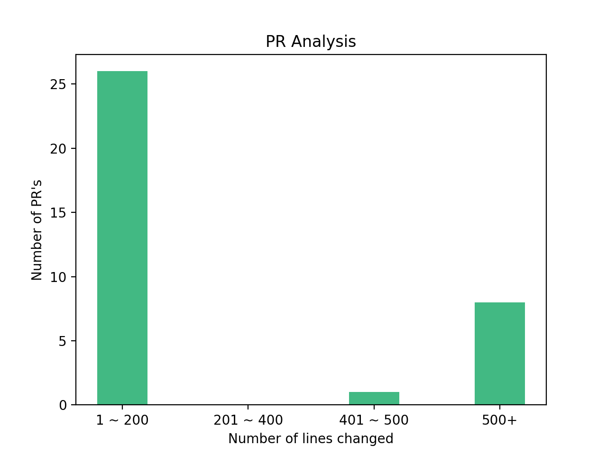

Welome to Jack (Jiaqi)'s Tech World
===================================

&nbsp;&nbsp;

><a href="https://www.bilibili.com/video/BV1Ca411Q7aK?share_source=copy_web&vd_source=7f40ee8f7150cba61ecdf3d901bbad42">
>    
></a>
>
> I'd like to take this moment to thank Yahoo!, my former employeer, who fundamentally setup my career and my unperishable passion for data tech. Thank you Yahoo! ❤️
>  
>  
> This page is also dedicated to my former colleague [Rick Jensen](https://github.com/cdeszaq), my life-long teacher on Software Engineering. Having been the best tech leader I've seen, he treats software design, programming, and code review a as a work of art. I will [follow his philosophy and, with tremendous sincerity, respect him as my role model in tech area](https://github.com/QubitPi/java-code-review-guide-book)

My Open Source Portfolio
------------------------

I belive in creating software using the open source way, a set of principles built upon an open forum for ideas where communities can form around solving a problem or developing a new technology. This philosophy affects everything my group do in Tech Industry as most of today’s IT leaders, who agree that enterprise open source is important, do

Open source software gains its strength from diverse communities of developers around the world. That’s why I’ve, since the beginning of my career in 2015, kept my eyes and hands dirty on studying and practicing developing open projects and technologies, protecting and defending open source intellectual property, and recruiting developers who actively participate in open projects across the IT stack. This experience helps inform a development model to produce more innovative, iterative, stable, and secure technologies.

By tapping into the collective talent and innovation of open source communities, I believe my team can create better software. This collaboration helps fuel much of the technology we use today

### Creator

    

### Contributor

### Active Forks

&nbsp;
&nbsp;
&nbsp;

    

I used to study technologies by [blogging](https://qubitpi.github.io/jersey-guide/) extensively. Since I'm running a company, my obligations right now are more on doing well for my employees and for my company. This gives me much less time on writing the tech blogs. I do, however, keep studying techs in a what I found more efficient approach.

Since my blogs were essentially paraphrasing their documentations, why not simply fork their entire documentation and add my notes, if any, to it? That basically saves a lot of my time and packs everything in a more giant notebook of forks. So here they are:

#### Software Infrastructure
[Chef](https://qubitpi.github.io/chef-web-docs/)([Chef 101](https://youtu.be/tt9_aWiSW5M)) | [Kubernetes](https://qubitpi.github.io/kubernetes-website/) | [Helm Charts](https://qubitpi.github.io/helm-www/) | [Jenkins](https://qubitpi.github.io/jenkins.io/)

###### OpenStack

- [OpenStack Install Guide](https://qubitpi.github.io/openstack-manuals-install-guide/)([What is OpenStack?](https://youtu.be/locCs2Duk5U))
- [OpenStack Doc Contrib Guide](https://qubitpi.github.io/openstack-manuals-doc-contrib-guide/)
- [OpenStack Virtual Machine Image Guide](https://qubitpi.github.io/openstack-manuals-virtual-machine-image-guide/)
- [OpenStack API Quick Start Guide](https://qubitpi.github.io/openstack-manuals-api-quick-start/)
- [OpenStack Glossary](https://qubitpi.github.io/openstack-manuals-glossary/)
- [OpenStack Swift](https://qubitpi.github.io/swift/)

- [Yahoo Engineering - Operating OpenStack at Scale](https://yahooeng.tumblr.com/post/159795571841/operating-openstack-at-scale)
- [How Yahoo! Uses Neutron for Ironic](https://www.openstack.org/videos/summits/tokio-2015/how-yahoo-uses-neutron-for-ironic)

###### Virtualization

[Docker](https://qubitpi.github.io/docker-docs/) | [Linux Containers](https://qubitpi.github.io/linuxcontainers.org/) | [QEMU](https://qubitpi.github.io/qemu/) ([WIKI](https://qubitpi.github.io/qemu-web/))

#### Data/Knowledge Graph

[Knowledge Graphs](https://qubitpi.github.io/Knowledge-Graphs-Book/) | [Data Visualization](https://qubitpi.github.io/data_to_viz/) | [KTX2 File Command Line Utility](https://qubitpi.github.io/KTX-Software/) | [Graphviz](https://qubitpi.github.io/graphviz.github.io/) | [Python](https://qubitpi.github.io/cpython/)

#### Frontend Technologies

[React](https://qubitpi.github.io/reactjs.org/) | [Create React App](https://qubitpi.github.io/create-react-app/) | [Vue](https://qubitpi.github.io/vue-docs/) | [TypeScript](https://qubitpi.github.io/TypeScript-Website/) | [Prettier](https://qubitpi.github.io/prettier/docs/en/index.html) | [W3Schools](https://qubitpi.github.io/W3Schools/) | [three.js](https://qubitpi.github.io/three.js/docs/)

#### Backend Dev

[Jersey](https://qubitpi.github.io/jersey/) | [Keycloak Documentation](https://qubitpi.github.io/keycloak-web/) | [Keycloak Documentation (Extra)](https://qubitpi.github.io/keycloak-documentation/)

#### Miscellaneous

[Git](https://qubitpi.github.io/progit2/) | [Changelog](https://qubitpi.github.io/keep-a-changelog/en/1.0.0/) | [sed](https://qubitpi.github.io/sed/) | [My Tech Blogs](https://qubitpi.github.io/jersey-guide/) | [Studying Agile](https://qubitpi.github.io/QubitPi/agile/)

> The forked repos that genereate all of the "documentation/study notes" above are listed [at the end of this page](https://github.com/QubitPi#comprehensive-documentation-related-forks)

### Archived Projects

---

My 
-----------

### Recent Activities

<!-- BILIBILI-RECENT-ACTIVITIES:START -->
- [【原 Log】深境螺旋 11 月下半期第 11 层](https://t.bilibili.com/729348561582424083)
- [【原Log】深境螺旋十一月下第十层](https://t.bilibili.com/728974731917656064)
- [我解锁了【一骑绝尘】成就，快来看看我的本周创作表现吧～](https://t.bilibili.com/717921337233899542)
- [【百人一揆3 - 机器们的午后】最后一个金牌到手](https://t.bilibili.com/717694640269033492)
- [【百人一揆 - 无限的天狗党人】香菱和宵宫好配～](https://t.bilibili.com/717220012032524387)
<!-- BILIBILI-RECENT-ACTIVITIES:END -->

### Recent Uploads

<!-- BILIBILI-UPLOAD-LIST:START -->
- [【原 Log】深境螺旋 11 月下半期第 11 层](https://www.bilibili.com/video/BV17P4y117DY)
- [【原Log】深境螺旋十一月下第十层](https://www.bilibili.com/video/BV11P411g74L)
- [【百人一揆3 - 机器们的午后】最后一个金牌到手](https://www.bilibili.com/video/BV11e4y1v7wp)
<!-- BILIBILI-UPLOAD-LIST:END -->

### Columns

<!-- BILIBILI-COLUMNS:START -->
- [孤云阁 F4 初级打法](https://www.bilibili.com/read/cv18323080)
<!-- BILIBILI-COLUMNS:END -->

### Recently Liked-Saved-Tipped (一键三连) Videos

<!-- BILIBILI-TIPPED-VIDEOS:START --> <a href=https://www.bilibili.com/video/BV15G4y1C7MV>雷电将军和嘤嘤怪</a>  <a href=https://www.bilibili.com/video/BV1XM411b7PP>魈PV的删减部分</a>  <a href=https://www.bilibili.com/video/BV1uD4y1V7ah>【原神手书】将军的新年祝福</a>  <a href=https://www.bilibili.com/video/BV1814y1u7JV>识宝结算画面——California Gurls</a>  <a href=https://www.bilibili.com/video/BV1iM411h7Jf>双子参见智慧之神</a> <!-- BILIBILI-TIPPED-VIDEOS:END -->

---

### Latest Genshin Impact News

#### Bilibili

<!-- BILIBILI-GENSHIN-IMPACT-ACTIVITIES-COVER:START --> <!-- BILIBILI-GENSHIN-IMPACT-ACTIVITIES-COVER:END -->

<!-- BILIBILI-GENSHIN-IMPACT-ACTIVITIES:START -->
- [#原神# #沙堑寻洲# #原神沙堑寻洲摄影征集活动# 亲爱的旅行者，《原神》「沙堑寻洲」千壑沙地主题摄影活动今日开启~ 大地轰鸣，沙地堑壑下沙虫肆行其间。 风暴通...](https://t.bilibili.com/752377776820977704)
- [互动抽奖 #原神# #迪奥娜# #生日快乐# 难得的休息日，我把小家伙们都带出来透透气。 你也是一起来晒太阳的吗？稍等哦，我让芬尼克给你挪个地方。 没有酒精，没有...](https://t.bilibili.com/752375741002285090)
- [《原神》拾枝杂谈-「艾尔海森：诠辩深妙」](https://t.bilibili.com/752375247082094712)
- [#原神# #原神UP主激励计划# 旅行者们大家好~ 《原神》3.4版本内容招募活动「磬弦奏华夜」现已开启，哔哩哔哩「百万创作者激励计划」也已同步启动。 自1月18日起...](https://t.bilibili.com/752359729364205570)
- [#原神# #海灯节# #磬弦奏华夜# 旅行者们好呀~海灯节将至，让我们来了解一下「磬弦奏华夜」活动的玩法吧！](https://t.bilibili.com/752351998428315656)
<!-- BILIBILI-GENSHIN-IMPACT-ACTIVITIES:END -->

### My  Channel

<!-- YOUTUBE-CHANNEL:START -->
- [[GLog] Spiral Abyss Floor 11, Late Nov. Period](https://www.youtube.com/watch?v=gLLEZIbGrPE)
- [[GLog] Spiral Abyss Floor 10, Late Nov. Period](https://www.youtube.com/watch?v=yFTagA9Ahj4)
- [[GLog] Spiral Abyss Early Nov. Period](https://www.youtube.com/watch?v=q73HV21FNrI)
- [Commemorate My First All-Pass Spiral Abyss Period!](https://www.youtube.com/watch?v=w0YeFg6-uxc)
- [[Sangonomiya Kokomi Story Quest] Warriors&#39; Dreams Like Spring Grass Renewing](https://www.youtube.com/watch?v=7LF81N_bBd0)
<!-- YOUTUBE-CHANNEL:END -->

<!-- 

**I'm thriving on creating a future where people never dominate the machine and machines won't slave the human; instead they both become happier together**. -->

---

 My Coffee-Morning Data Tech & Design News Central
-----------------------------------

<h3></h3>

<!-- GOOGLE-AI-BLOG:START -->
- [EHR-Safe: Generating High-Fidelity and Privacy-Preserving Synthetic Electronic Health Records](http://ai.googleblog.com/2022/12/ehr-safe-generating-high-fidelity-and.html)
- [Differential Privacy Accounting by Connecting the Dots](http://ai.googleblog.com/2022/12/differential-privacy-accounting-by.html)
- [Accelerating Text Generation with Confident Adaptive Language Modeling &lpar;CALM&rpar;](http://ai.googleblog.com/2022/12/accelerating-text-generation-with.html)
- [Who Said What? Recorder&#39;s On-device Solution for Labeling Speakers](http://ai.googleblog.com/2022/12/who-said-what-recorders-on-device.html)
- [RT-1: Robotics Transformer for Real-World Control at Scale](http://ai.googleblog.com/2022/12/rt-1-robotics-transformer-for-real.html)
<!-- GOOGLE-AI-BLOG:END -->

<h3></h3>

<!-- GOOGLE-DEEPMIND-BLOG:START -->
- [Competitive programming with AlphaCode](https://www.deepmind.com/blog/competitive-programming-with-alphacode)
- [AI for the board game Diplomacy](https://www.deepmind.com/blog/ai-for-the-board-game-diplomacy)
- [Mastering Stratego, the classic game of imperfect information](https://www.deepmind.com/blog/mastering-stratego-the-classic-game-of-imperfect-information)
- [DeepMind’s latest research at NeurIPS 2022](https://www.deepmind.com/blog/deepminds-latest-research-at-neurips-2022)
- [Building interactive agents in video game worlds](https://www.deepmind.com/blog/building-interactive-agents-in-video-game-worlds)
<!-- GOOGLE-DEEPMIND-BLOG:END -->

### [ML @ Reddit](https://www.reddit.com/r/MachineLearning/)

<!-- REDDIT-ML:START -->
- [[P] Chatbot Project Guidance](https://www.reddit.com/r/MachineLearning/comments/10fcll6/p_chatbot_project_guidance/)
- [[D] Do you know of any model capable of detecting generative model&lpar;GPT&rpar; generated text ?](https://www.reddit.com/r/MachineLearning/comments/10fclbg/d_do_you_know_of_any_model_capable_of_detecting/)
- [[R] Researchers out there: which are current research directions for tree-based models?](https://www.reddit.com/r/MachineLearning/comments/10fbiz2/r_researchers_out_there_which_are_current/)
- [[P] AI for Materials community](https://www.reddit.com/r/MachineLearning/comments/10f9nxx/p_ai_for_materials_community/)
- [[R] tasksource: Structured Dataset Preprocessing Annotations for Frictionless Extreme Multi-Task Learning and Evaluation &lpar;480 tasks+ sota encoder&rpar;](https://www.reddit.com/r/MachineLearning/comments/10f16l6/r_tasksource_structured_dataset_preprocessing/)
<!-- REDDIT-ML:END -->

###  Study Notes

* [Machine Learning](https://peitho-data.readthedocs.io/en/latest/peitho_data.html#machine-learning)

<h3></h3>

<!-- SCRUM-DOT-ORG-BLOGS:START -->
- [[VLOG] How to start Scrum in a Large Scale Enterprise](https://www.scrum.org/resources/blog/vlog-how-start-scrum-large-scale-enterprise)
- [Can ChatGPT teach you Scrum?](https://www.scrum.org/resources/blog/can-chatgpt-teach-you-scrum)
- [Why &quot;No&quot; is part of a Scrum Product Owner’s Love Language](https://www.scrum.org/resources/blog/why-no-part-scrum-product-owners-love-language)
- [Unlock the Power of ChatGPT for your Scrum Team](https://www.scrum.org/resources/blog/unlock-power-chatgpt-your-scrum-team)
- [Scrum requires Psychological Safety](https://www.scrum.org/resources/blog/scrum-requires-psychological-safety)
<!-- SCRUM-DOT-ORG-BLOGS:END -->

<h3></h3>

> [**Infrastructure is the "home" to softwares**](https://www.infoq.com/presentations/scaling-operations-facebook/). Just like, [quoting Donald Trump](https://www.youtube.com/watch?v=f1dVtwfVXx0&t=1077s), "the happiest people are the people that have great families", the "happiest" softwares are backed by the best-made tech infrustructure, and that's what I spend most of my time on in software engineering area

####  Study Notes

* [OpenStack Basics](https://qubitpi.github.io/jersey-guide/finalized/2021/08/20/openstack.html)
* [Building Enterprise Security](https://qubitpi.github.io/jersey-guide/finalized/2022/10/09/enterprise-security.html)

#### [OpenStack News](https://superuser.openstack.org/)

<!-- OPENSTACK-SUPERUSER:START -->
- [OpenStack Firewall as a Service &lpar;FWaaS&rpar;—the Basics and a Quick Tutorial](https://superuser.openstack.org/articles/openstack-firewall-as-a-service-fwaas-the-basics-and-a-quick-tutorial/)
- [Is It Edge or Just a Piece of a Large Distributed System? – Part 2](https://superuser.openstack.org/articles/is-it-edge-or-just-a-piece-of-a-large-distributed-system-part-2/)
- [Inside Open Infrastructure: The Latest from the OpenInfra Foundation](https://superuser.openstack.org/articles/openinfra-newsletter-51/)
- [Is It Edge or Just a Piece of a Large Distributed System?](https://superuser.openstack.org/articles/is-it-edge-or-just-a-piece-of-a-large-distributed-system/)
- [OpenInfra User Group Sweden, OpenInfra Forum #13](https://superuser.openstack.org/articles/openinfra-user-group-sweden-openinfra-forum-13/)
<!-- OPENSTACK-SUPERUSER:END -->

<h4><a href="https://www.docker.com/blog/">Docker Blogs</a></h4>

<!-- DOCKER-BLOG:START -->
- [Develop Your Cloud App Locally with the LocalStack Extension](https://www.docker.com/blog/develop-your-cloud-app-locally-with-the-localstack-extension/)
- [Docker Desktop 4.16: Better Performance and Docker Extensions GA](https://www.docker.com/blog/docker-desktop-4-16-better-performance-extensions-ga/)
- [December 2022 Newsletter](https://www.docker.com/blog/december-2022-newsletter/)
- [December Extensions Roundup: Improving Visibility for Your APIs and Images](https://www.docker.com/blog/new-extensions-december-2022/)
- [Reduce Your Image Size with the Dive-In Docker Extension](https://www.docker.com/blog/reduce-your-image-size-with-the-dive-in-docker-extension/)
<!-- DOCKER-BLOG:END -->

#### [Docker Documentation](https://docs.docker.com/) Updates

<!-- DOCKER-DOC-CHANGES:START --><li>Wed Jan 18 2023 11:49 AM <a href=https://github.com/docker/docs/commit/011ebd4c8fd1abeb69b81c6a13d0b1f0a6c7fcaa>remove outdated callout on WSL &lpar;#16547&rpar;</a></li><li>Wed Jan 18 2023 11:01 AM <a href=https://github.com/docker/docs/commit/4fa4bcc0c41619a05ff23b507dde318dc0fc5a8f>Merge pull request #16539 from jedevc/build-sbom-example-to-bottom</a></li><li>Wed Jan 18 2023 10:09 AM <a href=https://github.com/docker/docs/commit/8372b053b8965c9ea1848853580c226b916eaf3a>extension banner change &lpar;#16544&rpar;</a></li><li>Wed Jan 18 2023 9:16 AM <a href=https://github.com/docker/docs/commit/cd58a175524f6b60fc7271be0b93666d44abc986>Update generated reference docs with extension API 0.3.3 &lpar;Desktop 4.1…</a></li><li>Tue Jan 17 2023 10:32 PM <a href=https://github.com/docker/docs/commit/9589931d2774ad4af734fce5842713b802fa4b5e>Show k8s &amp; swarm links in similar way &lpar;#16535&rpar;</a></li><!-- DOCKER-DOC-CHANGES:END -->

<h4><a href="https://kubernetes.io/blog/">Kubernetes Blogs</a></h4>

<!-- KUBERNETES-BLOG:START -->
- [Blog: Protect Your Mission-Critical Pods From Eviction With PriorityClass](https://kubernetes.io/blog/2023/01/12/protect-mission-critical-pods-priorityclass/)
- [Blog: Kubernetes 1.26: Eviction policy for unhealthy pods guarded by PodDisruptionBudgets](https://kubernetes.io/blog/2023/01/06/unhealthy-pod-eviction-policy-for-pdbs/)
- [Blog: Kubernetes 1.26: Retroactive Default StorageClass](https://kubernetes.io/blog/2023/01/05/retroactive-default-storage-class/)
- [Blog: Kubernetes v1.26: Alpha support for cross-namespace storage data sources](https://kubernetes.io/blog/2023/01/02/cross-namespace-data-sources-alpha/)
- [Blog: Kubernetes v1.26: Advancements in Kubernetes Traffic Engineering](https://kubernetes.io/blog/2022/12/30/advancements-in-kubernetes-traffic-engineering/)
<!-- KUBERNETES-BLOG:END -->

<h4></h4>

<!-- LETS-ENCRYPT-BLOG:START -->
- [A Look into the Engineering Culture at ISRG](https://letsencrypt.org/2023/01/12/eng-culture-at-isrg.html)
- [Let’s Encrypt improves how we manage OCSP responses](https://letsencrypt.org/2022/12/15/ocspcaching.html)
- [A Year-End Letter from our Executive Director](https://letsencrypt.org/2022/12/05/ed-letter-2022.html)
- [Remembering Peter Eckersley](https://letsencrypt.org/2022/09/12/remembering-peter-eckersley.html)
- [A New Life for Certificate Revocation Lists](https://letsencrypt.org/2022/09/07/new-life-for-crls.html)
<!-- LETS-ENCRYPT-BLOG:END -->

<h4></h4>

<!-- OPENID-CONNECT-BLOG:START -->
- [Notice of Vote for Proposed Second Implementer’s Drafts of Two FAPI 2.0 Specifications](https://openid.net/2023/01/08/notice-of-vote-for-proposed-second-implementers-drafts-of-two-fapi-2-0-specifications/)
- [Announcing the 2023 OpenID Foundation Individual Community Board Members Election](https://openid.net/2023/01/03/2023-board-members-election/)
- [Implementer’s Draft of OpenID Connect Native SSO for Mobile Apps Approved](https://openid.net/2022/12/29/implementers-draft-of-openid-connect-native-sso-for-mobile-apps-approved/)
- [FAPI 2.0 – Announcing New Drafts and Security Analysis](https://openid.net/2022/12/19/fapi-2-0-announcement/)
- [Initiating User Registration via OpenID Connect is now a Final Specification](https://openid.net/2022/12/02/initiating-user-registration-via-openid-connect-is-now-a-final-specification/)
<!-- OPENID-CONNECT-BLOG:END -->

<h3></h3>

####  Study Notes

* [GraphQL Reference Guide](https://qubitpi.github.io/jersey-guide/finalized/2022/04/26/graphql.html)
* [React - The GraphQL Frontend](https://qubitpi.github.io/jersey-guide/finalized/2022/08/30/react-basics.html)

#### [GraphQL Specification](https://graphql.org/foundation/join/#graphql-specification) Significant Changes

<ul>
<!-- GRAPHQL-SPEC-SIGNIFICANT-CHANGES:START --><li>Thu Jan 12 2023 10:18 PM <a href=https://github.com/graphql/graphql-spec/commit/559063cb37c14ed74050f73efd3971ee13ff134d>Change &#39;server&#39; to &#39;service&#39; &lpar;#1005&rpar;</a></li><li>Thu Jan 12 2023 8:35 PM <a href=https://github.com/graphql/graphql-spec/commit/cbb83545cf8eeb5106856dda8f9d0b750f553124>Fix broken license link &lpar;#1007&rpar;</a></li><li>Fri Jan 06 2023 9:04 AM <a href=https://github.com/graphql/graphql-spec/commit/e736f78b3cb5c8abb1d6b2ec5e5102de455f98ed>Add a style guide to the specification &lpar;#1003&rpar;</a></li><li>Thu Jan 05 2023 8:00 PM <a href=https://github.com/graphql/graphql-spec/commit/193fba3912a43a5e2c9741f4269d279a018e2829>field merging - field TYPES must not differ &lpar;#979&rpar;</a></li><li>Thu Jan 05 2023 7:43 PM <a href=https://github.com/graphql/graphql-spec/commit/3d03cab7a8ffc455387f486fbab5155c2a7c7f3e>P30: Fixed the explanatory text for algorithm checking uniqueness of non-repeatable directives &lpar;#975&rpar;</a></li><!-- GRAPHQL-SPEC-SIGNIFICANT-CHANGES:END -->
</ul>

#### [GraphQL Java](https://www.graphql-java.com/) Significant Changes

##### [ANTLR Grammar](https://github.com/graphql-java/graphql-java/tree/master/src/main/antlr) Changes

<ul>
<!-- GRAPHQL-JAVA-SIGNIFICANT-CHANGES-ANTLR:START --><li>Sat Jan 14 2023 2:42 AM <a href=https://github.com/graphql-java/graphql-java/commit/94aadfee1a1aa8d78da57d15492174ef39e0e65d>Fix extend schema directives</a></li><li>Mon Dec 20 2021 4:02 AM <a href=https://github.com/graphql-java/graphql-java/commit/4a82b0bbd1483d148f3abf575fe705be6d2b0f70>Allow leading pipe in directive SDL, and add leading union pipe tests &lpar;#2650&rpar;</a></li><li>Wed Jul 14 2021 1:54 AM <a href=https://github.com/graphql-java/graphql-java/commit/dd290eabdc219ba5e725e0364cddcd2210fa169b>Update ANTLR grammar with new SourceCharacter definition</a></li><li>Tue Jun 29 2021 1:10 AM <a href=https://github.com/graphql-java/graphql-java/commit/5b12cbeff757c7280177375814b92a4387db152f>Add full Unicode to parser, the happy path</a></li><li>Sun Jun 27 2021 12:19 PM <a href=https://github.com/graphql-java/graphql-java/commit/f6460192969fdd87d3dcc12c3801e095ca58e90c>Fix extend type parsing issue &lpar;#2393&rpar;</a></li><!-- GRAPHQL-JAVA-SIGNIFICANT-CHANGES-ANTLR:END -->
</ul>

<h3></h3>

#### Twitter

<!-- ARANGO-TWITTER:START -->
- [Team Avocado is hiring! ArangoDB is looking for a Solution Architect in Isreal to join our team. 🥑 To learn more, check out the full job descriptio...](https://twitter.com/arangodb/status/1615680438323843072)
- [Learn how @FiniteStateInc uses ArangoDB to trace security vulnerabilities across software supply chains. Join Gün Akkor as he explores his experience...](https://twitter.com/arangodb/status/1615453932418998286)
- [ArangoDB webinar&#39;s are back! 🔥 Join us for our &quot;New Year, New AQL&quot; webinar to make 2023 the year you become an AQL master. You will learn how to ge...](https://twitter.com/arangodb/status/1615318048579223554)
- [Grab your spot still while you can! Join us for our first webinar of 2023, which we are sure will turn you into an AQL genius. 🔥 See you this Wedne...](https://twitter.com/arangodb/status/1615091542477217795)
- [Grab your spot quickly to get some hands on machine learning experience with ArangoDBs very own CTO @joerg_schad. 🥑 This week on January 18th, lear...](https://twitter.com/arangodb/status/1614955665457352707)
<!-- ARANGO-TWITTER:END -->

#### Official Blogs

<!-- ARANGO-BLOGS:START -->
- [December 2022: What&#39;s the Latest with ArangoDB? ArangoDB Newsletter: December 2022](https://rss.app/articles/cb4e791f6f6d729c1f5d4e4732d7a78a05191f251d28a2afd2e3890e8d8368c9f116b15977818177f1a2687fc0150d8c319739bf954d2f4696659024c29e1f78d7e327ffa4b778ad)
- [December 2022: What&#39;s the Latest with ArangoDB? ArangoDB Newsletter: December 2022](https://rss.app/articles/cb4e791f6f6d729c04434f0c7ec4b4850c111423513cbdec8db0d748d7c93695ad1eb75d378f813ca1bf3428985753c624913da3df137f1c94)
- [October 2022: What&#39;s the Latest with ArangoDB? ArangoDB Newsletter: August 2022](https://rss.app/articles/cb4e791f6f6d729c04434f0c7ec4b4850c111423513cbdec8db0d748d7c93696ad1eb75d378f813ca1bf3428985753c624913da3df137f1394)
- [August 2022: What&#39;s the Latest with ArangoDB? ArangoDB Newsletter: August 2022](https://rss.app/articles/cb4e791f6f6d729c04434f0c7ec4b4850c111423513cbdec8db0d748d7c9379fad1eb75d378f813ca1bf3428985753c624913da3df137f1294)
- [July 2022: What&#39;s the Latest with ArangoDB? ArangoDB Newsletter: July 2022](https://rss.app/articles/cb4e791f6f6d729c04434f0c7ec4b4850c111423513cbdec8db0d748d7c93790ad1eb75d378f813ca1bf3428985753c624913da3df137f1194)
<!-- ARANGO-BLOGS:END -->

####  Study Notes

* [Graph Analytics and Machine Learning through ArangoDB](https://qubitpi.github.io/jersey-guide/finalized/2022/09/03/ml-arango.html)
* [ArangoDB Query Language (AQL)](https://qubitpi.github.io/jersey-guide/finalized/2022/09/02/arango-aql.html)
* [ArangoDB Java Driver](https://qubitpi.github.io/jersey-guide/finalized/2022/09/05/arango-java-driver.html)
* [ArangoDB Graphs](https://qubitpi.github.io/jersey-guide/finalized/2022/09/03/arango-general-graphs.html)
* [ArangoDB Reference Guide](https://qubitpi.github.io/jersey-guide/finalized/2022/08/19/arangodb.html)
* [ArangoDB Architecture](https://qubitpi.github.io/jersey-guide/finalized/2022/09/05/arango-architecture.html)

<h3></h3>

#### Twitter

<!-- MEMGRAPH-TWITTER:START -->
- [🎓 Identity and Access Management &lpar;IAM&rpar; includes technologies and processes that enable organizations to provide users with appropriate access to sy...](https://twitter.com/memgraphdb/status/1615732496410230785)
- [🎓 #Learn #Cypher with #Memgraph Relationship types are case-sensitive and you cannot use the - character in a relationship type. #graphdatabase #op...](https://twitter.com/memgraphdb/status/1615714125937782791)
- [🎓 #Learn #Cypher with #Memgraph Relationship types are styled upper-case and use the underscore character _ to separate multiple words #graphdataba...](https://twitter.com/memgraphdb/status/1615711609501917184)
- [❓ Did you know that graphs can be used to model real-world situations, such as social networks, transportation networks, or electrical networks? #mem...](https://twitter.com/memgraphdb/status/1615704815778287618)
- [🔎 Database hosting is an interesting cost in the total cost of ownership and it should be taken into consideration before deciding which database t...](https://twitter.com/memgraphdb/status/1615692988188971008)
<!-- MEMGRAPH-TWITTER:END -->

#### Links

* [Newsletter](https://memgraph.com/newsletter/)
* [Blogs](https://memgraph.com/blog)
* [Community Forum](https://discourse.memgraph.com/)

<h3></h3>

#### Twitter

<!-- NEO4J-TWITTER:START -->
- [GraphQL Book Club - Chapter 7: Adding Authorization And Authentication @lyonwj](https://twitter.com/neo4j/status/1615722786810626048)
- [🤓 Are you new in #Cypher? Find all you need, here: #Neo4j #graphtechnoloy #Learning](https://twitter.com/neo4j/status/1615695621662380037)
- [Neo4j Live: Wardley Mapping with Neo4j @tom_asel](https://twitter.com/neo4j/status/1615374721356541954)
- [&quot;The customers started using #Neo4j, and the results that they saw – in much less time with much fewer resources – is mainly the most surprising, fo...](https://twitter.com/neo4j/status/1615373384962957313)
- [#TBT to our best articles of 2022... today: &quot;Maintain a Companion Plant Knowledge Graph in Google Sheets and #Neo4j&quot; by Sixing Huang #knowledgegraphs ...](https://twitter.com/neo4j/status/1615352764439138304)
<!-- NEO4J-TWITTER:END -->

#### YouTube

<!-- NEO4J-YOUTUBE:START -->
- [Neo4j Live: Porting Global-Chem Graph Infrastructure into Neo4j](https://www.youtube.com/watch?v=PSrrVOjnijA)
- [Discovering Neo4j AuraDB Free with Michael and Alexander](https://www.youtube.com/watch?v=bxuozmbPCWI)
- [Neo4j Live: Wardley Mapping with Neo4j](https://www.youtube.com/watch?v=UKvjYZ2kiNY)
- [Going Meta - Ep 12: Importing RDF data into Aura with Python + RDFLib](https://www.youtube.com/watch?v=DWINSvRxIbw)
- [GraphQL Book Club - Chapter 7: Adding Authorization And Authentication](https://www.youtube.com/watch?v=WrWbGml-7x8)
<!-- NEO4J-YOUTUBE:END -->

<h3></h3>

<!-- JANUSGRAPH-TWITTER:START -->
- [As a preparation of the upcoming 1.0.0 release, we have just deployed the release candidate 1.0.0 RC1: We encourage everyone to try it out and provide...](https://twitter.com/JanusGraph/status/1600822620542451712)
- [RT ScyllaDB: Learn how @JanusGraph leverages ScyllaDB &amp; explore potential use cases for the integration #graph #NoSQL #ScyllaDB #OpenSource #DEVCommun...](https://twitter.com/ScyllaDB/status/1565384501559279616)
- [RT gdotv: G.V&lpar;&rpar; 0.9.25 is out! Highlights: - Gremlin Query Debugging for all 🪲 - Query Editor UX Improvements - Various bug fixes - more! Free to d...](https://twitter.com/gdotv_ltd/status/1561777125383966726)
- [RT ScyllaDB: Learn about the broader #ScyllaDB ecosystem: #ApacheSpark, #ApacheKafka, @datadoghq @iota Chronicle, @JanusGraph @opennms Newts &amp; more �...](https://twitter.com/ScyllaDB/status/1561775885463818241)
- [RT Anant Corporation: In Data Engineer&#39;s Lunch #65, Ryan Quey will discuss the Graph Notebook tool put out by the @AWS team on @JanusGraph.](https://twitter.com/anantcorp/status/1546947807055077378)
<!-- JANUSGRAPH-TWITTER:END -->

<h3></h3>

> "Users own their own data, not corporations"
> 
> \- [Web3 Foundation](https://web3.foundation/about/)

**I'm not a fan of Blockchain, but a fan of Blockchain linked to _Data_ through Web3.0**

#### Twitter

<!-- WEB3-FOUNDATION-TWITTER:START -->
- [Hear Web3 Foundation&#39;s @BillLaboon discuss the educational resources, grants for new project developments, and other Foundation initiatives, as well a...](https://twitter.com/Web3foundation/status/1613932872250826753)
- [Re Signatures are still being collected from other projects and organizations ready to join the call to defend privacy. To read the full letter:](https://twitter.com/Web3foundation/status/1613552063220178944)
- [Re Protecting the privacy of people is key to ensuring the rights that compose the core of democracy. We at the Foundation hope that incoming lawmaker...](https://twitter.com/Web3foundation/status/1613552061219495936)
- [Re Organized by @fightfortheftr &amp; signed by privacy-preserving projects including @Polkadot parachain @MantaNetwork, the call comes as an open letter ...](https://twitter.com/Web3foundation/status/1613552059080400896)
- [Web3 Foundation believes the right to privacy and the right to code are essential for building a better web and achieving a more secure digital future...](https://twitter.com/Web3foundation/status/1613552057046241280)
<!-- WEB3-FOUNDATION-TWITTER:END -->

#### Study Notes

* [Web3 X](https://qubitpi.github.io/jersey-guide/finalized/2022/09/08/web-3-dot-0.html)
* [Blockchain 101](https://qubitpi.github.io/jersey-guide/finalized/2022/09/08/blockchain-101.html)

### Martin Fowler's Blog (**Building Software Effectively**)

<!-- MARTIN-FOWLER-BLOG:START -->
- [My favorite musical discoveries of 2022](https://martinfowler.com/articles/2022-music.html)
- [Some activities for the Data Mesh Accelerate Workshop](https://martinfowler.com/articles/data-mesh-accelerate-workshop.html#ASampleAgendaForADataMeshAccelerateWorkshop)
- [Data Mesh Accelerate Workshop](https://martinfowler.com/articles/data-mesh-accelerate-workshop.html)
- [Finding accounts to follow on Mastodon](https://martinfowler.com/articles/exploring-mastodon.html#finding-accounts-to-follow)
- [Installing Orbi Wifi Mesh broke my Sonos](https://martinfowler.com/articles/2022-orbi-sonos.html)
<!-- MARTIN-FOWLER-BLOG:END -->

<h3></h3>

<!-- DRIBBBLE-TRENDING:START -->
- [Apres — Home page web design](https://dribbble.com/shots/20394039)
- [NXN Website](https://dribbble.com/shots/20346730)
- [Pinecone Estates](https://dribbble.com/shots/20366766)
- [Campaign App Exploration](https://dribbble.com/shots/20360841)
- [Village in Normandie 🇫🇷](https://dribbble.com/shots/20351068)
<!-- DRIBBBLE-TRENDING:END -->

### My 

<!-- DESIGN-POST-LIST:START -->
- [[Color Palette] 雷电将军](https://www.behance.net/gallery/151020177/Color-Palette-)
- [[Design Practice] Vector Donut](https://www.behance.net/gallery/150426875/Design-Practice-Vector-Donut)
- [[Design Practice] Vector Peach](https://www.behance.net/gallery/150091831/Design-Practice-Vector-Peach)
- [[Design Practice] Paper Cut Out Effect](https://www.behance.net/gallery/149929601/Design-Practice-Paper-Cut-Out-Effect)
- [[Design Practice] 3D Isometric Illustration](https://www.behance.net/gallery/149824473/Design-Practice-3D-Isometric-Illustration)
<!-- DESIGN-POST-LIST:END -->

### Frontend

#### [CSS-Trikcs](https://css-tricks.com/)

<!-- CSS-TRIKCS:START -->
- [Solved With :has&lpar;&rpar;: Vertical Spacing in Long-Form Text](https://css-tricks.com/solved-with-has-vertical-spacing-in-long-form-text/)
- [6 Common SVG Fails &lpar;and How to Fix Them&rpar;](https://css-tricks.com/6-common-svg-fails-and-how-to-fix-them/)
- [:has is an unforgiving selector](https://css-tricks.com/has-is-an-unforgiving-selector/)
- [Faking Min Width on a Table Column](https://css-tricks.com/faking-min-width-on-a-table-column/)
- [Styling Buttons in WordPress Block Themes](https://css-tricks.com/styling-buttons-in-wordpress-block-themes/)
<!-- CSS-TRIKCS:END -->

Git Data Analytics - Everything is Datable
------------------------------------------

### My Pull Requests (PR) Analysis

> [Pull Requests should be small](https://qubitpi.github.io/jersey-guide/management/2022/09/01/small-changes.html). This graph indicates whether or not I am following good tech standards:
> 
> 

 

 
 
 
 
 
 
 
 
 
 
 
 
 
 
 
 
 
 
 
 
 
 
 
 
 
 
 
 
 
 
 
 
 
 
 
 
 
 
 
 
 

Comprehensive Documentation-Related Forks
-----------------------------------------

### Data/Knowledge Graph

### Software Infrastructure

###### OpenStack

###### Virtualization

### Frontend Technologies

### Backend Dev

### Miscellaneous

