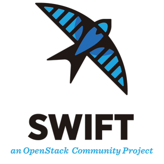
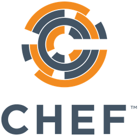

 Welome to Jack (Jiaqi)'s GitHub Page 
========================================================================================================================================

[ ![模之屋](https://img.shields.io/badge/模之屋-53B3F4?style=for-the-badge&logo=data:image/png;base64,iVBORw0KGgoAAAANSUhEUgAAABkAAAAYCAYAAAAPtVbGAAAABGdBTUEAALGPC/xhBQAAACBjSFJNAAB6JgAAgIQAAPoAAACA6AAAdTAAAOpgAAA6mAAAF3CculE8AAAABmJLR0QA/wD/AP+gvaeTAAAACXBIWXMAAAsSAAALEgHS3X78AAAAB3RJTUUH5ggLATIu29ytdgAAAZF6VFh0UmF3IHByb2ZpbGUgdHlwZSB4bXAAADiNjVRBcoMwDLzrFX2CkSzZPIdi+9aZHvv8roBgAiQtngQia7WrNQr9fH3Th186CsmcskwpW0nBimmKNnDw3zZbTeJ7UphtsGjN2FSmNb5nN2YO1Msg+OkQzbFo4BDFWgKQgyhXifgEZqlh4uALEhjFTSblGCnaiX/ddA05RawgEzhbWi6uCUlcF4rETQYZfXEjCcIIML7LWgR3SSPKQnbKXJzAt7uWs6IYTSmJCQLj0toIFyoUbgnwhcENJ1whjHgqdFwp06EpL2R3bS2aarcbz/DPChreMN7asJjY3vN1OpxUdvCZjt7xPUBu6oPu7NTDL9obmqKfxGi62bw5JhUnM/cmXuXRK4YOVKhMrnF221eYogwOKIKGVxr6X/o92e7XFIUc6q+XCkZkgDv6aOaYdpf1XJyu1TVARYYHM4bFtZXFD9k9Y7x64ZlKA70H/dVSJyUdb1nzlXOnvEXQeX64HSfoOkDH6e+5yhSR75tL+PLP5Dv0C18CGhl6KzH7AAAAAW9yTlQBz6J3mgAABepJREFUSMeVlFuMnWUVhp/1fd///3vPdGbPdGZ6GIZObemBjKm2thrwlEDQqCiYak0JCgYRo/HGC5ULE4sxxAuPMdELUkNBosGooDU2GDwQMQTTYNPSA20Zcei0nWnnuGf2/v/vW8uLaZBa8PDerzxZ7/uuJbcfKN+W4J6YTA2eyYN78pGv/O3UHfdvYSZ5Gj7y4A0Fr6WvmnHxz7N87x3dfOL3SoeU/tyCHwnYjd7JVhGmMy/fkd2/LfemGD+5riEEL+2X5jnZTvJQPbi9LWNCM+F8j2fZcThYn+PMLd1se6DJyHAHD90kfHnvs5zqfzO1Gm9Q1c+u6WJnTHb12FwKpUoqMnev7Nzf/t2Gbr1x96aMudJYTPDoC9Gm2/J4LXOfx9s/JAqaCzmeBQSnBinizSDkmFZb2lX6IarXvW84sKbbcaFl7H+xYlHD9x3QWl4TxuaVvc+XDNSFoU4kqt4SjZtPTkYmS1kZjOvNbKeVaTdqH3bIdh9c775D01SJOzXpdVGNyZaSgIG6sGNVQM1awQmjY/PKTWsCd43kjM4qL8wwlQe/z4mcW9sI3xjp4z01b2sPT5YdsTQXBRVkVpyc2H1tx2PBy59Q31+l9NGo1A5OJAqBiRZV5uV0CE6eG29S/vxklRcejk7ZuLqwR6A3xvitd1/lhmte+cNYZK40BMDAoB+lX0WuT+r/mgf3bRE5+vyU3lvG2FUpiHOz9SwcdVmQvyAydngycXDCJvDZ18zsTWVV3feuQRnuLeDAaMVc+xLg32RmpBi3t8v4XedlpjJ3fzJpCeCdHM29HHGr6uFY8O6nWebH60W4T1XXl2W8Z3OvZBt7Pb8ZjZQJRPiPUtX+sox7gpPREMI3nffnvXP7Ti24Cfn4E0ZwVa+aG4pJr21X8YFctOuuNxb88eXIoYmE/y+AV8t7f7Ceh9sVCjGOh8Sia3tIyJRTHa1Sujsm7doy4IlmHL3w/wEubbS1TPqBZluf82KLzhvu4vRZYnKUxnZVe2vuYMfKwMFziUpf5f0VWbw2xMwkqX2wUbgGokzuyXBXFfPMV4LBNlXrXr3M0SiEE9OKuzSYe+irySsg72BwmXvdnEx1Q1QbKqMw+HVwK2oreez9+1HVdWrGhh7HxKIy1TLWNhzD3Y5Nyz27NubkHtSgtxDuHMlZ0eFY3+PYvNyhl2/WMBhKIlQzEKasxueeurkwaw2KwHC34++zSs3Dh9ZnNKOhBjesCbw0p/z6dEV3IYz0Od4+6BnqcjhgdLakHQ1bsqye1IbbQL4ATpNQqdUQN5A7WF4TLraMj2zIWdkheC/ghMVo7N6cces1Gd2FMNkyOgtBBPrqwq5NGXl4ZRMxkdXihNELJSE5Q6vUpUkHOoIQBFoJNvY6ZtrGXNvorwkLcekf3bY5Z7ypVAnEoFkadS9s6nF0BKFVGWCY6uCX3lLIo7WWuYQQocug0wuUuuT7qk7HuobnqbHIeFMZqC+lHBxc3eUY6nIcmUwcmVRGlju6CyF3lzVh9YPHtZipHAFxmFIHagDtuNTXWoBkS82KemWDBCi8sKhG8EsO6GVFl0azlTJBW0GSYlAHsjIZM6URzUgGPYXwhW0Fy7Iruxoc3DGSYwaZg1KNUi/Rl8LvBPK2QmiVSpZRgIV2grNNZSHCbGn0FMLqTsfrqa/2L/jZprFQXfZECxGXeQPnnIBACP6wOf/yi3NLN/KTYyXnF5T/RUcvJn58rKSMl441+PGQudPJDBUIRRDMycUg/MiMj52ZT31JKZ49z8REq+x773DwWwc8PTW57I+VCc4tKE+fSTw5lloXWsyL0C8iSUQOBexxVWs7M+TuJ9oY1LxYvYn/jKl1l5V+Onj5RVJOOtHbVtTlmqFl1AfqjsxBMxrnmmZj8zY31eaQc+5hgVuTpq15CD9D5Egjiw+bl6YkVD51oIUgtFXIa6wQk6pZ2S5gWyPni80ovYuVvlPNdojIWjOri8i0mZ0I3j1T9+5pHzRfLPmBwK+6au6XUa30yWZxihn8E6ClCRfscKMFAAAAeGVYSWZNTQAqAAAACAAFARIAAwAAAAEAAQAAARoABQAAAAEAAABKARsABQAAAAEAAABSASgAAwAAAAEAAgAAh2kABAAAAAEAAABaAAAAAAAAAEgAAAABAAAASAAAAAEAAqACAAQAAAABAAAAVKADAAQAAAABAAAAUAAAAAD+Go4xAAAAJXRFWHRkYXRlOmNyZWF0ZQAyMDIyLTA4LTExVDAxOjM4OjIwKzAwOjAwFyUQKAAAACV0RVh0ZGF0ZTptb2RpZnkAMjAyMi0wOC0xMVQwMTozODoyMCswMDowMGZ4qJQAAAAodEVYdGRhdGU6dGltZXN0YW1wADIwMjItMDgtMTFUMDE6NTA6NDYrMDA6MDBvsD9BAAAAEnRFWHRleGlmOkV4aWZPZmZzZXQAOTBZjN6bAAAAF3RFWHRleGlmOlBpeGVsWERpbWVuc2lvbgA4NII7G+kAAAAXdEVYdGV4aWY6UGl4ZWxZRGltZW5zaW9uADgwWMAGdQAAABJ0RVh0dGlmZjpPcmllbnRhdGlvbgAxt6v8OwAAABV0RVh0dGlmZjpSZXNvbHV0aW9uVW5pdAAynCpPowAAABB0RVh0eG1wOkNvbG9yU3BhY2UAMQUOyNEAAAAXdEVYdHhtcDpQaXhlbFhEaW1lbnNpb24AMjYwCCEUPwAAABZ0RVh0eG1wOlBpeGVsWURpbWVuc2lvbgA4MI1Z9mEAAAAASUVORK5CYII=) ](https://www.aplaybox.com/u/359302990)

My name is Jiaqi. I am a CEO and Co-Founder of a private [data-tech startup](https://github.com/paion-data). We are a group of people promoting [eudaimonia](https://www.youtube.com/watch?v=PrvtOWEXDIQ&list=PL-CLnI8tPXu-gONDgFuz4MfJU9GTqbshc) inside young hearts（为世界上所有的美好和快乐而努力）.

&nbsp;&nbsp;

---

My 
-----------

### Recent Activities

<!-- BILIBILI-RECENT-ACTIVITIES:START -->
- [我解锁了【一骑绝尘】成就，快来看看我的本周创作表现吧～](https://t.bilibili.com/717921337233899542)
- [【百人一揆3 - 机器们的午后】最后一个金牌到手](https://t.bilibili.com/717694640269033492)
- [【百人一揆 - 无限的天狗党人】香菱和宵宫好配～](https://t.bilibili.com/717220012032524387)
- [妮露卡池，但是晴宝](https://t.bilibili.com/716862060855558151)
- [【百人一揆 - 野良犬与恶汉之梦】好耶！首打金牌](https://t.bilibili.com/716808356600217609)
<!-- BILIBILI-RECENT-ACTIVITIES:END -->

### Recent Uploads

<!-- BILIBILI-UPLOAD-LIST:START -->
- [【百人一揆3 - 机器们的午后】最后一个金牌到手](https://www.bilibili.com/video/BV11e4y1v7wp)
- [【百人一揆 - 无限的天狗党人】香菱和宵宫好配～](https://www.bilibili.com/video/BV14e411L7Kc)
- [妮露卡池，但是晴宝](https://www.bilibili.com/video/BV11G4y1p7RF)
<!-- BILIBILI-UPLOAD-LIST:END -->

### Columns

<!-- BILIBILI-COLUMNS:START -->
- [孤云阁 F4 初级打法](https://www.bilibili.com/read/cv18323080)
<!-- BILIBILI-COLUMNS:END -->

### Recently Liked-Saved-Tipped (一键三连) Videos

<!-- BILIBILI-TIPPED-VIDEOS:START --> <a href=https://www.bilibili.com/video/BV1B14y1j7De>【烟绯】高阶萌妹</a>  <a href=https://www.bilibili.com/video/BV1im4y1F7NK>【原神有声漫画】不要再做如此稚气的动作了啊！</a>  <a href=https://www.bilibili.com/video/BV1q84y1B7zZ>这个女孩真可爱</a>  <a href=https://www.bilibili.com/video/BV1bV4y1G7Vs>⚡ 3.2 玩 家 现 状 ⚡</a>  <a href=https://www.bilibili.com/video/BV1k8411e7DN>《 早 柚 .exe》</a> <!-- BILIBILI-TIPPED-VIDEOS:END -->

---

### Latest Genshin Impact News

#### Official

<!-- GENSHIN-IMPACT-LATEST-NEWS:START -->
- [《原神》3.2版本「虚空鼓动，劫火高扬」内容专题页上线](https://ys.mihoyo.com/main/news/detail/24419)
- [「知识，与你分享。」——「白草净华」·纳西妲](https://ys.mihoyo.com/main/news/detail/24418)
- [白草净华，幽宫启蛰](https://ys.mihoyo.com/main/news/detail/22728)
- [《原神》纳西妲角色PV——「生日快乐」](https://ys.mihoyo.com/main/news/detail/24417)
- [「B站1400W粉丝数达成！」](https://ys.mihoyo.com/main/news/detail/24425)
<!-- GENSHIN-IMPACT-LATEST-NEWS:END -->

#### Bilibili

<!-- BILIBILI-GENSHIN-IMPACT-ACTIVITIES-COVER:START --> <!-- BILIBILI-GENSHIN-IMPACT-ACTIVITIES-COVER:END -->

<!-- BILIBILI-GENSHIN-IMPACT-ACTIVITIES:START -->
- [#原神# #冒险家试炼# 亲爱的旅行者，「冒险家试炼」活动即将开启~ 〓活动时间〓 2022/11/04 10:00 ~ 2022/11/21 03:59 〓参与条件〓 冒险等阶≥20级 〓活动说明...](https://t.bilibili.com/723803204746215481)
- [互动抽奖 #原神# #香菱# #生日快乐# 你来啦，正好，来试试我的新菜式！ 这次加入了我最新研制的调料，全程大火翻炒。 不仅色泽漂亮，味道也大有变化，你尝一尝就...](https://t.bilibili.com/723801692929261650)
- [《原神》拾枝杂谈-「纳西妲：遍解玄奥」](https://t.bilibili.com/723801645685669959)
- [#原神# #原神UP主激励计划# 旅行者们大家好~ 《原神》3.2版本内容招募活动「虚空鼓动，劫火高扬」现已开启，哔哩哔哩「百万创作者激励计划」也已同步启动。 自11...](https://t.bilibili.com/723786200983273603)
- [#原神# #神铸赋形# 亲爱的旅行者，「神铸赋形」活动祈愿现已开启，「法器·千夜浮梦」「弓·飞雷之弦振」概率UP！ 活动期间，旅行者可以在「神铸赋形」活动祈愿...](https://t.bilibili.com/723782339799285776)
<!-- BILIBILI-GENSHIN-IMPACT-ACTIVITIES:END -->

### My  Channel

<!-- YOUTUBE-CHANNEL:START -->
- [Commemorate My First All-Pass Spiral Abyss Period!](https://www.youtube.com/watch?v=w0YeFg6-uxc)
- [[Sangonomiya Kokomi Story Quest] Warriors&#39; Dreams Like Spring Grass Renewing](https://www.youtube.com/watch?v=7LF81N_bBd0)
- [[Trump Part 13 - Medicare and Social Security &amp; Closing Statements] The Third Presidential Debate](https://www.youtube.com/watch?v=e3IqN8mc-0Q)
- [[Trump Part 12 - National Debt] The Third Presidential Debate, October 19, 2016](https://www.youtube.com/watch?v=_R5rasHhHDI)
- [[Trump Part 11 - Syria] The Third Presidential Debate, October 19, 2016](https://www.youtube.com/watch?v=wPOR8K4k9J4)
<!-- YOUTUBE-CHANNEL:END -->

**I'm thriving on creating a future where people never dominate the machine and machines won't slave the human; instead they both become happier together. I also believe that the world tomorrow belongs to [right-brainers](https://www.danpink.com/books/whole-new-mind/), those who are creative and excel in [Design](https://www.behance.net/jack20191124) and [Persuasion](https://trello.com/b/Ce84JiYh)**.

---

### My 

<!-- DESIGN-POST-LIST:START -->
- [[Color Palette] 雷电将军](https://www.behance.net/gallery/151020177/Color-Palette-)
- [[Design Practice] Vector Donut](https://www.behance.net/gallery/150426875/Design-Practice-Vector-Donut)
- [[Design Practice] Vector Peach](https://www.behance.net/gallery/150091831/Design-Practice-Vector-Peach)
- [[Design Practice] Paper Cut Out Effect](https://www.behance.net/gallery/149929601/Design-Practice-Paper-Cut-Out-Effect)
- [[Design Practice] 3D Isometric Illustration](https://www.behance.net/gallery/149824473/Design-Practice-3D-Isometric-Illustration)
<!-- DESIGN-POST-LIST:END -->

---

><a href="https://www.bilibili.com/video/BV1Ca411Q7aK?share_source=copy_web&vd_source=7f40ee8f7150cba61ecdf3d901bbad42">
>    
></a>
>
> I'd like to take this moment to thank Yahoo!, my former employeer, who fundamentally setup my career and my unperishable passion for data tech. Thank you Yahoo! ❤️
>  
>  
> This page is also dedicated to my former colleague [Rick Jensen](https://github.com/cdeszaq), my life-long teacher on Software Engineering. Having been the best tech leader I've seen, he treats software design, programming, and code review a as a work of art. I will [follow his philosophy and, with tremendous sincerity, respect him as my role model in tech area](https://github.com/QubitPi/java-code-review-guide-book)

Attribution - Bilibili <a href="https://www.bilibili.com/video/BV1Ca411Q7aK?share_source=copy_web&vd_source=7f40ee8f7150cba61ecdf3d901bbad42">海螺张</a>
 

Attribution - Bilibili <a href="https://www.bilibili.com/video/BV1VB4y1h7Km?share_source=copy_web&vd_source=7f40ee8f7150cba61ecdf3d901bbad42">夜猫社的樱花庄</a>
 

My Open Source Projects
-----------------------

I belive in creating software using the open source way, a set of principles built upon an open forum for ideas where communities can form around solving a problem or developing a new technology. This philosophy affects everything my group do in Tech Industry as most of today’s IT leaders, who agree that enterprise open source is important, do

Open source software gains its strength from diverse communities of developers around the world. That’s why I’ve, since the beginning of my career in 2015, kept my eyes and hands dirty on studying and practicing developing open projects and technologies, protecting and defending open source intellectual property, and recruiting developers who actively participate in open projects across the IT stack. This experience helps inform a development model to produce more innovative, iterative, stable, and secure technologies.

By tapping into the collective talent and innovation of open source communities, I believe my team can create better software. This collaboration helps fuel much of the technology we use today

<!--  -->

### Creator

### Contributor

### Active Forks

&nbsp;
&nbsp;
&nbsp;

My Tech Blogs
-------------

### Tech Management Topics

<!-- MGMT-BLOG-POST-LIST:START -->
- [&lpar;WIP&rpar; Learning from Atlassian’s Team Playbook](https://qubitpi.github.io/jersey-guide/management/2022/09/21/learning-from-atlassian-team-playbook.html)
- [The Agile Coach - A Guide to Agile Development](https://qubitpi.github.io/jersey-guide/management/2022/09/20/agile.html)
- [What happens when you eliminate test and QA? Fewer errors and faster development, say Yahoo’s tech leaders](https://qubitpi.github.io/jersey-guide/management/2022/09/20/no-qa.html)
- [How to Make Your One-on-Ones with Employees More Productive](https://qubitpi.github.io/jersey-guide/management/2022/09/07/one-on-one.html)
- [&lpar;WIP&rpar; Standardizing Backend Software Configuration](https://qubitpi.github.io/jersey-guide/management/2022/09/07/standardizing-ws-config.html)
<!-- MGMT-BLOG-POST-LIST:END -->

### New Tech Blogs

<!-- BLOG-POST-LIST:START -->
- [Infrastructure as Code &lpar;IaC&rpar;](https://qubitpi.github.io/jersey-guide/finalized/2022/11/02/infrastructure-as-code.html)
- [Docker Basics](https://qubitpi.github.io/jersey-guide/finalized/2022/10/24/docker-basics.html)
- [Building Enterprise CI/CD](https://qubitpi.github.io/jersey-guide/finalized/2022/10/12/enterprise-ci-cd.html)
- [Building Enterprise Security](https://qubitpi.github.io/jersey-guide/finalized/2022/10/09/enterprise-security.html)
- [Kubernetes Basics](https://qubitpi.github.io/jersey-guide/finalized/2022/09/28/kubernetes-basics.html)
<!-- BLOG-POST-LIST:END -->

Attribution - Bilibili <a href="https://www.bilibili.com/video/BV1B94y197ew?share_source=copy_web&vd_source=7f40ee8f7150cba61ecdf3d901bbad42">苏帕帕瓦</a> 

 My Coffee-Morning Data Tech & Design News Central
-----------------------------------

<h3></h3>

<!-- GOOGLE-AI-BLOG:START -->
- [Natural Language Assessment: A New Framework to Promote Education](http://ai.googleblog.com/2022/10/natural-language-assessment-new.html)
- [Open Images V7 — Now Featuring Point Labels](http://ai.googleblog.com/2022/10/open-images-v7-now-featuring-point.html)
- [Google at ECCV 2022](http://ai.googleblog.com/2022/10/google-at-eccv-2022.html)
- [PI-ARS: Accelerating Evolution-Learned Visual-Locomotion with Predictive Information Representations](http://ai.googleblog.com/2022/10/pi-ars-accelerating-evolution-learned.html)
- [MUSIQ: Assessing Image Aesthetic and Technical Quality with Multi-scale Transformers](http://ai.googleblog.com/2022/10/musiq-assessing-image-aesthetic-and.html)
<!-- GOOGLE-AI-BLOG:END -->

<h3></h3>

<!-- GOOGLE-DEEPMIND-BLOG:START -->
- [Digital transformation with Google Cloud](https://www.deepmind.com/blog/digital-transformation-with-google-cloud)
- [Measuring perception in AI models](https://www.deepmind.com/blog/measuring-perception-in-ai-models)
- [How undesired goals can arise with correct rewards](https://www.deepmind.com/blog/how-undesired-goals-can-arise-with-correct-rewards)
- [Discovering novel algorithms with AlphaTensor](https://www.deepmind.com/blog/discovering-novel-algorithms-with-alphatensor)
- [Supporting the next generation of AI leaders](https://www.deepmind.com/blog/supporting-the-next-generation-of-ai-leaders)
<!-- GOOGLE-DEEPMIND-BLOG:END -->

### [ML @ Reddit](https://www.reddit.com/r/MachineLearning/)

<!-- REDDIT-ML:START -->
- [ML classification model with low overall training accuracy and big range of CV accuracies &quot;[Discussion]&quot;, &quot;[Research]&quot;, &quot;[R]&quot;, &quot;[Project]&quot;](https://www.reddit.com/r/MachineLearning/comments/ykijkk/ml_classification_model_with_low_overall_training/)
- [[R] Sequence 2 Mat](https://www.reddit.com/r/MachineLearning/comments/ykdqla/r_sequence_2_mat/)
- [[D] What are the benefits of being a reviewer?](https://www.reddit.com/r/MachineLearning/comments/ykbp1s/d_what_are_the_benefits_of_being_a_reviewer/)
- [[D] Graph neural networks](https://www.reddit.com/r/MachineLearning/comments/ykajrg/d_graph_neural_networks/)
- [[P] Stream and Upload Versioned Data](https://www.reddit.com/r/MachineLearning/comments/yk73rz/p_stream_and_upload_versioned_data/)
<!-- REDDIT-ML:END -->

###  Study Notes

* [Machine Learning Basics](https://qubitpi.github.io/jersey-guide/finalized/2022/08/08/machine-learning.html)

<h3></h3>

<!-- SCRUM-DOT-ORG-BLOGS:START -->
- […Too much transparency in a Scrum Master?](https://www.scrum.org/resources/blog/too-much-transparency-scrum-master)
- [If you Want to Save Money, Don&#39;t use Scrum](https://www.scrum.org/resources/blog/if-you-want-save-money-dont-use-scrum)
- [When Scrum Doesn&#39;t Work](https://www.scrum.org/resources/blog/when-scrum-doesnt-work)
- [El Product Owner provee Alineamiento Estratégico](https://www.scrum.org/resources/blog/el-product-owner-provee-alineamiento-estrategico)
- [Fixing OKR Theater Using Agile/Scrum Principles](https://www.scrum.org/resources/blog/fixing-okr-theater-using-agilescrum-principles)
<!-- SCRUM-DOT-ORG-BLOGS:END -->

<h3></h3>

> **Infrastructure is the "home" to softwares**. Just like, [quoting Donald Trump](https://www.youtube.com/watch?v=f1dVtwfVXx0&t=1077s), "the happiest people are the people that have great families", the "happiest" softwares are backed by the best-made tech infrustructure, and that's what I spend most of my time on in software engineering area

####  Study Notes

* [OpenStack 101](https://youtu.be/locCs2Duk5U)
* [OpenStack Basics](https://qubitpi.github.io/jersey-guide/finalized/2021/08/20/openstack.html)
* [Building Enterprise Security](https://qubitpi.github.io/jersey-guide/finalized/2022/10/09/enterprise-security.html)

#### [OpenStack News](https://superuser.openstack.org/)

<!-- OPENSTACK-SUPERUSER:START -->
- [Learnings from Organizing an OpenInfra Meetup!](https://superuser.openstack.org/articles/learnings-from-organizing-an-openinfra-meetup/)
- [Inside Open Infrastructure: The Latest from the OpenInfra Foundation](https://superuser.openstack.org/articles/openinfra-newsletter-49/)
- [OpenStack Zed: The End of the Alphabet, The Beginning of a New Era | OpenInfra Live Recap](https://superuser.openstack.org/articles/openstack-zed-the-end-of-the-alphabet-the-beginning-of-a-new-era-openinfra-live-recap/)
- [OpenStack Security: A Practical Guide](https://superuser.openstack.org/articles/openstack-security-a-practical-guide/)
- [Around the World with OpenInfra Events | OpenInfra Live Recap](https://superuser.openstack.org/articles/around-the-world-with-openinfra-events-openinfra-live-recap/)
<!-- OPENSTACK-SUPERUSER:END -->

#### [OpenStack Swift Docker Image](https://github.com/FNNDSC/docker-swift-onlyone) Updates

<!-- OPENSTACK-SWIFT-COMMUNITY-DOCKER:START --><li>Tue Oct 25 2022 12:55 AM <a href=https://github.com/FNNDSC/docker-swift-onlyone/commit/266eeaa949fba0863ade5777fa6633a1c095482c>Remove wrong ci.yml</a></li><li>Tue Oct 25 2022 12:54 AM <a href=https://github.com/FNNDSC/docker-swift-onlyone/commit/928d05a9c871738b7fb47dc983659676ecb6c066>Optionally skip expensive chown</a></li><li>Fri Oct 29 2021 12:04 AM <a href=https://github.com/FNNDSC/docker-swift-onlyone/commit/a63aa6b4c0c88f13f395c6abf455c637f0e525c6>Added CI workflow script</a></li><li>Tue Jun 15 2021 9:12 PM <a href=https://github.com/FNNDSC/docker-swift-onlyone/commit/ec8eb38d561d3831e8ad5c2611f9d823da981adf>Merge pull request #2 from zrthxn/passwords</a></li><li>Mon Jun 14 2021 9:01 AM <a href=https://github.com/FNNDSC/docker-swift-onlyone/commit/877e6e1e716a56f7e0adeff1dd6a8556b4993359>Update README.md</a></li><!-- OPENSTACK-SWIFT-COMMUNITY-DOCKER:END -->

<h4><a href="https://www.docker.com/blog/">Docker Blogs</a></h4>

<!-- DOCKER-BLOG:START -->
- [Developing Go Apps With Docker](https://www.docker.com/blog/developing-go-apps-docker/)
- [Announcing Docker Hub OCI Artifacts Support](https://www.docker.com/blog/announcing-docker-hub-oci-artifacts-support/)
- [Docker Captain Take 5 — Nelson](https://www.docker.com/blog/docker-captain-take-5-nelson/)
- [Security Advisory: High Severity OpenSSL Vulnerabilities](https://www.docker.com/blog/security-advisory-critical-openssl-vulnerability/)
- [How to Implement Decentralized Storage Using Docker Extensions](https://www.docker.com/blog/how-to-implement-decentralized-storage-using-docker-extensions/)
<!-- DOCKER-BLOG:END -->

#### [Docker Documentation](https://docs.docker.com/) Updates

<!-- DOCKER-DOC-CHANGES:START --><li>Wed Nov 02 2022 7:39 PM <a href=https://github.com/docker/docs/commit/2415b2711ac85f9a49c7c10a9d2df9557a4af1fc>Merge pull request #16053 from docker/craig-osterhout-patch-1</a></li><li>Wed Nov 02 2022 6:09 PM <a href=https://github.com/docker/docs/commit/3c5c3d6cab1d23dd329b815f23815599af754384>TOC typo fix</a></li><li>Wed Nov 02 2022 2:27 PM <a href=https://github.com/docker/docs/commit/64127a23606cf91ca696e135eed6638be6eec9d4>Merge pull request #16048 from dvdksn/sidenav-width</a></li><li>Wed Nov 02 2022 1:18 PM <a href=https://github.com/docker/docs/commit/20d69349a3b9da8a6c4710c90f360ba5b3cdec97>Merge pull request #16047 from dvdksn/breadscrumbs-lvl5</a></li><li>Wed Nov 02 2022 1:14 PM <a href=https://github.com/docker/docs/commit/dc5261ebf829e7e6ae2d386346a1e93767182c9a>increased sidenav width &lpar;+2em&rpar;</a></li><!-- DOCKER-DOC-CHANGES:END -->

<h4><a href="https://kubernetes.io/blog/">Kubernetes Blogs</a></h4>

<!-- KUBERNETES-BLOG:START -->
- [Blog: Server Side Apply Is Great And You Should Be Using It](https://kubernetes.io/blog/2022/10/20/advanced-server-side-apply/)
- [Blog: Current State: 2019 Third Party Security Audit of Kubernetes](https://kubernetes.io/blog/2022/10/05/current-state-2019-third-party-audit/)
- [Blog: Introducing Kueue](https://kubernetes.io/blog/2022/10/04/introducing-kueue/)
- [Blog: Kubernetes 1.25: alpha support for running Pods with user namespaces](https://kubernetes.io/blog/2022/10/03/userns-alpha/)
- [Blog: Enforce CRD Immutability with CEL Transition Rules](https://kubernetes.io/blog/2022/09/29/enforce-immutability-using-cel/)
<!-- KUBERNETES-BLOG:END -->

#### [Kubernetes Documentation](https://kubernetes.io/docs/home/) Updates

<!-- KUBERNETES-DOC-CHANGES:START --><li>Wed Nov 02 2022 8:20 AM <a href=https://github.com/kubernetes/website/commit/937d859799ac7938872474fbe96c1cd083707d91>Merge pull request #37522 from logicalhan/instrumentation</a></li><li>Tue Nov 01 2022 9:58 PM <a href=https://github.com/kubernetes/website/commit/72266dd0cf4271beb054596637c15d8b1bed6f3f>update documentation to include metrics from custom collectors</a></li><li>Tue Nov 01 2022 5:58 PM <a href=https://github.com/kubernetes/website/commit/1727b822c8f00201db334eba09b65d11e7b9a86a>Merge pull request #37521 from bishal7679/patch-9</a></li><li>Tue Nov 01 2022 5:56 PM <a href=https://github.com/kubernetes/website/commit/c801c0220de87df03a11f7d008059a73c072f2fb>Merge pull request #37637 from windsonsea/volink</a></li><li>Tue Nov 01 2022 5:54 PM <a href=https://github.com/kubernetes/website/commit/0af0de04f260b2d8d6f864759e07386f2df46834>Merge pull request #37482 from cailynse/update-weight-setup</a></li><!-- KUBERNETES-DOC-CHANGES:END -->

#### [Helm Documentation](https://helm.sh/docs/) Updates

<!-- HELM-DOC-CHANGES:START --><li>Tue Nov 01 2022 2:29 PM <a href=https://github.com/helm/helm-www/commit/5cddae288f5e37b05fcbfeb65a3b43ed3846685f>Merge pull request #1370 from undera/patch-2</a></li><li>Tue Oct 25 2022 1:01 PM <a href=https://github.com/helm/helm-www/commit/40e7283354abd302a9a8b5afd36fa306f6aa0b83>Fix/docs empty &lpar;#1371&rpar;</a></li><li>Mon Oct 24 2022 4:44 PM <a href=https://github.com/helm/helm-www/commit/90b5ada2ff3315967ae93b44d37802d603b040cf>Add Helm Dashboard to the list of plugins</a></li><li>Mon Oct 17 2022 6:39 PM <a href=https://github.com/helm/helm-www/commit/d8426eb209247babf240cf3d0f45ffea3d120e06>Update Helm booth heading</a></li><li>Fri Oct 14 2022 5:05 PM <a href=https://github.com/helm/helm-www/commit/f1e87f4706bfdc1b11c26e89b7f5e012186a0ecb>Merge pull request #1365 from helm/karenhchu-patch-1</a></li><!-- HELM-DOC-CHANGES:END -->

####  Study Notes

* [Docker Basics](https://qubitpi.github.io/jersey-guide/finalized/2022/10/24/docker-basics.html)
* [Kubernetes Basics](https://qubitpi.github.io/jersey-guide/finalized/2022/09/28/kubernetes-basics.html)

#### [Chef Documentation](https://docs.chef.io/) Updates

<!-- CHEF-DOC-CHANGES:START --><li>Wed Nov 02 2022 7:49 AM <a href=https://github.com/chef/chef-web-docs/commit/d8312fd06c7fa0d17f56e9bba1221d149ed19a4c>minor changes</a></li><li>Thu Oct 27 2022 2:05 PM <a href=https://github.com/chef/chef-web-docs/commit/f12be6f33cba1efd078bfdde272569ab700f7fbc>chnages updated</a></li><li>Thu Oct 27 2022 1:54 PM <a href=https://github.com/chef/chef-web-docs/commit/3d146f4733d2441ff55612f2b544362a641b8bea>updated the image</a></li><li>Thu Oct 27 2022 1:48 PM <a href=https://github.com/chef/chef-web-docs/commit/827a3b05a6dea215071bb3ea2aaf10b60a9d3096>merging commits</a></li><li>Thu Oct 20 2022 7:55 PM <a href=https://github.com/chef/chef-web-docs/commit/fa465c698dcb8af9861d12ac2aa54735b43eb545>minor fix &lpar;#3990&rpar;</a></li><!-- CHEF-DOC-CHANGES:END -->

#### Study Notes 

* [Chef 101](https://youtu.be/tt9_aWiSW5M)
* [Infrastructure as Code (IaC)](https://qubitpi.github.io/jersey-guide/finalized/2022/11/02/infrastructure-as-code.html)

#### [Jenkins Documentation](https://www.jenkins.io/doc/) Updates

<!-- JENKINS-DOC-CHANGES:START --><li>Wed Nov 02 2022 7:56 PM <a href=https://github.com/jenkins-infra/jenkins.io/commit/e11ee8dbe820ee09d1fe18adb803e0247ba576b2>fix: broken helm charts links on Infrastructure project page &lpar;#5657&rpar;</a></li><li>Wed Nov 02 2022 7:20 PM <a href=https://github.com/jenkins-infra/jenkins.io/commit/a249ff4b2993bad6624ae65c765e85018a0d8fea>Make headings visible in project idea &lpar;#5660&rpar;</a></li><li>Wed Nov 02 2022 7:12 PM <a href=https://github.com/jenkins-infra/jenkins.io/commit/d0753573ab7fa5b4d0cc3cae4def04e2a110e95f>Jenkins - Add Declarative vs Scripted syntax video &lpar;#5662&rpar;</a></li><li>Wed Nov 02 2022 7:10 PM <a href=https://github.com/jenkins-infra/jenkins.io/commit/ee4d582c136ccb24946c24f36942b5863afb1c1c>Fix javadoc links for LTS versions &lpar;#5663&rpar;</a></li><li>Wed Nov 02 2022 3:06 PM <a href=https://github.com/jenkins-infra/jenkins.io/commit/bbf4f58d0ed58795d963878ead9c647de709ee08>Add term View &lpar;#5658&rpar;</a></li><!-- JENKINS-DOC-CHANGES:END -->

####  Study Notes

- [Building Enterprise CI/CD](https://qubitpi.github.io/jersey-guide/finalized/2022/10/12/enterprise-ci-cd.html)

<h4></h4>

<!-- LETS-ENCRYPT-BLOG:START -->
- [Remembering Peter Eckersley](https://letsencrypt.org/2022/09/12/remembering-peter-eckersley.html)
- [A New Life for Certificate Revocation Lists](https://letsencrypt.org/2022/09/07/new-life-for-crls.html)
- [Nurturing Continued Growth of Our Oak CT Log](https://letsencrypt.org/2022/05/19/database-to-app-tls.html)
- [TLS Beyond the Web: How MongoDB Uses Let’s Encrypt for Database-to-Application Security](https://letsencrypt.org/2022/04/28/database-to-app-tls.html)
- [Let’s Encrypt Receives the Levchin Prize for Real-World Cryptography](https://letsencrypt.org/2022/04/13/receiving-the-levchin-prize.html)
<!-- LETS-ENCRYPT-BLOG:END -->

<h3></h3>

####  Study Notes

* [GraphQL Reference Guide](https://qubitpi.github.io/jersey-guide/finalized/2022/04/26/graphql.html)
* [React - The GraphQL Frontend](https://qubitpi.github.io/jersey-guide/finalized/2022/08/30/react-basics.html)

#### [GraphQL Specification](https://graphql.org/foundation/join/#graphql-specification) Significant Changes

<ul>
<!-- GRAPHQL-SPEC-SIGNIFICANT-CHANGES:START --><li>Thu Sep 01 2022 7:38 PM <a href=https://github.com/graphql/graphql-spec/commit/3aa021fb3651710508a37e13c71b7268189982f9>separate out IsSubType from IsValidImplementationFieldType &lpar;#977&rpar;</a></li><li>Mon Jun 27 2022 5:34 PM <a href=https://github.com/graphql/graphql-spec/commit/47a6bfdba35ad9b96cba501a52593d3f04c8c5e9>Editorial: Clarify intro for inline fragments &lpar;#969&rpar;</a></li><li>Thu Jun 23 2022 11:27 PM <a href=https://github.com/graphql/graphql-spec/commit/3885a64f3dc0f9cb64b43aaf1f77e661d98f4dca>Editorial: Error Terminology &lpar;#966&rpar;</a></li><li>Tue Jun 21 2022 8:17 PM <a href=https://github.com/graphql/graphql-spec/commit/9a96fc40f2307af15eecc3a257f85ec49adf50d9>Editorial: Clarity about subject being a GraphQL service or system &lpar;#965&rpar;</a></li><li>Tue Jun 21 2022 8:09 PM <a href=https://github.com/graphql/graphql-spec/commit/57bd86d779482e9167d2113a9ba926e2ecb74dcc>Editorial: Fix reference to object in interface introspection &lpar;#964&rpar;</a></li><!-- GRAPHQL-SPEC-SIGNIFICANT-CHANGES:END -->
</ul>

#### [GraphQL Java](https://www.graphql-java.com/) Significant Changes

##### [ANTLR Grammar](https://github.com/graphql-java/graphql-java/tree/master/src/main/antlr) Changes

<ul>
<!-- GRAPHQL-JAVA-SIGNIFICANT-CHANGES-ANTLR:START --><li>Mon Dec 20 2021 4:02 AM <a href=https://github.com/graphql-java/graphql-java/commit/4a82b0bbd1483d148f3abf575fe705be6d2b0f70>Allow leading pipe in directive SDL, and add leading union pipe tests &lpar;#2650&rpar;</a></li><li>Wed Jul 14 2021 1:54 AM <a href=https://github.com/graphql-java/graphql-java/commit/dd290eabdc219ba5e725e0364cddcd2210fa169b>Update ANTLR grammar with new SourceCharacter definition</a></li><li>Tue Jun 29 2021 1:10 AM <a href=https://github.com/graphql-java/graphql-java/commit/5b12cbeff757c7280177375814b92a4387db152f>Add full Unicode to parser, the happy path</a></li><li>Sun Jun 27 2021 12:19 PM <a href=https://github.com/graphql-java/graphql-java/commit/f6460192969fdd87d3dcc12c3801e095ca58e90c>Fix extend type parsing issue &lpar;#2393&rpar;</a></li><li>Sun Nov 15 2020 11:56 PM <a href=https://github.com/graphql-java/graphql-java/commit/ff3f6918330b9c78321b2fe6fce615ce2b155eac>Repeatable directives support &lpar;#2015&rpar;</a></li><!-- GRAPHQL-JAVA-SIGNIFICANT-CHANGES-ANTLR:END -->
</ul>

<h3></h3>

#### Twitter

<!-- ARANGO-TWITTER:START -->
- [Add ArangoDB to your reading list! 😎 Learn more about why users are switching from relational to graph databases, and how ArangoDB is the best way ...](https://twitter.com/arangodb/status/1587836965617016832)
- [In this medium article, Machine Learning Working Student, Max demonstrates How to Deploy ArangoDB Graphs on GPUs for Accelerated Graph Algorithms usin...](https://twitter.com/arangodb/status/1587565166337687559)
- [Get started with graphs and ArangoDB! 🔥 Check out our AQL Fundamentals course available on our brand new ArangoDB University. Get started with this...](https://twitter.com/arangodb/status/1587474569157279744)
- [Learn more about graph databases with ArangoDB! 🔥 Check out this blog post to explore: ✨ What is a graph? ✨ What is a graph database? ✨ Differen...](https://twitter.com/arangodb/status/1587202771681419271)
- [Sign up for the next ArangoDB #webinar. 🔥 Join Software Engineer Jakub Wierzbowski &lpar;and some other special guests&rpar; on November 10th, 2022, to learn...](https://twitter.com/arangodb/status/1587112202426875909)
<!-- ARANGO-TWITTER:END -->

#### Official Blogs

<!-- ARANGO-BLOGS:START -->
- [August 2022: What&#39;s the Latest with ArangoDB? ArangoDB Newsletter: August 2022](https://rss.app/articles/cb4e791f6f6d729c04434f0c7ec4b4850c111423513cbdec8db0d748d7c9379fad1eb75d378f813ca1bf3428985753c624913da3df137f1294)
- [July 2022: What&#39;s the Latest with ArangoDB? ArangoDB Newsletter: July 2022](https://rss.app/articles/cb4e791f6f6d729c04434f0c7ec4b4850c111423513cbdec8db0d748d7c93790ad1eb75d378f813ca1bf3428985753c624913da3df137f1194)
- [What is a Graph Database? What is a Graph Database](https://rss.app/articles/cb4e791f6f6d729c04434f0c7ec4b4850c111423513cbdec8db0d748d7c93790ad08ad5d2dc5872beef3772a9d454fcb7d8139a593402a57de24)
- [May 2022: What&#39;s the Latest with ArangoDB? ArangoDB Newsletter: May 2022](https://rss.app/articles/cb4e791f6f6d729c04434f0c7ec4b4850c111423513cbdec8db0d748d7c93792ad1eb75d378f813ca1bf3428985753c624913da3df137f1094)
- [April 2022: What&#39;s the Latest with ArangoDB? ArangoDB Newsletter: April 2022](https://rss.app/articles/cb4e791f6f6d729c04434f0c7ec4b4850c111423513cbdec8db0d748d7c93793ad1eb75d378f813ca1bf3428985753c624913da3df137f1794)
<!-- ARANGO-BLOGS:END -->

####  Study Notes

* [Graph Analytics and Machine Learning through ArangoDB](https://qubitpi.github.io/jersey-guide/finalized/2022/09/03/ml-arango.html)
* [ArangoDB Query Language (AQL)](https://qubitpi.github.io/jersey-guide/finalized/2022/09/02/arango-aql.html)
* [ArangoDB Java Driver](https://qubitpi.github.io/jersey-guide/finalized/2022/09/05/arango-java-driver.html)
* [ArangoDB Graphs](https://qubitpi.github.io/jersey-guide/finalized/2022/09/03/arango-general-graphs.html)
* [ArangoDB Reference Guide](https://qubitpi.github.io/jersey-guide/finalized/2022/08/19/arangodb.html)
* [ArangoDB Architecture](https://qubitpi.github.io/jersey-guide/finalized/2022/09/05/arango-architecture.html)

<h3></h3>

#### Twitter

<!-- MEMGRAPH-TWITTER:START -->
- [🎓 #Memgraph presents graph algorithms: Bridge detection 🗒️ As in the real world, the definition of a bridge in graph theory denotes something t...](https://twitter.com/memgraphdb/status/1587905686519824385)
- [Check out our blog post 📰 How to use #GQLAlchemy query builder? ➡️](https://twitter.com/memgraphdb/status/1587872126308126720)
- [Real-time graph analytics combines streaming data technology, graph databases, and graph algorithms to tackle problems not suited for relational datab...](https://twitter.com/memgraphdb/status/1587864419563872256)
- [The simplest usage of Cypher query language is to find data stored in the database. For that you can use MATCH, WHERE, RETURN, UNION, UNION ALL and UN...](https://twitter.com/memgraphdb/status/1587851114745044992)
- [Learn how to build a simple #Python web application from scratch! The application will simulate how a POS device gets compromised, after which the car...](https://twitter.com/memgraphdb/status/1587817521935155203)
<!-- MEMGRAPH-TWITTER:END -->

#### Links

* [Newsletter](https://memgraph.com/newsletter/)
* [Blogs](https://memgraph.com/blog)
* [Community Forum](https://discourse.memgraph.com/)

<h3></h3>

#### Twitter

<!-- NEO4J-TWITTER:START -->
- [Learn and win with #NODES2022! 😎 The 10 participants with the most friends attending will each receive $500. Read how, here: #Neo4j #contest #price...](https://twitter.com/neo4j/status/1587874758078697474)
- [Read all about Neo4j AuraDB Updates! 👉Graph Visualization’s New Capabilities 👉New Security and Privacy Features Protect User Experience and mor...](https://twitter.com/neo4j/status/1587822021676830721)
- [Road to NODES - Graph EDA Using the Neo4j GDS Client](https://twitter.com/neo4j/status/1587818253786976257)
- [Join this free webinar to discover how #AstraZeneca use a Neo4j Reaction Knowledge Graph to integrate data from multiple sources to predict new reacti...](https://twitter.com/neo4j/status/1587806967736766464)
- [Webinar alert! 📢 &quot;#GraphDataScience: Transforming How Data Scientists Power Their Analysis.&quot; Register! North America - November 3 --&gt; Europe - 3 No...](https://twitter.com/neo4j/status/1587791806477090818)
<!-- NEO4J-TWITTER:END -->

#### YouTube

<!-- NEO4J-YOUTUBE:START -->
- [Road to NODES - Graph EDA Using the Neo4j GDS Client](https://www.youtube.com/watch?v=oG9InPntehQ)
- [Going Meta - Ep: 10 SPARQL based integrations... and managing graph expectations](https://www.youtube.com/watch?v=nG62SzxOBJc)
- [Neo4j GraphDay Roma 2022](https://www.youtube.com/watch?v=ufj7wYqHMcw)
- [Neo4j Live: Graph Data Art](https://www.youtube.com/watch?v=9Fhcgxka0T4)
- [Road to NODES - Blazing Fast Graphs: Hands-on with Apache Arrow and Neo4j](https://www.youtube.com/watch?v=To6PgVvtok8)
<!-- NEO4J-YOUTUBE:END -->

<h3></h3>

<!-- JANUSGRAPH-TWITTER:START -->
- [RT ScyllaDB: Learn how @JanusGraph leverages ScyllaDB &amp; explore potential use cases for the integration #graph #NoSQL #ScyllaDB #OpenSource #DEVCommun...](https://twitter.com/ScyllaDB/status/1565384501559279616)
- [RT gdotv: G.V&lpar;&rpar; 0.9.25 is out! Highlights: - Gremlin Query Debugging for all 🪲 - Query Editor UX Improvements - Various bug fixes - more! Free to d...](https://twitter.com/gdotv_ltd/status/1561777125383966726)
- [RT ScyllaDB: Learn about the broader #ScyllaDB ecosystem: #ApacheSpark, #ApacheKafka, @datadoghq @iota Chronicle, @JanusGraph @opennms Newts &amp; more �...](https://twitter.com/ScyllaDB/status/1561775885463818241)
- [RT Anant Corporation: In Data Engineer&#39;s Lunch #65, Ryan Quey will discuss the Graph Notebook tool put out by the @AWS team on @JanusGraph.](https://twitter.com/anantcorp/status/1546947807055077378)
- [Re @apachetinkerpop This should of course read JanusGraph​.Net and Gremlin​.Net.](https://twitter.com/JanusGraph/status/1542092798710661122)
<!-- JANUSGRAPH-TWITTER:END -->

<h3></h3>

> "Users own their own data, not corporations"
> 
> \- [Web3 Foundation](https://web3.foundation/about/)

**I'm not a fan of Blockchain, but a fan of Blockchain linked to _Data_ through Web3.0**

#### Twitter

<!-- WEB3-FOUNDATION-TWITTER:START -->
- [Want to know more about the future of media in Web3? Join us on November 3rd in Lisbon to hear Web3 Foundation&#39;s @Ursulaok, @djtomchak of Cogency, and...](https://twitter.com/Web3foundation/status/1585986087272562688)
- [Interested in learning the fundamentals of blockchain, Web3, and @Polkadot technology? Join the Web3x online courses from W3F and @edXOnline for the p...](https://twitter.com/Web3foundation/status/1585955703243476993)
- [Happening now: tune in to an AMA on @Polkadot&#39;s governance system with Web3 Foundation&#39;s @BillLaboon:](https://twitter.com/Web3foundation/status/1585900315244924928)
- [Interested in learning the fundamentals of blockchain and Web3? Take your chance to learn from the Web3 Foundation educators @BillLaboon &amp; @DrW3RK in ...](https://twitter.com/Web3foundation/status/1584927564858105859)
- [On October 28th at 1pm UTC, join Web3 Foundation&#39;s @BillLaboon in an AMA session on all things @Polkadot &amp; @kusamanetwork. To join the session in the ...](https://twitter.com/Web3foundation/status/1584469977796513792)
<!-- WEB3-FOUNDATION-TWITTER:END -->

#### Study Notes

* [Web3 X](https://qubitpi.github.io/jersey-guide/finalized/2022/09/08/web-3-dot-0.html)
* [Blockchain 101](https://qubitpi.github.io/jersey-guide/finalized/2022/09/08/blockchain-101.html)

<h3></h3>

<!-- DRIBBBLE-TRENDING:START -->
- [Data](https://dribbble.com/shots/19745204)
- [Carty - Digital Banking Landing Page Website](https://dribbble.com/shots/19742791)
- [ProAgenda Website: Pricing Page](https://dribbble.com/shots/19786463)
- [ProAgenda Mobile Website and Custom Illustration](https://dribbble.com/shots/19748461)
- [Attio - Onboarding Flow](https://dribbble.com/shots/19768774)
<!-- DRIBBBLE-TRENDING:END -->

Git Data Analytics - Everything is Datable
------------------------------------------

### My Pull Requests (PR) Analysis

> [Pull Requests should be small](https://qubitpi.github.io/jersey-guide/management/2022/09/01/small-changes.html). This graph indicates whether or not I am following good tech standards:
> 
> 

 

 
 
 
 
 
 
 
 
 
 
 
 
 
 
 
 
 
 
 
 
 
 
 
 
 
 
 
 
 
 
 
 
 
 
 
 
 
 
 
 
 

Attribution - <a href="https://www.bilibili.com/video/BV1Dq4y1D7cr?p=3">原宝</a>
 

