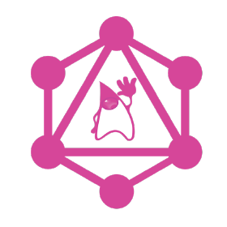

 Welome to Jack (Jiaqi)'s GitHub Page 
========================================================================================================================================

[ ![模之屋](https://img.shields.io/badge/模之屋-53B3F4?style=for-the-badge&logo=data:image/png;base64,iVBORw0KGgoAAAANSUhEUgAAABkAAAAYCAYAAAAPtVbGAAAABGdBTUEAALGPC/xhBQAAACBjSFJNAAB6JgAAgIQAAPoAAACA6AAAdTAAAOpgAAA6mAAAF3CculE8AAAABmJLR0QA/wD/AP+gvaeTAAAACXBIWXMAAAsSAAALEgHS3X78AAAAB3RJTUUH5ggLATIu29ytdgAAAZF6VFh0UmF3IHByb2ZpbGUgdHlwZSB4bXAAADiNjVRBcoMwDLzrFX2CkSzZPIdi+9aZHvv8roBgAiQtngQia7WrNQr9fH3Th186CsmcskwpW0nBimmKNnDw3zZbTeJ7UphtsGjN2FSmNb5nN2YO1Msg+OkQzbFo4BDFWgKQgyhXifgEZqlh4uALEhjFTSblGCnaiX/ddA05RawgEzhbWi6uCUlcF4rETQYZfXEjCcIIML7LWgR3SSPKQnbKXJzAt7uWs6IYTSmJCQLj0toIFyoUbgnwhcENJ1whjHgqdFwp06EpL2R3bS2aarcbz/DPChreMN7asJjY3vN1OpxUdvCZjt7xPUBu6oPu7NTDL9obmqKfxGi62bw5JhUnM/cmXuXRK4YOVKhMrnF221eYogwOKIKGVxr6X/o92e7XFIUc6q+XCkZkgDv6aOaYdpf1XJyu1TVARYYHM4bFtZXFD9k9Y7x64ZlKA70H/dVSJyUdb1nzlXOnvEXQeX64HSfoOkDH6e+5yhSR75tL+PLP5Dv0C18CGhl6KzH7AAAAAW9yTlQBz6J3mgAABepJREFUSMeVlFuMnWUVhp/1fd///3vPdGbPdGZ6GIZObemBjKm2thrwlEDQqCiYak0JCgYRo/HGC5ULE4sxxAuPMdELUkNBosGooDU2GDwQMQTTYNPSA20Zcei0nWnnuGf2/v/vW8uLaZBa8PDerzxZ7/uuJbcfKN+W4J6YTA2eyYN78pGv/O3UHfdvYSZ5Gj7y4A0Fr6WvmnHxz7N87x3dfOL3SoeU/tyCHwnYjd7JVhGmMy/fkd2/LfemGD+5riEEL+2X5jnZTvJQPbi9LWNCM+F8j2fZcThYn+PMLd1se6DJyHAHD90kfHnvs5zqfzO1Gm9Q1c+u6WJnTHb12FwKpUoqMnev7Nzf/t2Gbr1x96aMudJYTPDoC9Gm2/J4LXOfx9s/JAqaCzmeBQSnBinizSDkmFZb2lX6IarXvW84sKbbcaFl7H+xYlHD9x3QWl4TxuaVvc+XDNSFoU4kqt4SjZtPTkYmS1kZjOvNbKeVaTdqH3bIdh9c775D01SJOzXpdVGNyZaSgIG6sGNVQM1awQmjY/PKTWsCd43kjM4qL8wwlQe/z4mcW9sI3xjp4z01b2sPT5YdsTQXBRVkVpyc2H1tx2PBy59Q31+l9NGo1A5OJAqBiRZV5uV0CE6eG29S/vxklRcejk7ZuLqwR6A3xvitd1/lhmte+cNYZK40BMDAoB+lX0WuT+r/mgf3bRE5+vyU3lvG2FUpiHOz9SwcdVmQvyAydngycXDCJvDZ18zsTWVV3feuQRnuLeDAaMVc+xLg32RmpBi3t8v4XedlpjJ3fzJpCeCdHM29HHGr6uFY8O6nWebH60W4T1XXl2W8Z3OvZBt7Pb8ZjZQJRPiPUtX+sox7gpPREMI3nffnvXP7Ti24Cfn4E0ZwVa+aG4pJr21X8YFctOuuNxb88eXIoYmE/y+AV8t7f7Ceh9sVCjGOh8Sia3tIyJRTHa1Sujsm7doy4IlmHL3w/wEubbS1TPqBZluf82KLzhvu4vRZYnKUxnZVe2vuYMfKwMFziUpf5f0VWbw2xMwkqX2wUbgGokzuyXBXFfPMV4LBNlXrXr3M0SiEE9OKuzSYe+irySsg72BwmXvdnEx1Q1QbKqMw+HVwK2oreez9+1HVdWrGhh7HxKIy1TLWNhzD3Y5Nyz27NubkHtSgtxDuHMlZ0eFY3+PYvNyhl2/WMBhKIlQzEKasxueeurkwaw2KwHC34++zSs3Dh9ZnNKOhBjesCbw0p/z6dEV3IYz0Od4+6BnqcjhgdLakHQ1bsqye1IbbQL4ATpNQqdUQN5A7WF4TLraMj2zIWdkheC/ghMVo7N6cces1Gd2FMNkyOgtBBPrqwq5NGXl4ZRMxkdXihNELJSE5Q6vUpUkHOoIQBFoJNvY6ZtrGXNvorwkLcekf3bY5Z7ypVAnEoFkadS9s6nF0BKFVGWCY6uCX3lLIo7WWuYQQocug0wuUuuT7qk7HuobnqbHIeFMZqC+lHBxc3eUY6nIcmUwcmVRGlju6CyF3lzVh9YPHtZipHAFxmFIHagDtuNTXWoBkS82KemWDBCi8sKhG8EsO6GVFl0azlTJBW0GSYlAHsjIZM6URzUgGPYXwhW0Fy7Iruxoc3DGSYwaZg1KNUi/Rl8LvBPK2QmiVSpZRgIV2grNNZSHCbGn0FMLqTsfrqa/2L/jZprFQXfZECxGXeQPnnIBACP6wOf/yi3NLN/KTYyXnF5T/RUcvJn58rKSMl441+PGQudPJDBUIRRDMycUg/MiMj52ZT31JKZ49z8REq+x773DwWwc8PTW57I+VCc4tKE+fSTw5lloXWsyL0C8iSUQOBexxVWs7M+TuJ9oY1LxYvYn/jKl1l5V+Onj5RVJOOtHbVtTlmqFl1AfqjsxBMxrnmmZj8zY31eaQc+5hgVuTpq15CD9D5Egjiw+bl6YkVD51oIUgtFXIa6wQk6pZ2S5gWyPni80ovYuVvlPNdojIWjOri8i0mZ0I3j1T9+5pHzRfLPmBwK+6au6XUa30yWZxihn8E6ClCRfscKMFAAAAeGVYSWZNTQAqAAAACAAFARIAAwAAAAEAAQAAARoABQAAAAEAAABKARsABQAAAAEAAABSASgAAwAAAAEAAgAAh2kABAAAAAEAAABaAAAAAAAAAEgAAAABAAAASAAAAAEAAqACAAQAAAABAAAAVKADAAQAAAABAAAAUAAAAAD+Go4xAAAAJXRFWHRkYXRlOmNyZWF0ZQAyMDIyLTA4LTExVDAxOjM4OjIwKzAwOjAwFyUQKAAAACV0RVh0ZGF0ZTptb2RpZnkAMjAyMi0wOC0xMVQwMTozODoyMCswMDowMGZ4qJQAAAAodEVYdGRhdGU6dGltZXN0YW1wADIwMjItMDgtMTFUMDE6NTA6NDYrMDA6MDBvsD9BAAAAEnRFWHRleGlmOkV4aWZPZmZzZXQAOTBZjN6bAAAAF3RFWHRleGlmOlBpeGVsWERpbWVuc2lvbgA4NII7G+kAAAAXdEVYdGV4aWY6UGl4ZWxZRGltZW5zaW9uADgwWMAGdQAAABJ0RVh0dGlmZjpPcmllbnRhdGlvbgAxt6v8OwAAABV0RVh0dGlmZjpSZXNvbHV0aW9uVW5pdAAynCpPowAAABB0RVh0eG1wOkNvbG9yU3BhY2UAMQUOyNEAAAAXdEVYdHhtcDpQaXhlbFhEaW1lbnNpb24AMjYwCCEUPwAAABZ0RVh0eG1wOlBpeGVsWURpbWVuc2lvbgA4MI1Z9mEAAAAASUVORK5CYII=) ](https://www.aplaybox.com/u/359302990)

My name is Jiaqi. I am a CEO and Co-Founder of a private [data-tech startup](https://github.com/paion-data). We are a group of promoting [eudaimonia](https://www.youtube.com/watch?v=PrvtOWEXDIQ&list=PL-CLnI8tPXu-gONDgFuz4MfJU9GTqbshc) inside young hearts（为世界上所有的美好和快乐而努力）.

&nbsp;&nbsp;

---

My 
-----------

### Recent Activities

<!-- BILIBILI-RECENT-ACTIVITIES:START -->
- [原神 3.1，帅诺没得比](https://t.bilibili.com/713493157233295399)
- [七七二命了，好耶[崩坏3_吃饭团]](https://t.bilibili.com/704318132081131590)
- [论团队协作的重要性](https://t.bilibili.com/702005146170687526)
- [孤云阁 F4 初级打法](https://t.bilibili.com/699094678745645081)
- [小宝 我又来找你玩啦～](https://t.bilibili.com/699086355097976887)
<!-- BILIBILI-RECENT-ACTIVITIES:END -->

### Recent Uploads

<!-- BILIBILI-UPLOAD-LIST:START -->
- [原神 3.1，帅诺没得比](https://www.bilibili.com/video/BV1UD4y1y7tJ)
- [论团队协作的重要性](https://www.bilibili.com/video/BV1hB4y1g7Jp)
- [小宝 我又来找你玩啦～](https://www.bilibili.com/video/BV1PG411t79N)
<!-- BILIBILI-UPLOAD-LIST:END -->

### Columns

<!-- BILIBILI-COLUMNS:START -->
- [孤云阁 F4 初级打法](https://www.bilibili.com/read/cv18323080)
<!-- BILIBILI-COLUMNS:END -->

### Recently Liked-Saved-Tipped (一键三连) Videos

<!-- BILIBILI-TIPPED-VIDEOS:START --> <a href=https://www.bilibili.com/video/BV1VB4y1j7Nq>咻的一下抱走两个太阳</a>  <a href=https://www.bilibili.com/video/BV1he4y1z7Cs>赤王的秘密-坟头维密!!!!王陵大舞台，有梦你就来</a>  <a href=https://www.bilibili.com/video/BV1Ge411T7nj>【原神】一觉醒来👴和派蒙灵魂互换了！？</a>  <a href=https://www.bilibili.com/video/BV16e4y1H7ma>【波兰球】各国塞车时的反应（真逝事件）</a>  <a href=https://www.bilibili.com/video/BV14B4y1J7YQ>爱芽摇，但虫乱入</a> <!-- BILIBILI-TIPPED-VIDEOS:END -->

---

### Latest Genshin Impact News

#### Official

<!-- GENSHIN-IMPACT-LATEST-NEWS:START -->
- [《原神》杯中遥吟之歌活动过场动画-「待风归，启佳酿」](https://ys.mihoyo.com/main/news/detail/22855)
- [《原神》剧情PV-「『神』意」](https://ys.mihoyo.com/main/news/detail/22847)
- [《原神》剧情PV-「沙中遗事」](https://ys.mihoyo.com/main/news/detail/22846)
- [《原神》「派蒙的画作凯迪拉克联动篇」联动主题表情包现已上架](https://ys.mihoyo.com/main/news/detail/22844)
- [《原神》线上音乐会2022 - 无际之旅的旋律](https://ys.mihoyo.com/main/news/detail/22845)
<!-- GENSHIN-IMPACT-LATEST-NEWS:END -->

#### Bilibili

<!-- BILIBILI-GENSHIN-IMPACT-ACTIVITIES-COVER:START --> <!-- BILIBILI-GENSHIN-IMPACT-ACTIVITIES-COVER:END -->

<!-- BILIBILI-GENSHIN-IMPACT-ACTIVITIES:START -->
- [互动抽奖 #原神# #杯中遥吟之歌# 《原神》杯中遥吟之歌活动过场动画-「待风归，启佳酿」现已发布~ https://www.bilibili.com/video/BV1wD4y1y7CZ 从封上酒桶，到...](https://t.bilibili.com/713506067916521510)
- [《原神》杯中遥吟之歌活动过场动画-「待风归，启佳酿」](https://t.bilibili.com/713504109407240519)
- [恭喜@过去现在未来皆为空白 @世界什么的怎样都好 @四郎゛ 等10位同学中奖，已私信通知，详情请点击互动抽奖查看。](https://t.bilibili.com/713442184555135014)
- [互动抽奖 #原神# #剧情PV# 《原神》剧情PV-「『神』意」现已发布~ https://www.bilibili.com/video/BV1hW4y1e7Kx 时隔多日再会的海芭夏，似乎已经完成了林中的修...](https://t.bilibili.com/713134235413643265)
- [《原神》剧情PV-「『神』意」](https://t.bilibili.com/713133028530978950)
<!-- BILIBILI-GENSHIN-IMPACT-ACTIVITIES:END -->

### My  Channel

<!-- YOUTUBE-CHANNEL:START -->
- [[Genshin Impact] Cyno](https://www.youtube.com/watch?v=P1tIZhoSE9A)
- [This is Why Team Coordination is Crucial](https://www.youtube.com/watch?v=quIxpsqGo1w)
- [Guyun Stone Forest always reminds me of the 2022 Summer Fantasia Event](https://www.youtube.com/watch?v=CYzmvCc_XQU)
- [Kokomi is coming! Let&#39;s have some fun in Slumbering Court and get a Ocean-Hued Clam set for her](https://www.youtube.com/watch?v=MPBElzFOfAA)
- [Kokomi is coming! Let&#39;s have some fun in Slumbering Court and get a Ocean-Hued Clam set for her](https://www.youtube.com/watch?v=d7SuC2lQouI)
<!-- YOUTUBE-CHANNEL:END -->

**I'm thriving on creating a future where people never dominate the machine and machines won't slave the human; instead they both become happier together. I also believe that the world tomorrow belongs to [right-brainers](https://www.danpink.com/books/whole-new-mind/), those who are creative and excel in [Design](https://www.behance.net/jack20191124) and [Persuasion](https://trello.com/b/Ce84JiYh)**.

---

### My 

<!-- DESIGN-POST-LIST:START -->
- [[Color Palette] 雷电将军](https://www.behance.net/gallery/151020177/Color-Palette-)
- [[Design Practice] Vector Donut](https://www.behance.net/gallery/150426875/Design-Practice-Vector-Donut)
- [[Design Practice] Vector Peach](https://www.behance.net/gallery/150091831/Design-Practice-Vector-Peach)
- [[Design Practice] Paper Cut Out Effect](https://www.behance.net/gallery/149929601/Design-Practice-Paper-Cut-Out-Effect)
- [[Design Practice] 3D Isometric Illustration](https://www.behance.net/gallery/149824473/Design-Practice-3D-Isometric-Illustration)
<!-- DESIGN-POST-LIST:END -->

---

><a href="https://www.bilibili.com/video/BV1Ca411Q7aK?share_source=copy_web&vd_source=7f40ee8f7150cba61ecdf3d901bbad42">
>    
></a>
>
> I'd like to take this moment to thank Yahoo!, my former employeer, who fundamentally setup my career and my unperishable passion for data tech. Thank you Yahoo! ❤️
>  
>  
> This page is also dedicated to my former colleague [Rick Jensen](https://github.com/cdeszaq), my life-long teacher on Software Engineering. Having been the best tech leader I've seen, he treats software design, programming, and code review a as a work of art. I will [follow his philosophy and, with tremendous sincerity, respect him as my role model in tech area](https://github.com/QubitPi/java-code-review-guide-book)

Attribution - Bilibili <a href="https://www.bilibili.com/video/BV1Ca411Q7aK?share_source=copy_web&vd_source=7f40ee8f7150cba61ecdf3d901bbad42">海螺张</a>
 

Attribution - Bilibili <a href="https://www.bilibili.com/video/BV1VB4y1h7Km?share_source=copy_web&vd_source=7f40ee8f7150cba61ecdf3d901bbad42">夜猫社的樱花庄</a>
 

My Open Source Projects 
--------------------

I belive in creating software using the open source way, a set of principles built upon an open forum for ideas where communities can form around solving a problem or developing a new technology. This philosophy affects everything my group do in Tech Industry as most of today’s IT leaders, who agree that enterprise open source is important, do

Open source software gains its strength from diverse communities of developers around the world. That’s why I’ve, since the beginning of my career in 2015, kept my eyes and hands dirty on studying and practicing developing open projects and technologies, protecting and defending open source intellectual property, and recruiting developers who actively participate in open projects across the IT stack. This experience helps inform a development model to produce more innovative, iterative, stable, and secure technologies.

By tapping into the collective talent and innovation of open source communities, I believe my team can create better software. This collaboration helps fuel much of the technology we use today

<!--  -->

### Creator

### Contributor

### Active Forks

&nbsp;
&nbsp;
&nbsp;

&nbsp;
&nbsp;
&nbsp;
&nbsp;
&nbsp;
&nbsp;
&nbsp;
&nbsp;
&nbsp;
&nbsp;
&nbsp;
&nbsp;
&nbsp;
&nbsp;

My Tech Blogs
-------------

### Tech Management Topics

<!-- MGMT-BLOG-POST-LIST:START -->
- [&lpar;WIP&rpar; Learning from Atlassian’s Team Playbook](https://qubitpi.github.io/jersey-guide/management/2022/09/21/learning-from-atlassian-team-playbook.html)
- [The Agile Coach - A Guide to Agile Development](https://qubitpi.github.io/jersey-guide/management/2022/09/20/agile.html)
- [What happens when you eliminate test and QA? Fewer errors and faster development, say Yahoo’s tech leaders](https://qubitpi.github.io/jersey-guide/management/2022/09/20/no-qa.html)
- [How to Make Your One-on-Ones with Employees More Productive](https://qubitpi.github.io/jersey-guide/management/2022/09/07/one-on-one.html)
- [&lpar;WIP&rpar; Standardizing Backend Software Configuration](https://qubitpi.github.io/jersey-guide/management/2022/09/07/standardizing-ws-config.html)
<!-- MGMT-BLOG-POST-LIST:END -->

#### Building Tech Infrustructure for Startup

1. [Deploying Jenkins](https://qubitpi.github.io/jersey-guide/finalized/2022/09/28/kubernetes-basics.html)
2. [Deploying Kubernetes](https://qubitpi.github.io/jersey-guide/finalized/2022/09/28/kubernetes-basics.html)
3. [Building Repository Management Infrastructure](https://qubitpi.github.io/jersey-guide/finalized/2022/10/02/nexus.html)

#### scrum.org community blogs

<!-- SCRUM-DOT-ORG-BLOGS:START -->
- [Allan Kelly: Honey, ich habe das Backlog geschrumpft — Hands-on Agile #44](https://www.scrum.org/resources/blog/allan-kelly-honey-ich-habe-das-backlog-geschrumpft-hands-agile-44)
- [Digital Transformation and Scrum](https://www.scrum.org/resources/blog/digital-transformation-and-scrum)
- [What&#39;s wrong with a Mid Sprint Check-in or Mid Sprint Review?](https://www.scrum.org/resources/blog/whats-wrong-mid-sprint-check-or-mid-sprint-review)
- [[VLOG] Project Management vs Product Management](https://www.scrum.org/resources/blog/vlog-project-management-vs-product-management)
- [Why Limiting Work in Progress Matters for Scrum](https://www.scrum.org/resources/blog/why-limiting-work-progress-matters-scrum)
<!-- SCRUM-DOT-ORG-BLOGS:END -->

### New Tech Blogs

<!-- BLOG-POST-LIST:START -->
- [Building Repository Management Infrastructure](https://qubitpi.github.io/jersey-guide/finalized/2022/10/02/nexus.html)
- [Kubernetes Basics](https://qubitpi.github.io/jersey-guide/finalized/2022/09/28/kubernetes-basics.html)
- [Provider v.s. @Provider](https://qubitpi.github.io/jersey-guide/finalized/2022/09/24/diprovider-vs-provider-annotation.html)
- [Deploying Jenkins to AWS and Kubernetes/EKS](https://qubitpi.github.io/jersey-guide/finalized/2022/09/22/jenkins-on-aws.html)
- [Single Responsibility Principle - What Defines a Reason to Change?](https://qubitpi.github.io/jersey-guide/finalized/2022/09/13/single-responsibility-principle-what-is-reason.html)
<!-- BLOG-POST-LIST:END -->

<a href="https://www.bilibili.com/video/BV15v4y137C4?share_source=copy_web&vd_source=7f40ee8f7150cba61ecdf3d901bbad42">
    那条让三蹦子刀掉爱莉希雅的狗，胡堂主今天就送你往生 :)
</a>

### WIP Tech Blogs (Studying...)

<!-- WIP-BLOG-POST-LIST:START -->
- [Introduction to ReactiveX Java - RxJava](https://qubitpi.github.io/jersey-guide/wip/2022/08/19/reactivex-java.html)
- [Machine Learning - Understanding the Philosophy of Learning through Kant’s Critique of Pure Reason](https://qubitpi.github.io/jersey-guide/wip/2022/08/12/ml-philosophy-of-learning.html)
- [Artificial Neural Networks - Linear Algebra Basics](https://qubitpi.github.io/jersey-guide/wip/2022/08/11/linear-algebra.html)
- [Machine Learning - Artificial Neural Networks](https://qubitpi.github.io/jersey-guide/wip/2022/08/09/artificial-neural-networks.html)
- [Machine Learning - Evaluating Hypothesis](https://qubitpi.github.io/jersey-guide/wip/2022/08/08/evaluating-hypothesis.html)
- [Introduction to Knowledge Graph Embeddings &lpar;KGE&rpar;](https://qubitpi.github.io/jersey-guide/wip/2022/08/07/knowledge-graph-embeddings.html)
<!-- WIP-BLOG-POST-LIST:END -->

Attribution - Bilibili <a href="https://www.bilibili.com/video/BV1B94y197ew?share_source=copy_web&vd_source=7f40ee8f7150cba61ecdf3d901bbad42">苏帕帕瓦</a> 

 My Coffee-Morning Data Tech & Design News Central
-----------------------------------

<h3></h3>

#### Twitter

<!-- GRAPHQL-TWITTER:START -->
- [Thrilled to welcome one of the newest members of the GraphQL Foundation, Read more about why Inigo&#39;s joined the GraphQL Foundation:](https://twitter.com/GraphQL/status/1562123613632835584)
- [Take a moment to share your thoughts and opinions about the state of GraphQL in this Brought to you by the fine folks behind StateOfJS](https://twitter.com/GraphQL/status/1538564611045085185)
- [RT Lee Byron: Thanks to our sponsors, it&#39;s now free to join GraphQL Conf &lpar;+ OpenJS World and cdCon, all one mega-conf!&rpar; Live talks, social events, and...](https://twitter.com/leeb/status/1530193408567828481)
- [DataLoader is back to release cadence! @singh_saihaj from @TheGuildDev just released v2.1.0 - the first version since creating the new roadmap Check i...](https://twitter.com/GraphQL/status/1514283679299813382)
- [RT GraphiQL: We have news about GraphiQL 2&#39;s design! 🎉 After all the great feedback from the community, we&#39;ve incorporated changes around theming, ...](https://twitter.com/GraphiQL/status/1508062921766674439)
<!-- GRAPHQL-TWITTER:END -->

#### Study Notes

* [GraphQL Resolvers](https://qubitpi.github.io/jersey-guide/finalized/2022/09/06/graphql-resolvers.html)
* [GraphQL Reference Guide](https://qubitpi.github.io/jersey-guide/finalized/2022/04/26/graphql.html)
* [React - The GraphQL Frontend](https://qubitpi.github.io/jersey-guide/finalized/2022/08/30/react-basics.html)
* [Setting Up a Minimized GraphQL Server](https://qubitpi.github.io/jersey-guide/finalized/2021/08/18/example-graphql-server.html)

#### [GraphQL Specification](https://graphql.org/foundation/join/#graphql-specification) Significant Changes

<ul>
<!-- GRAPHQL-SPEC-SIGNIFICANT-CHANGES:START --><li>Thu Sep 01 2022 7:38 PM <a href=https://github.com/graphql/graphql-spec/commit/3aa021fb3651710508a37e13c71b7268189982f9>separate out IsSubType from IsValidImplementationFieldType &lpar;#977&rpar;</a></li><li>Mon Jun 27 2022 5:34 PM <a href=https://github.com/graphql/graphql-spec/commit/47a6bfdba35ad9b96cba501a52593d3f04c8c5e9>Editorial: Clarify intro for inline fragments &lpar;#969&rpar;</a></li><li>Thu Jun 23 2022 11:27 PM <a href=https://github.com/graphql/graphql-spec/commit/3885a64f3dc0f9cb64b43aaf1f77e661d98f4dca>Editorial: Error Terminology &lpar;#966&rpar;</a></li><li>Tue Jun 21 2022 8:17 PM <a href=https://github.com/graphql/graphql-spec/commit/9a96fc40f2307af15eecc3a257f85ec49adf50d9>Editorial: Clarity about subject being a GraphQL service or system &lpar;#965&rpar;</a></li><li>Tue Jun 21 2022 8:09 PM <a href=https://github.com/graphql/graphql-spec/commit/57bd86d779482e9167d2113a9ba926e2ecb74dcc>Editorial: Fix reference to object in interface introspection &lpar;#964&rpar;</a></li><!-- GRAPHQL-SPEC-SIGNIFICANT-CHANGES:END -->
</ul>

#### [GraphQL Java](https://www.graphql-java.com/) Significant Changes

##### [ANTLR Grammar](https://github.com/graphql-java/graphql-java/tree/master/src/main/antlr) Changes

<ul>
<!-- GRAPHQL-JAVA-SIGNIFICANT-CHANGES-ANTLR:START --><li>Mon Dec 20 2021 4:02 AM <a href=https://github.com/graphql-java/graphql-java/commit/4a82b0bbd1483d148f3abf575fe705be6d2b0f70>Allow leading pipe in directive SDL, and add leading union pipe tests &lpar;#2650&rpar;</a></li><li>Wed Jul 14 2021 1:54 AM <a href=https://github.com/graphql-java/graphql-java/commit/dd290eabdc219ba5e725e0364cddcd2210fa169b>Update ANTLR grammar with new SourceCharacter definition</a></li><li>Tue Jun 29 2021 1:10 AM <a href=https://github.com/graphql-java/graphql-java/commit/5b12cbeff757c7280177375814b92a4387db152f>Add full Unicode to parser, the happy path</a></li><li>Sun Jun 27 2021 12:19 PM <a href=https://github.com/graphql-java/graphql-java/commit/f6460192969fdd87d3dcc12c3801e095ca58e90c>Fix extend type parsing issue &lpar;#2393&rpar;</a></li><li>Sun Nov 15 2020 11:56 PM <a href=https://github.com/graphql-java/graphql-java/commit/ff3f6918330b9c78321b2fe6fce615ce2b155eac>Repeatable directives support &lpar;#2015&rpar;</a></li><!-- GRAPHQL-JAVA-SIGNIFICANT-CHANGES-ANTLR:END -->
</ul>

<h3></h3>

#### Twitter

<!-- OPENSTACK-TWITTER:START -->
- [RT Mark Collier 柯理怀: THANK YOU to the over 700 developers who contributed to the 26th on-time release of OpenStack! Hope to see everyone in Vancouv...](https://twitter.com/sparkycollier/status/1577778456439525382)
- [RT Ghanshyam Mann: Thanks to all the contributors for another on time and successful release. It&#39;s all your 6 months of hard work and keeping @OpenSta...](https://twitter.com/GmannInCloud/status/1577710090219851777)
- [RT Kendall Nelson: I honestly never thought when I started working on @OpenStack during the #Liberty release that I would still be around to see the e...](https://twitter.com/knelson92/status/1577702508910313474)
<!-- OPENSTACK-TWITTER:END -->

<h4></h4>

<!-- DOCKERHUB-BLOG:START -->
- [How to Use the Postgres Docker Official Image](https://www.docker.com/blog/how-to-use-the-postgres-docker-official-image/)
- [Simplified Deployment of Local Container Images to OpenShift](https://www.docker.com/blog/deployment-of-local-container-images-to-openshift/)
- [September 2022 Newsletter](https://www.docker.com/blog/september-2022-newsletter/)
- [September Extensions Roundup: Test APIs, Use Oracle SQLcl, and More](https://www.docker.com/blog/new-extensions-september-2022/)
- [Creating Kubernetes Extensions in Docker Desktop](https://www.docker.com/blog/creating-kubernetes-extensions-in-docker-desktop/)
<!-- DOCKERHUB-BLOG:END -->

<h4></h4>

##### Blogs

<!-- KUBERNETES-BLOG:START -->
- [Blog: Current State: 2019 Third Party Security Audit of Kubernetes](https://kubernetes.io/blog/2022/10/05/current-state-2019-third-party-audit/)
- [Blog: Introducing Kueue](https://kubernetes.io/blog/2022/10/04/introducing-kueue/)
- [Blog: Kubernetes 1.25: alpha support for running Pods with user namespaces](https://kubernetes.io/blog/2022/10/03/userns-alpha/)
- [Blog: Enforce CRD Immutability with CEL Transition Rules](https://kubernetes.io/blog/2022/09/29/enforce-immutability-using-cel/)
- [Blog: Kubernetes 1.25: Kubernetes In-Tree to CSI Volume Migration Status Update](https://kubernetes.io/blog/2022/09/26/storage-in-tree-to-csi-migration-status-update-1.25/)
<!-- KUBERNETES-BLOG:END -->

##### [Kubernetes Documentation](https://kubernetes.io/docs/home/) Updates

<!-- KUBERNETES-DOC-CHANGES:START --><li>Wed Oct 05 2022 11:09 PM <a href=https://github.com/kubernetes/website/pull/37173>Make &quot;Pod&quot; uppercase for consistency in this file</a></li><li>Wed Oct 05 2022 6:44 PM <a href=https://github.com/kubernetes/website/pull/37170>update commitee-steering alias following 2022 election</a></li><li>Wed Oct 05 2022 6:43 PM <a href=https://github.com/kubernetes/website/pull/37169>update release managers</a></li><li>Wed Oct 05 2022 7:25 AM <a href=https://github.com/kubernetes/website/pull/37158>added warning about indefinitely running resources</a></li><li>Tue Oct 04 2022 10:38 PM <a href=https://github.com/kubernetes/website/pull/37156>blog: followup to PR 36971 to add suggestions to third party security audit blog</a></li><!-- KUBERNETES-DOC-CHANGES:END -->

##### [Helm Documentation](https://helm.sh/docs/) Updates

<!-- HELM-DOC-CHANGES:START --><li>Sat Oct 01 2022 5:24 PM <a href=https://github.com/helm/helm-www/commit/38cc4a3c422344d3cbb3f13d54e688c3a6bc58ce>Update localization.md</a></li><li>Wed Sep 21 2022 6:11 PM <a href=https://github.com/helm/helm-www/commit/49b49d2630522f74f1844fa784b8b45b8aa2171e>Updated for the latest Helm release</a></li><li>Mon Sep 19 2022 9:40 PM <a href=https://github.com/helm/helm-www/commit/4eae4e37619870a047183869ba26a2330d08926f>Update registries.md with additional OCI information</a></li><li>Thu Sep 15 2022 10:32 AM <a href=https://github.com/helm/helm-www/commit/f65888dd8ef87acf8bf91eded9e59e3907cffd2e>Merge pull request #1347 from w7089/patch-2</a></li><li>Thu Sep 15 2022 10:15 AM <a href=https://github.com/helm/helm-www/commit/7c309cfea0ca7271db16851b3d981f7034c0d464>Merge pull request #1351 from dbarkelew/patch-2</a></li><!-- HELM-DOC-CHANGES:END -->

##### Study Notes

* [Kubernetes Basics](https://qubitpi.github.io/jersey-guide/finalized/2022/09/28/kubernetes-basics.html)

<h4></h4>

<!-- LETS-ENCRYPT-BLOG:START -->
- [Remembering Peter Eckersley](https://letsencrypt.org/2022/09/12/remembering-peter-eckersley.html)
- [A New Life for Certificate Revocation Lists](https://letsencrypt.org/2022/09/07/new-life-for-crls.html)
- [Nurturing Continued Growth of Our Oak CT Log](https://letsencrypt.org/2022/05/19/database-to-app-tls.html)
- [TLS Beyond the Web: How MongoDB Uses Let’s Encrypt for Database-to-Application Security](https://letsencrypt.org/2022/04/28/database-to-app-tls.html)
- [Let’s Encrypt Receives the Levchin Prize for Real-World Cryptography](https://letsencrypt.org/2022/04/13/receiving-the-levchin-prize.html)
<!-- LETS-ENCRYPT-BLOG:END -->

#### Study Notes

* [OpenVPN](https://qubitpi.github.io/jersey-guide/finalized/2021/10/03/open-vpn.html)
* [Deploying Jenkins to AWS](https://qubitpi.github.io/jersey-guide/finalized/2022/09/22/jenkins-on-aws.html)
* [OpenStack Reference Guide](https://qubitpi.github.io/jersey-guide/finalized/2021/08/20/openstack.html)
* [Rancher - A Virtualized CI/CD on top of Kubernetes](https://qubitpi.github.io/jersey-guide/finalized/2021/08/05/rancher.html)

<h3></h3>

> "Users own their own data, not corporations"
> 
> \- [Web3 Foundation](https://web3.foundation/about/)

**I'm not a fan of Blockchain, but a fan of Blockchain linked to _Data_ through Web3.0**

#### Twitter

<!-- WEB3-FOUNDATION-TWITTER:START -->
- [Tomorrow, on October 5th at 1pm UTC, join @DrW3RK, @keeganquigley_ to find out more about staking on @Polkadot`s AMA that focuses on all practical “h...](https://twitter.com/Web3foundation/status/1577223750516449280)
- [RT Polkadot: For those in NYC: on Sept 21st, learn all about Polkadot’s next-generation governance system, Gov2, from @Web3foundation`s @DrW3RK. Regi...](https://twitter.com/Polkadot/status/1572230607194791940)
- [“I&#39;m delighted to speak at @TheEconomist Metaverse Summit. For the metaverse to fulfill its potential, we need to create the right conditions for the...](https://twitter.com/Web3foundation/status/1570065549626843137)
- [Re W3F continues to support the expansion of the Web 3.0 ecosystem. If you’re interested in development &amp; research related to @Polkadot, @Kusamanetwo...](https://twitter.com/Web3foundation/status/1569284627109380098)
- [Re A shoutout to @massbitprotocol for receiving a W3F grant to develop MassBit Route, a decentralized API service built on a @Substrate_io framework w...](https://twitter.com/Web3foundation/status/1569284624836349953)
<!-- WEB3-FOUNDATION-TWITTER:END -->

#### Study Notes

* [Web3 X](https://qubitpi.github.io/jersey-guide/finalized/2022/09/08/web-3-dot-0.html)
* [Blockchain 101](https://qubitpi.github.io/jersey-guide/finalized/2022/09/08/blockchain-101.html)

<h3></h3>

#### ArangoDB

##### Twitter

<!-- ARANGO-TWITTER:START -->
- [Join CEO Shekhar Iyer as we wrap up day 2 of ArangoDB Summit! 🔥 👇🥑 #ArangoDBSummit22](https://twitter.com/arangodb/status/1577733606272663552)
- [Happening now - Kevin Bayes &amp; Anna Spyker of @DecodedHealth in the industry track. 🔥 ArangoDB Summit day is wrapping up shortly, but you can still ...](https://twitter.com/arangodb/status/1577724074142437406)
- [Our final presentation in our thought leadership track is now with Ashleigh Faith. 🔥 Listen in here! 👇🥑 #ArangoDBSummit22](https://twitter.com/arangodb/status/1577724070271094813)
- [Get your final dose of use cases with Ray Gill &amp; Jim Davidson of @jamasoftware. 🔥 Listen in now! 👇🥑 #ArangoDBSummit22](https://twitter.com/arangodb/status/1577724068241051668)
- [Listen to Matthias Fey of PyTorch Geometric now in our industry track. 🔥 Join the stream here! 🥑 #ArangoDBSummit22](https://twitter.com/arangodb/status/1577724061815377935)
<!-- ARANGO-TWITTER:END -->

##### Official Blogs

<!-- ARANGO-BLOGS:START -->
- [August 2022: What&#39;s the Latest with ArangoDB? ArangoDB Newsletter: August 2022](https://rss.app/articles/cb4e791f6f6d729c04434f0c7ec4b4850c111423513cbdec8db0d748d7c9379fad1eb75d378f813ca1bf3428985753c624913da3df137f1294)
- [July 2022: What&#39;s the Latest with ArangoDB? ArangoDB Newsletter: July 2022](https://rss.app/articles/cb4e791f6f6d729c04434f0c7ec4b4850c111423513cbdec8db0d748d7c93790ad1eb75d378f813ca1bf3428985753c624913da3df137f1194)
- [What is a Graph Database? What is a Graph Database](https://rss.app/articles/cb4e791f6f6d729c04434f0c7ec4b4850c111423513cbdec8db0d748d7c93790ad08ad5d2dc5872beef3772a9d454fcb7d8139a593402a57de24)
- [May 2022: What&#39;s the Latest with ArangoDB? ArangoDB Newsletter: May 2022](https://rss.app/articles/cb4e791f6f6d729c04434f0c7ec4b4850c111423513cbdec8db0d748d7c93792ad1eb75d378f813ca1bf3428985753c624913da3df137f1094)
- [April 2022: What&#39;s the Latest with ArangoDB? ArangoDB Newsletter: April 2022](https://rss.app/articles/cb4e791f6f6d729c04434f0c7ec4b4850c111423513cbdec8db0d748d7c93793ad1eb75d378f813ca1bf3428985753c624913da3df137f1794)
<!-- ARANGO-BLOGS:END -->

##### Study Notes

* [Graph Analytics and Machine Learning through ArangoDB](https://qubitpi.github.io/jersey-guide/finalized/2022/09/03/ml-arango.html)
* [ArangoDB Query Language (AQL)](https://qubitpi.github.io/jersey-guide/finalized/2022/09/02/arango-aql.html)
* [ArangoDB Java Driver](https://qubitpi.github.io/jersey-guide/finalized/2022/09/05/arango-java-driver.html)
* [ArangoDB Graphs](https://qubitpi.github.io/jersey-guide/finalized/2022/09/03/arango-general-graphs.html)
* [ArangoDB Reference Guide](https://qubitpi.github.io/jersey-guide/finalized/2022/08/19/arangodb.html)
* [ArangoDB Architecture](https://qubitpi.github.io/jersey-guide/finalized/2022/09/05/arango-architecture.html)

#### Memgraph

##### Twitter

<!-- MEMGRAPH-TWITTER:START -->
- [Check out our blog post 📰 How to migrate from #Neo4j to #Memgraph ➡️](https://twitter.com/memgraphdb/status/1577920852137578499)
- [Check out our blog post 📰 WASM to the Moon - Introducing the Very First #WASM Based Client ➡️](https://twitter.com/memgraphdb/status/1577901975542317056)
- [Re @BenGamble7 @daveklein @supe_katarina This was so close call. A real photo finish situation.](https://twitter.com/memgraphdb/status/1577892913664729088)
- [Congratulations @daveklein! We hope that you will enjoy your prize :&rpar; #memgraph #Current22](https://twitter.com/memgraphdb/status/1577892652057591810)
- [Hi @BenGamble7, don&#39;t forget to come to #Memgraph booth at 3 P.M. to check your position on the leaderboard and to see if you have won the prize! #Cur...](https://twitter.com/memgraphdb/status/1577737185159249921)
<!-- MEMGRAPH-TWITTER:END -->

##### Links

* [Newsletter](https://memgraph.com/newsletter/)
* [Blogs](https://memgraph.com/blog)
* [Community Forum](https://discourse.memgraph.com/)

#### Neo4J

##### Twitter

<!-- NEO4J-TWITTER:START -->
- [Beren Erchamion takes his first steps with graph databases setting up Neo4j Community Server on his MacBook Pro. #neo4j #Neo4jCommunity](https://twitter.com/neo4j/status/1577752499523665942)
- [Keep your Cypher queries clean! Simply feed them to format_cypher.java, and let it clean and organize your queries for you — @rotnroll666 #neo4j #cyp...](https://twitter.com/neo4j/status/1577722548720209946)
- [We know you were waiting for a new book!🙋 Say hello to the &quot;Full Stack GraphQL Applications&quot; book by William Lyon. In this blog, he gives you a sne...](https://twitter.com/neo4j/status/1577720347520110609)
- [Great news! 💥 We&#39;ve released flex templates for Google Cloud Dataflow, which support complex ETL processes through configuration, not code. Read mo...](https://twitter.com/neo4j/status/1577682555167559685)
- [The 4th edition of NODES comes with Multi-time zone coverage with live, convenient sessions for the Americas, Europe, Middle East, Africa, and Asia-Pa...](https://twitter.com/neo4j/status/1577614661159116800)
<!-- NEO4J-TWITTER:END -->

##### YouTube

<!-- NEO4J-YOUTUBE:START -->
- [58 - Introducing Workspaces, a New Experience for Neo4j Developer Tools](https://www.youtube.com/watch?v=isCriRgnFDk)
- [57 - New! Monitoring and Administration with Neo4j Ops Manager](https://www.youtube.com/watch?v=_XMdDM9FojY)
- [56 - Encrypting and Protecting Your Data in Neo4j](https://www.youtube.com/watch?v=2MsAdy7S0ok)
- [54 - Top 10 Cypher Tuning Tips &amp; Tricks](https://www.youtube.com/watch?v=DAlWoamQ41Q)
- [50 - Toolbelt Trifecta: Connecting to Neo4j with Java and AWS Lambda](https://www.youtube.com/watch?v=HwetrY62ZbU)
<!-- NEO4J-YOUTUBE:END -->

#### JanusGraph

<!-- JANUSGRAPH-TWITTER:START -->
- [RT ScyllaDB: Learn how @JanusGraph leverages ScyllaDB &amp; explore potential use cases for the integration #graph #NoSQL #ScyllaDB #OpenSource #DEVCommun...](https://twitter.com/ScyllaDB/status/1565384501559279616)
- [RT gdotv: G.V&lpar;&rpar; 0.9.25 is out! Highlights: - Gremlin Query Debugging for all 🪲 - Query Editor UX Improvements - Various bug fixes - more! Free to d...](https://twitter.com/gdotv_ltd/status/1561777125383966726)
- [RT ScyllaDB: Learn about the broader #ScyllaDB ecosystem: #ApacheSpark, #ApacheKafka, @datadoghq @iota Chronicle, @JanusGraph @opennms Newts &amp; more �...](https://twitter.com/ScyllaDB/status/1561775885463818241)
- [RT Anant Corporation: In Data Engineer&#39;s Lunch #65, Ryan Quey will discuss the Graph Notebook tool put out by the @AWS team on @JanusGraph.](https://twitter.com/anantcorp/status/1546947807055077378)
- [Re @apachetinkerpop This should of course read JanusGraph​.Net and Gremlin​.Net.](https://twitter.com/JanusGraph/status/1542092798710661122)
<!-- JANUSGRAPH-TWITTER:END -->

<h3></h3>

<!-- DRIBBBLE-TRENDING:START -->
- [Pictograms &lpar;WIP&rpar;](https://dribbble.com/shots/19536810)
- [product page: web design](https://dribbble.com/shots/19561471)
- [Essential UX Statistics, Insights &amp; Best Practices](https://dribbble.com/shots/19526556)
- [RADAR - Web3 projects aggregator mobile app](https://dribbble.com/shots/19564396)
- [News Reader](https://dribbble.com/shots/19561569)
<!-- DRIBBBLE-TRENDING:END -->

Git Data Analytics - Everything is Datable
------------------------------------------

### My Pull Requests (PR) Analysis

> [Pull Requests should be small](https://qubitpi.github.io/jersey-guide/management/2022/09/01/small-changes.html). This graph indicates whether or not I am following good tech standards:
> 
> 

 

 
 
 
 
 
 
 
 
 
 
 
 
 
 
 
 
 
 
 
 
 
 
 
 
 
 
 
 
 
 
 
 
 
 
 
 
 
 
 
 
 

Attribution - <a href="https://www.bilibili.com/video/BV1Dq4y1D7cr?p=3">原宝</a>
 

