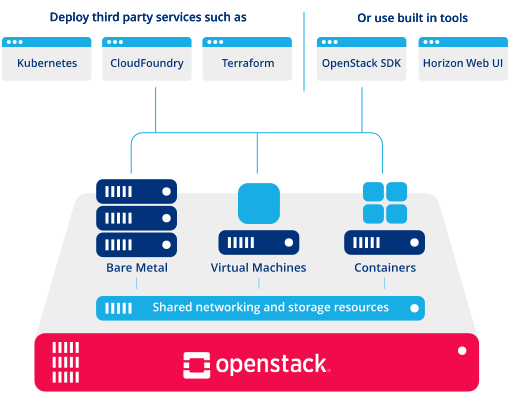

<div align="right">
    
> To my dearest Mom and Grandma who teach me how to love this world with ❤️
    
</div> 

<div align="center">

[](https://readings.qubitpi.org/)
[](https://huggingface.co/QubitPi)
[](https://jupyter-notebooks.qubitpi.org/)
[](https://www.youtube.com/@QubitPi)
[](https://space.bilibili.com/1771839550)
[](https://enka.network/u/MyGenshinTeams/312Vco)

[](https://trello.com/b/eB2miz73/tarot-daily-reading-2024)
[](https://github.com/QubitPi/general-relativity)
[](https://awesome.qubitpi.org/)
[](https://www.behance.net/jack20191124)
[](https://www.zhihu.com/people/jack20191124)

<!-- [![HelloTalk](https://img.shields.io/badge/HelloTalk-0054F7?style=for-the-badge&logoColor=white&logo=data:image/svg+xml;base64,PD94bWwgdmVyc2lvbj0iMS4wIiBlbmNvZGluZz0idXRmLTgiPz48IS0tIFVwbG9hZGVkIHRvOiBTVkcgUmVwbywgd3d3LnN2Z3JlcG8uY29tLCBHZW5lcmF0b3I6IFNWRyBSZXBvIE1peGVyIFRvb2xzIC0tPg0KPHN2ZyB3aWR0aD0iODAwcHgiIGhlaWdodD0iODAwcHgiIHZpZXdCb3g9IjAgMCA0OCA0OCIgaWQ9IkxheWVyXzIiIGRhdGEtbmFtZT0iTGF5ZXIgMiIgeG1sbnM9Imh0dHA6Ly93d3cudzMub3JnLzIwMDAvc3ZnIj48ZGVmcz48c3R5bGU+LmNscy0xe2ZpbGw6bm9uZTtzdHJva2U6I2ZmZmZmZjtzdHJva2UtbGluZWNhcDpyb3VuZDtzdHJva2UtbGluZWpvaW46cm91bmQ7fTwvc3R5bGU+PC9kZWZzPjxwYXRoIGNsYXNzPSJjbHMtMSIgZD0iTTQzLjUsMjIuODNjMC04LjY4LTguNzMtMTUuNzEtMTkuNS0xNS43MS0xMC4yNiwwLTE4Ljc2LDYuNDEtMTkuNDUsMTQuNjYsMCwuMzQsMCwuNjksMCwxQzQuNSwzMSwxMi4xNywzNy42NCwyMiwzOC40NWgwYzIsLjEsMS44Mi4zMSwxLjgyLDEuNjJoMGMwLDEuMzEtLjA1LDIuODMtLjA1LDIuODMsMCwuOTIuNTEsMSwxLjE5LDEsMS4zLDAsNi4zNy0zLjE5LDkuMDctNS40NmEzMC45MywzMC45MywwLDAsMCw3Ljc5LTkuMjFoMGExMy4yOCwxMy4yOCwwLDAsMCwxLjY1LTUuMzJDNDMuNDgsMjMuNTMsNDMuNSwyMy4xOCw0My41LDIyLjgzWk0zMC4zNiwzMi4yMmEzLjA2LDMuMDYsMCwwLDEtMy4wNi0zLjA2aDBhMy4wNywzLjA3LDAsMSwxLDMuMDYsMy4wNlpNMjQuMzQsMTlhNC4zNSw0LjM1LDAsMCwxLDQuMzUtNC4zNWgwQTQuMzUsNC4zNSwwLDAsMSwzMywxOWgwYTQuMzUsNC4zNSwwLDEsMS04LjcsMFptLTcsMTEuNzJoMEE1LjY2LDUuNjYsMCwxLDEsMjMsMjUuMSw1LjY2LDUuNjYsMCwwLDEsMTcuMzcsMzAuNzZaIi8+PC9zdmc+)](https://hellotalk.cn/u/_Klee_) -->

[](mailto:jack20220723@gmail.com)
[](mailto:jiaqiliu@paion-data.dev)
[](https://calendar.google.com/calendar/u/0/embed?src=jack20220723@gmail.com&ctz=Asia/Shanghai&mode=WEEK&wkst=2)

[-EC585D?style=for-the-badge)](https://www.reddit.com/r/ChineseLanguage/comments/dr4i2n/comment/f6ewc34/?utm_source=share&utm_medium=web2x&context=3)

-2E71E5?style=for-the-badge)
[-178fd6?style=for-the-badge)](https://en.wikipedia.org/wiki/Attic_Greek)
[-178fd6?style=for-the-badge)](https://hmmlschool.org/latin/)
[](https://persian.qubitpi.org/study-notes.pdf)
[![Quizlet](https://img.shields.io/badge/Quizlet-4255FF?style=for-the-badge&logoColor=white&logo=data:image/svg+xml;base64,PD94bWwgdmVyc2lvbj0iMS4wIiBlbmNvZGluZz0idXRmLTgiPz48IS0tIFVwbG9hZGVkIHRvOiBTVkcgUmVwbywgd3d3LnN2Z3JlcG8uY29tLCBHZW5lcmF0b3I6IFNWRyBSZXBvIE1peGVyIFRvb2xzIC0tPg0KPHN2ZyB3aWR0aD0iODAwcHgiIGhlaWdodD0iODAwcHgiIHZpZXdCb3g9IjAgMCA0OCA0OCIgeG1sbnM9Imh0dHA6Ly93d3cudzMub3JnLzIwMDAvc3ZnIj48ZGVmcz48c3R5bGU+LmF7ZmlsbDpub25lO3N0cm9rZTojZmZmZmZmO3N0cm9rZS1saW5lY2FwOnJvdW5kO3N0cm9rZS1saW5lam9pbjpyb3VuZDt9PC9zdHlsZT48L2RlZnM+PHBhdGggY2xhc3M9ImEiIGQ9Ik0yNS4zOTQzLDIuNTQ1NUEyMS4xNDcxLDIxLjE0NzEsMCwwLDAsNy45Nzk0LDkuODYzOWEyMS4zNSwyMS4zNSwwLDAsMCw3LjAwNDMsMzMuMjQwNiwyMS4xMSwyMS4xMSwwLDAsMCwxOC44NzItLjQwNjMuNTg3NS41ODc1LDAsMCwxLC4zLS4wNjM4LjU4MTcuNTgxNywwLDAsMSwuMjkxMy4wOTY0LDE2LjM3NiwxNi4zNzYsMCwwLDAsOS4zMTE5LDIuNzY4My41OTMyLjU5MzIsMCwwLDAsLjU5MzQtLjU5NDlWMzcuNjdhLjU5NzUuNTk3NSwwLDAsMC0uMTM2OS0uMzg4Ni41ODYzLjU4NjMsMCwwLDAtLjM1NTMtLjIwNjMsOC4zOTUsOC4zOTUsMCwwLDEtMS45ODE5LS41NzExLjU4OTEuNTg5MSwwLDAsMS0uMzI3My0uMzc1My42MTczLjYxNzMsMCwwLDEtLjAxNzctLjI1NTEuNjAzMy42MDMzLDAsMCwxLC4wODkyLS4yMzg5QTIxLjM2NTgsMjEuMzY1OCwwLDAsMCwzNS43NjYzLDYuMDc0LDIxLjEyMzcsMjEuMTIzNywwLDAsMCwyNS4zNywyLjUzMjdabS0xNC4yMTcsMjEuMjczYTEyLjkwODcsMTIuOTA4NywwLDAsMSw3LjkxODgtMTEuOTM2NkExMi43OTY3LDEyLjc5NjcsMCwwLDEsMzMuMDk3MywxNC42NzRhMTIuOTQzOCwxMi45NDM4LDAsMCwxLTEuOTQ5LDE5Ljg2NSwxMi44MDQzLDEyLjgwNDMsMCwwLDEtMTYuMjEzNy0xLjYwMzgsMTIuOTQyMSwxMi45NDIxLDAsMCwxLTMuNzY2MS05LjExNzlaIi8+PC9zdmc+)](https://quizlet.com/jack20220723)

</div>

> I'd like to take this moment to thank Yahoo!, my former employeer, who taught me to love Software Engineering and how to write the best-quality software. 4 years of being her employee nourished my life philosophy that the end of [Software Development in itself](https://en.wikipedia.org/wiki/Thing-in-itself) is not about money, but [**people**](https://www.bilibili.com/video/BV17D4y1t74j/), [**passion**](https://www.bilibili.com/video/BV1pC4y1g7dH), and [**love**](https://www.bilibili.com/video/BV1Kj411g7Lu/?share_source=copy_web). Thank you Yahoo! 

> This page is also dedicated to my mentor <a href="https://github.com/cdeszaq">Rick Jensen</a>, my life-long teacher on Software Engineering. Having been the best tech leader I've seen, he treats software design, programming, and code review as a work of art and _loves Software Engineering by_ ❤️, which is why I will <a href="https://github.com/QubitPi/java-code-review-guide-book">follow his philosophy and, with tremendous sincerity, respect him as my role model in tech world</a>

I have a __Bachelor's Degree of Engineering Physics__ (on _Computational Quantum Mechanics_) and a __Master's Degree of Computer Science__ (on _Big Data_ and _Cloud Computing_) both from [University of Illinois at Urbana-Champaign](https://www.usnews.com/best-graduate-schools/top-science-schools/computer-science-rankings). Since then, my career has been focusing on B2C [_Knowledge Graph_](https://www.ontotext.com/knowledgehub/fundamentals/what-is-a-knowledge-graph/) applications, because it is a career that converges all of my consuming interests: __Big Data Analytics__, __Natural Language Processing (NLP)__, and __the curiosity of exploring complex systems__ <a href="https://github.com/users/QubitPi/projects/7"></a>

What I learned from 4 years of College Physics is an idea that the answer to questions around all __complex__ systems always come down in __the most straightforward and self-evident__ form:

- _Why can't we go back in time and change world history even with a time machine?_ Because [we can't make 2 secods shorter than 1 second](https://en.wikipedia.org/wiki/Relativity_of_simultaneity), which breaks the basic Physical principle of Simultaneity
- _What drives an investor's $200 million found for this starup?_ Because they know why the founder chose to begin this adventure
- _"How did you master Physics like a genious?"_ [Einstein: "I have no special talents. I am only passionately curious..."](https://www.goodreads.com/quotes/11458-i-have-no-special-talents-i-am-only-passionately-curious)[^1] ("...plus __I do inherited a ridiculously hight IQ from god__, sorry folks")

[^1]: This a rational humblebragging but a rationally subconscious truth

What I found the most complicated system is __human__. Learning the simpliest and the most truthful nature deep in the mind of every complicated soul and heart is my strongest drive to explore this world of invisible subconciousness that can be most effectively revealed by the __Data of Our Langauge - [NLP technologies](https://huggingface.co/QubitPi)__

<div align="center">

<h1>
Wherever There is Language, There is an Application for NLP
</h1>

</div>

<div align="right">
    <a href="https://en.wikipedia.org/wiki/Functional_programming"></a>
</div>
</br>
<div align="right">
    <a href="https://www.npmjs.com/~jack20191124"></a>
    <a href="https://hub.docker.com/r/jack20191124/"></a>
    <a href="https://central.sonatype.com/search?q=io.github.qubitpi"></a>
    <a href="https://pypi.org/user/jack20191124/"></a>
    <a href="https://codesandbox.io/u/jack20220723"></a>
</div>

- I started learning English as a Chinese student far later than my contemporaries. Just 1 month after the moment I didn't even know how to spell "hello", I took the first English language exam in my life and got the highest score in my Middle school class among those contemporaries
- When I studied abroad in US, I picked up German language class for fun and I can still remember how I spent just little effort before I was able to speak better German than those Indo-European-native language speakers
- _I love languages_

  - I have been studying ancient languages, such as [Ἑλληνική](https://en.wikipedia.org/wiki/Attic_Greek) and [𐎱𐎠𐎼𐎿](https://en.wikipedia.org/wiki/Old_Persian_cuneiform), because they are interesting, engaging, challenging, and, most of all, fun in their own right
  - I have been nonsensical with languages
  - I have been facinated by how just a single alphabet along with interestingly rigorous syntax rules allows us to live through an endlessly fabulous 5000 years of human history

__Today, I extend my passion to the career of [Natural Language Processing](https://en.wikipedia.org/wiki/Natural_language_processing) AI, becuase I believe in the power of language, the greatest invention in human history that, once being open-source technologized, shall advance the way we interact with this world__


Machine Learning [](https://github.com/QubitPi/intellij-theme-ubuntu)  <a href="https://status.qubitpi.org/"></a>
----------------

<div align="center">

[](https://github.com/QubitPi/lamassu)

</div>

Immutble Infrastructure [](https://github.com/QubitPi/intellij-theme-ubuntu) [](https://github.com/QubitPi/intellij-theme-ubuntu) 
-----------------------

<div align="center">

[](https://hashicorp-aws.com)

</div>

[](https://github.com/QubitPi/packer-plugin-hashicorp-aws)
[](https://github.com/QubitPi/terraform-provider-hashicorp-aws)
[](https://github.com/QubitPi/hashicorp-aws-github-actions)
[](https://github.com/QubitPi/screwdriver-cd-python-sdk)

Jersey Webservice [](https://github.com/QubitPi/intellij-theme-ubuntu) 
-----------------

<div align="center">

[](https://qubitpi.github.io/jersey-webservice-template/)

</div>

[](https://github.com/QubitPi/jersey-webservice-template-jpa-data-models)
[](https://github.com/QubitPi/jersey-webservice-template-jpa-data-models-acceptance-tests)
[](https://athena.qubitpi.org/)
[](https://qubitpi.github.io/aristotle/)
[](https://paion-data.github.io/astraios/)
[](https://github.com/marketplace/actions/maven-central-release-action)

React [](https://github.com/QubitPi/intellij-theme-ubuntu) 
-----

<div align="center">

[](https://github.com/QubitPi/react-template)

</div>

[](https://qubitpi.github.io/react-3d-graph-landing-page/)

Contributor
-----------

[](https://github.com/yahoo/fili)
[](https://github.com/yahoo/elide)
[](https://github.com/neo4j/neo4j-browser)
[](https://github.com/screwdriver-cd/in-a-box)
[](https://github.com/screwdriver-cd/template-validator)
[](https://github.com/screwdriver-cd/executor-docker)
[](https://github.com/hashicorp/packer)
[](https://github.com/neo4j/docs-cypher)
[](https://github.com/QubitPi/mdbm)
[](https://github.com/apache/druid)
[](https://github.com/nrandecker/particle)

Active Forks (having at least 1 PR merged within the last 5 days)
-----------------------------------------------------------------

<!-- ACTIVE-FORKS:START -->
[](https://github.com/QubitPi/screwdriver-cd-guide)
[](https://github.com/QubitPi/docker-docs)
[](https://github.com/paion-data/immutable-infrastructure-as-a-service)
<!-- ACTIVE-FORKS:END -->

<div align="center">

<h2>No Matter How Far I Go Beyond<br>I Shall Never Leave Behind Studying Technologies Everyday<br>Because She Made My Dream Possible</h2>

<a href="https://www.bilibili.com/video/BV1yG411M73g"></a>

</div>


[](https://status.qubitpi.org)

I'm interested in 4 topics of tech world:

1. [NLP](https://github.com/QubitPi#machine-learning-) Machine Learning
2. [Immutable Infrastructure](https://github.com/QubitPi#devops--) DevOps
3. [React](https://github.com/QubitPi#frontend--)-based Frontend Dev with little more focus on the UI design
4. No-Spring [Webservice](https://github.com/QubitPi#backend-) Dev

I used to study technologies by [blogging](https://leadership.qubitpi.org) extensively. Since I'm running a company, my obligations right now are more on doing well for _my employees_ and for _my company_, which leave me literally no time for the blogging. I do, however, keep studying techs in a, what I found, more efficient approach below.

Inspired by large enterpeise hosting their own private mirrors of public Maven Central, I forked documentation source codes of all technoloteis I'm interested in and publish them to GitHub Pages, which result in the following curated list. By these [forks under my account](https://github.com/QubitPi?tab=repositories&q=documentation&type=&language=&sort=), I'm writing my [tech blog](https://qubitpi.github.io/jersey-guide/) with thousands of helping hands around the world. In addition, I could also [add my own study notes on top of their documentations](https://github.com/QubitPi/mlflow/pull/12/files):

### Machine Learning [](https://trello.com/c/s9XKbV8q)


[](https://huggingface.co/QubitPi)
[](https://jupyter-notebooks.qubitpi.org/)

- [Stanford CNN](https://qubitpi.github.io/stanford-cs231n.github.io/) | [Google JAX](https://qubitpi.github.io/google-jax/) | [Google Flax](https://google-flax.readthedocs.io/en/latest/)
- ASR: [CMU Sphinx](https://cmusphinx.qubitpi.org/)
- **Reinforcement Learning**: [OpenAI RL](https://open-ai-spinningup.readthedocs.io/en/latest/)
- [**MLOps**](https://neptune.ai/blog/best-open-source-mlops-tools): [MLflow](https://mlflow.qubitpi.org/) | [Metaflow](https://qubitpi.github.io/metaflow-docs/) | [MLReef](https://qubitpi.github.io/mlreef/)
- **[Hugging Face](https://huggingface.co/)**: Tokenizers [Node](https://qubitpi.github.io/huggingface-tokenizers/node/html/)/[Python](https://qubitpi.github.io/huggingface-tokenizers/python/html/) API
- **Tools**: [Jupyter](https://jupyter.qubitpi.org/) | [Jupyter Docs](https://jupyter-docs.qubitpi.org/) | [scikit-learn](https://qubitpi.github.io/scikit-learn/) | [GQL](https://qubitpi.github.io/gql/) | [State of AI Reports](https://qubitpi.github.io/stateofai/)
- [**Python**](https://qubitpi.github.io/cpython/): [The Hitchhiker’s Guide to Python](https://qubitpi.github.io/hitchhiker-python-guide/) | [PEP's](https://qubitpi.github.io/peps/) | [conda](https://qubitpi.github.io/conda/)
- **Knowledge Graph**: [Knowledge Graphs](https://qubitpi.github.io/Knowledge-Graphs-Book/) | [Data Visualization](https://qubitpi.github.io/data_to_viz/) | [NetworkX](https://qubitpi.github.io/networkx/) | [NetworkX Guides](https://qubitpi.github.io/nx-guides/) | [Memgraph NextworkX Guide](https://qubitpi.github.io/memgraph-networkx-guide/) | [react-force-graph](https://qubitpi.github.io/react-force-graph/) | [spaCy](https://qubitpi.github.io/spaCy)  | [Stanford SNAP](https://qubitpi.github.io/snap/) | [TextGrapher](https://github.com/QubitPi/TextGrapher)

  - **Knowledge Graph Embedding (KGE)** [AmpliGraph](https://qubitpi.github.io/AmpliGraph/) | [Knowledge Graph Embeddings Tutorial: From Theory to Practice](https://qubitpi.github.io/Kge-Tutorial-ECAI2020.github.io/)
  - **Tools** [vs](https://vs.qubitpi.org/) | [Wikipedia Graph Canvas](https://wikipedia-graph.qubitpi.org/) | [Wikipedia Graph Search](https://qubitpi.github.io/wiki-graph/?lang=en&wordle=&query=General%20relativity)

- LLM

  - **Llama**: [llama.cpp](https://github.com/QubitPi/llama.cpp) | [Llama on Android/iPhone](https://qubitpi.github.io/mlc-llm/)
  - **Chinese LLM**: [Chinese-Mixtral](https://github.com/QubitPi/Chinese-Mixtral) | [Llama2-Chinese](https://github.com/QubitPi/Llama2-Chinese) | [Chinese-LLaMA-Alpaca-2](https://github.com/QubitPi/Chinese-LLaMA-Alpaca-2)
  - **[浙江大学 LLM 生态体系](http://knowlm.zjukg.cn/)**: [KnowLM](https://github.com/QubitPi/KnowLM?tab=readme-ov-file#-whats-the-knowlm) | [DeepKE](https://github.com/QubitPi/DeepKE) | [NeuralKG](https://github.com/QubitPi/NeuralKG) | [OpenUE](https://github.com/QubitPi/OpenUE) | [EasyInstruct](https://github.com/QubitPi/EasyInstruct) | [EasyEdit](https://github.com/QubitPi/EasyEdit)
  - LLM Reasoning: [world models](https://qubitpi.github.io/worldmodels.github.io/) | [LangChain](https://qubitpi.github.io/langchain/)

### DevOps <sup> </sup>

[](https://www.hashicorp.com/resources/what-is-mutable-vs-immutable-infrastructure) [](https://qubitpi.gitbook.io/learn-cantrill-io-labs) [](https://youtu.be/locCs2Duk5U) [](https://qubitpi.github.io/100-go-mistakes/)  [![](https://img.shields.io/badge/Screwdriver%20CD-1475BB?style=for-the-badge&logo=data:image/svg+xml;base64,PD94bWwgdmVyc2lvbj0iMS4wIiBlbmNvZGluZz0iaXNvLTg4NTktMSI/Pg0KPCEtLSBVcGxvYWRlZCB0bzogU1ZHIFJlcG8sIHd3dy5zdmdyZXBvLmNvbSwgR2VuZXJhdG9yOiBTVkcgUmVwbyBNaXhlciBUb29scyAtLT4NCjxzdmcgaGVpZ2h0PSI4MDBweCIgd2lkdGg9IjgwMHB4IiB2ZXJzaW9uPSIxLjEiIGlkPSJMYXllcl8xIiB4bWxucz0iaHR0cDovL3d3dy53My5vcmcvMjAwMC9zdmciIHhtbG5zOnhsaW5rPSJodHRwOi8vd3d3LnczLm9yZy8xOTk5L3hsaW5rIiANCgkgdmlld0JveD0iMCAwIDUxMiA1MTIiIHhtbDpzcGFjZT0icHJlc2VydmUiPg0KPHBhdGggc3R5bGU9ImZpbGw6I2ZmZmZmZjsiIGQ9Ik01MDQuNzgzLDc3LjA5MWgtMC4wMDZIMzAzLjQ5NGMtMi4wMzYsMC0zLjk3NywwLjg1OS01LjM0NSwyLjM2Ng0KCWMtMS4zNjgsMS41MDgtMi4wMzgsMy41Mi0xLjg0Miw1LjU0OWwzLjkyNSw0MC42OTNjMC4zNDMsMy41NTIsMy4yMjgsNi4zMiw2Ljc5Miw2LjUxNmw0Mi4wNSwyLjMxNGwtODAuNzM2LDExMi4wMjNMMTgwLjI5Myw3MS4xNDINCglsNjMuNTYzLTIuNDNjMy44NDQtMC4xNDYsNi44OTYtMy4yNzYsNi45NDUtNy4xMjFsMC40NjQtMzYuMzkyYzAuMDIyLTEuOTMyLTAuNzI2LTMuNzkyLTIuMDgyLTUuMTY2DQoJYy0xLjM1Ni0xLjM3Mi0zLjIwNi0yLjE0Ny01LjEzNy0yLjE0N0g3LjIyYy0zLjk4OSwwLTcuMjIsMy4yMzEtNy4yMiw3LjIyMXY0MC41NThjMCwzLjk0NywzLjE3LDcuMTYzLDcuMTE1LDcuMjJsNjYuOTE3LDAuOTY0DQoJbDEyNy4yNTcsMjI0LjQ4OGwtMC41NjgsMTQwLjIwNWwtODguNDgsMy42MzFjLTMuODE3LDAuMTU1LTYuODUsMy4yNTktNi45MjMsNy4wNzdsLTAuNzE2LDM3LjUwNg0KCWMtMC4wMzcsMS45MzksMC43MDksMy44MSwyLjA2OSw1LjE5NmMxLjM1NiwxLjM4MywzLjIxMiwyLjE2MSw1LjE1MSwyLjE2MWgyNzYuNzYyYzEuOTgxLDAsMy44NzUtMC44MTMsNS4yMzktMi4yNDkNCgljMS4zNjMtMS40MzUsMi4wNzgtMy4zNjgsMS45NzQtNS4zNDZsLTEuOTMzLTM3LjEzMmMtMC4xOTItMy42OTItMy4xNC02LjY0MS02LjgzNS02LjgzNGwtNzYuMTI0LTMuOTkybC0xMS4wODItMTM2LjU3DQoJTDQzNi40NzksMTM3LjMzbDU1LjY0LTIuNTNjMy4wNjMtMC4xNDIsNS43MDQtMi4yMDIsNi41ODctNS4xMzlsMTIuOTA5LTQzLjAxOGMwLjI0OC0wLjcyOSwwLjM4NS0xLjUxNiwwLjM4NS0yLjMzMg0KCUM1MTIsODAuMzI1LDUwOC43NzIsNzcuMDkxLDUwNC43ODMsNzcuMDkxeiIvPg0KPC9zdmc+)](https://qubitpi.github.io/screwdriver-cd-homepage/) [](https://qubitpi.github.io/docker-docs/)

<a href="https://youtu.be/locCs2Duk5U"></a>

- [](https://www.hashicorp.com/cloud-operating-model) [Packer](https://packer.qubitpi.org/packer) | [Terraform](https://terraform.qubitpi.org/terraform) | [Terraform CDK](https://qubitpi.github.io/hashicorp-terraform-cdk/terraform/cdktf) | [Consul](https://consul.qubitpi.org/consul) | [Vault](https://qubitpi.github.io/hashicorp-vault/vault) | [Packer Plugin Scaffolding](https://github.com/QubitPi/hashicorp-packer-plugin-scaffolding) | [Terraform Provider Scaffolding](https://github.com/QubitPi/hashicorp-terraform-provider-scaffolding-framework)

<ul>
    <li>
        <a href="https://www.hashicorp.com/blog/maturing-your-terraform-workflow"></a> Blogs
        <ul>
<!-- HASHICORP-BLOG:START --><li><a href=https://www.hashicorp.com/blog/just-in-time-approval-workflow-with-boundary-and-azure>Just-in-time approval workflow with Boundary and Azure</a></li><li><a href=https://www.hashicorp.com/blog/hcp-terraform-adds-granular-api-access-for-audit-trails>HCP Terraform adds granular API access for audit trails</a></li><li><a href=https://www.hashicorp.com/blog/the-2024-hashicorp-principle-awards>The 2024 HashiCorp Principle Awards</a></li><!-- HASHICORP-BLOG:END -->
        </ul>
    </li>
</ul>

- [![](https://img.shields.io/badge/Screwdriver%20CD-1475BB?style=for-the-badge&logo=data:image/svg+xml;base64,PD94bWwgdmVyc2lvbj0iMS4wIiBlbmNvZGluZz0iaXNvLTg4NTktMSI/Pg0KPCEtLSBVcGxvYWRlZCB0bzogU1ZHIFJlcG8sIHd3dy5zdmdyZXBvLmNvbSwgR2VuZXJhdG9yOiBTVkcgUmVwbyBNaXhlciBUb29scyAtLT4NCjxzdmcgaGVpZ2h0PSI4MDBweCIgd2lkdGg9IjgwMHB4IiB2ZXJzaW9uPSIxLjEiIGlkPSJMYXllcl8xIiB4bWxucz0iaHR0cDovL3d3dy53My5vcmcvMjAwMC9zdmciIHhtbG5zOnhsaW5rPSJodHRwOi8vd3d3LnczLm9yZy8xOTk5L3hsaW5rIiANCgkgdmlld0JveD0iMCAwIDUxMiA1MTIiIHhtbDpzcGFjZT0icHJlc2VydmUiPg0KPHBhdGggc3R5bGU9ImZpbGw6I2ZmZmZmZjsiIGQ9Ik01MDQuNzgzLDc3LjA5MWgtMC4wMDZIMzAzLjQ5NGMtMi4wMzYsMC0zLjk3NywwLjg1OS01LjM0NSwyLjM2Ng0KCWMtMS4zNjgsMS41MDgtMi4wMzgsMy41Mi0xLjg0Miw1LjU0OWwzLjkyNSw0MC42OTNjMC4zNDMsMy41NTIsMy4yMjgsNi4zMiw2Ljc5Miw2LjUxNmw0Mi4wNSwyLjMxNGwtODAuNzM2LDExMi4wMjNMMTgwLjI5Myw3MS4xNDINCglsNjMuNTYzLTIuNDNjMy44NDQtMC4xNDYsNi44OTYtMy4yNzYsNi45NDUtNy4xMjFsMC40NjQtMzYuMzkyYzAuMDIyLTEuOTMyLTAuNzI2LTMuNzkyLTIuMDgyLTUuMTY2DQoJYy0xLjM1Ni0xLjM3Mi0zLjIwNi0yLjE0Ny01LjEzNy0yLjE0N0g3LjIyYy0zLjk4OSwwLTcuMjIsMy4yMzEtNy4yMiw3LjIyMXY0MC41NThjMCwzLjk0NywzLjE3LDcuMTYzLDcuMTE1LDcuMjJsNjYuOTE3LDAuOTY0DQoJbDEyNy4yNTcsMjI0LjQ4OGwtMC41NjgsMTQwLjIwNWwtODguNDgsMy42MzFjLTMuODE3LDAuMTU1LTYuODUsMy4yNTktNi45MjMsNy4wNzdsLTAuNzE2LDM3LjUwNg0KCWMtMC4wMzcsMS45MzksMC43MDksMy44MSwyLjA2OSw1LjE5NmMxLjM1NiwxLjM4MywzLjIxMiwyLjE2MSw1LjE1MSwyLjE2MWgyNzYuNzYyYzEuOTgxLDAsMy44NzUtMC44MTMsNS4yMzktMi4yNDkNCgljMS4zNjMtMS40MzUsMi4wNzgtMy4zNjgsMS45NzQtNS4zNDZsLTEuOTMzLTM3LjEzMmMtMC4xOTItMy42OTItMy4xNC02LjY0MS02LjgzNS02LjgzNGwtNzYuMTI0LTMuOTkybC0xMS4wODItMTM2LjU3DQoJTDQzNi40NzksMTM3LjMzbDU1LjY0LTIuNTNjMy4wNjMtMC4xNDIsNS43MDQtMi4yMDIsNi41ODctNS4xMzlsMTIuOTA5LTQzLjAxOGMwLjI0OC0wLjcyOSwwLjM4NS0xLjUxNiwwLjM4NS0yLjMzMg0KCUM1MTIsODAuMzI1LDUwOC43NzIsNzcuMDkxLDUwNC43ODMsNzcuMDkxeiIvPg0KPC9zdmc+)](https://qubitpi.github.io/screwdriver-cd-homepage/) [Guide](https://screwdriver-docs.qubitpi.org/) | [Docker Compose](https://github.com/QubitPi/screwdriver-cd-in-a-box) | [Custome Forks for Personal Usage](https://github.com/QubitPi?tab=repositories&q=screwdriver-cd+in%3Aname&type=fork&language=&sort=)

<ul>
    <li>
        <a href="https://blog.screwdriver.cd/"></a>
        <ul>
            <!-- SCREWDRIVER-CD-BLOG:START --><li><a href=https://blog.screwdriver.cd/post/753538981311971328>March 2024 Release Highlights and Bug Bash Recap</a></li><li><a href=https://blog.screwdriver.cd/post/753519039121375232>Retroactive: February 2024 Release Rollout and Bug Bash</a></li><li><a href=https://blog.screwdriver.cd/post/751041118249091072>Retroactive: January 2024 Release Rollout and Bug Bash</a></li><!-- SCREWDRIVER-CD-BLOG:END -->
        </ul>
    </li>
</ul>

- [](https://youtu.be/locCs2Duk5U) [Install Guide](https://qubitpi.github.io/openstack-manuals-install-guide/) | [Doc Contrib Guide](https://qubitpi.github.io/openstack-manuals-doc-contrib-guide/) | [Virtual Machine Image Guide](https://qubitpi.github.io/openstack-manuals-virtual-machine-image-guide/) | [API Quick Start Guide](https://qubitpi.github.io/openstack-manuals-api-quick-start/) | [Glossary](https://qubitpi.github.io/openstack-manuals-glossary/) | [Swift](https://qubitpi.github.io/openstack-swift/) | [python-swiftclient](https://qubitpi.github.io/openstack-python-swiftclient/)
- [](https://qubitpi.github.io/elastic-docs/) | [Elastic Stack](https://qubitpi.github.io/elastic-stack-docs/) | [Elasticsearch](https://qubitpi.github.io/elasticsearch/) | [Kibana](https://qubitpi.github.io/kibana/) | [Logstash](https://qubitpi.github.io/logstash/) | [Beats](https://qubitpi.github.io/elastic-beats/)
- [Sentry Documentation](https://qubitpi.github.io/sentry-docs/) | [Sentry Developer Documentation](https://qubitpi.github.io/sentry-develop/)
- [DockOvpn](https://dockovpn.qubitpi.org/) | [Upptime](https://qubitpi.github.io/upptime.js.org/) | [Docker Mailserver](https://qubitpi.github.io/docker-mailserver/edge/) | [LinuxServer.io](https://linuxserver.qubitpi.org/) | [LinuxServer Documentations](https://linuxserver-docs.qubitpi.org/)
- <details><summary></summary>

  - Start VM from command line

    ```bash
    VBoxManage startvm <vm_name> --type headless
    ```

  - Stop virtual machine

    ```bash
    VBoxManage controlvm <vm_name> poweroff
    ```

  - [SSH into a virtual machine](https://www.cyberciti.biz/faq/ubuntu-linux-install-openssh-server/)
 
    1. To open guest machine network settings to make sure it's attached to NAT
   
       

    2. Then go to _Advanced_ -> **_Port Forwarding_** and add these settings:

       - The IP fields can be left empty.
       - Name: ssh (or whatever you like)
       - Protocol: TCP
       - Host Port: 2222 (or any other port you like)
       - Gust port: 22

       

    3. Reboot host machine and ssh by `ssh -p 2222 virtualbox-user-name@localhost`
 
  </details>

### Frontend <sup> </sup>

 

> I have a backend-dev origin, but the reason I love frontend-dev, from a technical perspective, is, while not always the case in backend-dev, frontend-dev appears to be a world of [_functional programming_](https://en.wikipedia.org/wiki/Functional_programming), which I like a lot (subconcisously)

- **UI Design** [Component-Driven UI Development](https://qubitpi.github.io/componentdriven.org/) | [tailwindcss](https://tailwindcss.qubitpi.org/)
- **[React](https://qubitpi.github.io/react.dev/)** [styled-components](https://qubitpi.github.io/styled-components-website/) | [react-bootstrap](https://qubitpi.github.io/react-bootstrap/) | [react-icons](https://qubitpi.github.io/react-icons) | [yarn](https://qubitpi.github.io/yarnpkg-berry/) | [Monorepo](https://qubitpi.github.io/monorepo.tools/) | [TypeScript](https://qubitpi.github.io/TypeScript-Website/) | [React + TypeScript Cheatsheet](https://qubitpi.github.io/react-typescript-cheatsheet/)| [Babel](https://qubitpi.github.io/babel-website/) | [Jest](https://qubitpi.github.io/jest/) | [testing-library](https://qubitpi.github.io/testing-library-docs/) | [Cypress](https://qubitpi.github.io/cypress-documentation/guides/overview/why-cypress/) | [Argos](https://qubitpi.github.io/argos-docs/getting-started) | [Prettier](https://qubitpi.github.io/prettier/docs/en/index.html) | [typescript-eslint](https://qubitpi.github.io/typescript-eslint/) | [TypeDoc](https://qubitpi.github.io/typedoc-site/) | [ExpressJS](https://qubitpi.github.io/expressjs.com/) | [Redux](https://qubitpi.github.io/redux/) | [React Redux](https://react-redux.qubitpi.org/) | [Redux Toolkit](https://redux-toolkit.qubitpi.org/) | [redux-observable](https://qubitpi.github.io/redux-observable/) | [RxJS](https://qubitpi.github.io/rxjs/) | [InversifyJS](https://inversify.qubitpi.org/) | [GraphQL Relay](https://qubitpi.github.io/relay/) | [Immer](https://qubitpi.github.io/immer/) | [Lexical](https://qubitpi.github.io/lexical/) | [i18next](https://qubitpi.gitbook.io/i18next/) | [react-i18next](https://qubitpi.gitbook.io/react-i18next/)
- **Knowledge Graph** [Memgraph Orb](https://qubitpi.github.io/memgraph-orb/) | [three.js](https://qubitpi.github.io/three.js/docs/) | [D3-graph-gallery](https://qubitpi.github.io/D3-graph-gallery/)

---

### Frontend | [Platform 9¾](https://harrypotter.fandom.com/wiki/Platform_Nine_and_Three-Quarters) | Backend

[](https://graphql.org/) [](https://qubitpi.github.io/json-schema-website/) [](https://www.openapis.org/) [](https://graphql.com/learn/federated-architecture/)

> [!NOTE]  
> In my architectural view, not only do BE & FE not couple with each other, but also they do not even KNOW the existence of each other. They sit in two [different universes](https://en.wikipedia.org/wiki/Multiverse). The two universes are completely disjoint and nothing that happens in any one of them is causally linked to what happens in any other one. They are only aware of a "boundary" defined by [GraphQL](https://graphql.org/) or, if not possible, [OpenAPI](https://www.openapis.org/)

- GraphQL: [GraphQL](https://qubitpi.github.io/graphql.github.io/) | [GraphQL Specification](https://qubitpi.github.io/graphql-spec/draft/) | [GraphQL Java](https://graphql-java.qubitpi.org/) | [Principled GraphQL](https://qubitpi.github.io/principled-graphql/) | [Apollo GraphQL](https://apollographql.qubitpi.org/) | [Apollo GraphQL Client (React)](https://apollographql.qubitpi.org/react/)
- [JSON Schema](https://qubitpi.github.io/json-schema-website/)
- OpenAPI: [The OpenAPI Specification](https://qubitpi.github.io/OpenAPI-Specification/) | [Learn OpenAPI](https://qubitpi.github.io/learn.openapis.org/) | [OpenAPI Tooling](https://qubitpi.github.io/OpenAPI-Tooling/) | [OpenAPI Map](https://qubitpi.github.io/openapi-map/)

---

### Backend <sup></sup>

 

- [**Jakarta RESTful Web Services**](https://qubitpi.github.io/jakartaee-rest/)

  - [Jakarta RESTful Web Services 3.1 Specification](https://qubitpi.github.io/jakartaee-rest/jaxrs-spec/target/generated-docs/spec.html) ([PDF](https://qubitpi.github.io/jakartaee-rest/jaxrs-spec/target/generated-docs/spec.pdf))
  - [APIs](https://qubitpi.github.io/jakartaee-rest/apidocs/)
  - [Jakarta EE Jekyll Theme](https://qubitpi.github.io/jekyll-theme-jakarta-ee/)

- [**JPA**](https://jpa.qubitpi.org/)

  - Specification [HTML](https://jpa.qubitpi.org/latest/draft.html)/[PDF](https://jpa.qubitpi.org/latest/draft.pdf)
  - [API](https://jpa.qubitpi.org/latest/api/jakarta.persistence/module-summary.html)

- **Webservice** [JSR-330 Dependency Injection standard](https://qubitpi.github.io/javax-inject/) ([Javadocs](https://qubitpi.github.io/javax-inject/api)) | [Jersey](https://qubitpi.github.io/jersey/) | [GlassFish HK2](https://qubitpi.github.io/glassfish-hk2/) | [Jetty](https://qubitpi.github.io/jetty.project/) | [Groovy Spock](https://qubitpi.github.io/spock-doc/) | [Cucumber](https://cucumber.qubitpi.org/) | [Owner Config](https://qubitpi.github.io/owner/) | [Testcontainers for Java](https://qubitpi.github.io/testcontainers-java/) | [JaCoCo](https://qubitpi.github.io/jacoco.github.io/) | [ReactiveX](https://qubitpi.github.io/reactivex-docs/) | [RxJava](https://qubitpi.github.io/RxJava/3.x/javadoc/) | [JSON:API](https://qubitpi.github.io/json-api/) | [Hjson](https://qubitpi.github.io/hjson.github.io/) | [Querydsl](https://qubitpi.github.io/querydsl.github.io/)
  - **Hibernate ORM** [Introduction](https://qubitpi.github.io/hibernate-orm/asciidoc/introduction/html_single/Hibernate_Introduction.html) ([PDF](https://qubitpi.github.io/hibernate-orm/asciidoc/introduction/pdf/Hibernate_Introduction.pdf)) | [Quickstart](https://qubitpi.github.io/hibernate-orm/asciidoc/quickstart/html_single/) | [User Guide](https://qubitpi.github.io/hibernate-orm/asciidoc/userguide/html_single/Hibernate_User_Guide.html) ([PDF](https://qubitpi.github.io/hibernate-orm/asciidoc/quickstart/pdf/index.pdf)) | [Hibernate Query Language (HQL)](https://qubitpi.github.io/hibernate-orm/asciidoc/querylanguage/html_single/Hibernate_Query_Language.html) ([PDF](https://qubitpi.github.io/hibernate-orm/asciidoc/querylanguage/pdf/Hibernate_Query_Language.pdf)) | [Integration Guide](https://qubitpi.github.io/hibernate-orm/asciidoc/integrationguide/html_single/Hibernate_Integration_Guide.html) | [Javadocs](https://qubitpi.github.io/hibernate-orm/javadocs/) | [Topical Guides](https://qubitpi.github.io/hibernate-orm/asciidoc/topical/html_single/) | [Logging](https://qubitpi.github.io/hibernate-orm/asciidoc/logging/logging.html) | [Dialects](https://qubitpi.github.io/hibernate-orm/asciidoc/dialect/dialect.html) | [Migration Guide](https://qubitpi.github.io/hibernate-orm/asciidoc/migration-guide/migration-guide.html)
- **Security** <sup>[](https://github.com/QubitPi/oauth-in-action-code)</sup> [Let's Encrypt](https://qubitpi.github.io/letsencrypt-website/) | [Certbot](https://qubitpi.github.io/certbot/certbot/docs/html/) | [Kong Gateway](https://qubitpi.github.io/docs.konghq.com/gateway/latest/) ([Docker Compose](https://github.com/QubitPi/docker-kong)) | [JWT Token](https://qubitpi.github.io/jsonwebtoken.github.io/website)([debugger](https://qubitpi.github.io/jsonwebtoken.github.io/extension/)) | [Logto](https://logto.qubitpi.org/) | [Keycloak Documentation](https://qubitpi.github.io/keycloak-web/) | [Keycloak Documentation (Extra)](https://qubitpi.github.io/keycloak-documentation/)
- **Database** [Apache CouchDB](https://qubitpi.github.io/couchdb/) | [Hadoop](https://qubitpi.github.io/hadoop/) | [Hive](https://qubitpi.github.io/hive-site/) ([Documentation](https://qubitpi.github.io/hive/)) | [Swift Java](https://qubitpi.github.io/javaswift.github.com/) | [SQL style guide](https://qubitpi.github.io/sqlstyle.guide/)
  - **Graph Database** [Memgraph Documentation](https://qubitpi.github.io/memgraph-docs/) | [ArangoDB Documentation](https://qubitpi.github.io/arangodb-docs/stable/)

    - **Neo4J** [Neo4j Getting Started Guide](https://qubitpi.github.io/neo4j-docs-getting-started/getting-started/) | [Neo4J Browser](https://neo4j-browser.qubitpi.org/) | [Cypher](https://qubitpi.github.io/docs-cypher/) | [~~Neo4J Developer Guides~~](https://qubitpi.github.io/neo4j-developer-guides/developer/get-started/) | [NeoDash](https://qubitpi.github.io/neodash/neodash/2.4)

      - [Movies Graph Example](https://neo4j-graph-examples-movies.qubitpi.org/neo4j-graph-examples-movie/1/movies/) | [Healthcare Analytics Graph Examples](https://qubitpi.github.io/neo4j-graph-examples-healthcare-analytics/neo4j-graph-examples-healthcare-analytics/1/healthcare-analytics/) | [Network Management Graph Example](https://qubitpi.github.io/neo4j-graph-examples-network-management/neo4j-graph-examples-network-management/1/network-management/) | [Stack Overflow](https://qubitpi.github.io/neo4j-graph-examples-stackoverflow/neo4j-graph-examples-stackoverflow/1/stackoverflow) | [中医知识图谱](https://github.com/QubitPi/TCM_KG)

### Miscellaneous

[TiddlyRoam](https://qubitpi.github.io/tiddlyroam_org/) ([template file](https://qubitpi.github.io/tiddlyroam/)) | [Write the Docs](https://qubitpi.github.io/writethedocs/) | [Docusaurus](docusaurus.qubitpi.org/) | [Bit Twiddling Hacks](https://qubitpi.github.io/Bit-Twiddling-Hacks/) | [Google Engineering Practices Documentation](https://qubitpi.github.io/google-eng-practices/) | [Git](https://qubitpi.github.io/progit2/) | [Changelog](https://qubitpi.github.io/keep-a-changelog/en/1.0.0/) | [Studying Agile](https://qubitpi.github.io/QubitPi/agile/) | [KTX2 File Command Line Utility](https://qubitpi.github.io/KTX-Software/) | [Gource](https://qubitpi.github.io/Gource/) | [Turing machine visualizer](https://qubitpi.github.io/turing-machine-viz/)

- Anki: [Anki's manual](https://qubitpi.github.io/anki-manual/) | [AnkiMobile Manual](https://qubitpi.github.io/ankimobile-docs/)

#### [Loeb Classical Library](https://qubitpi.github.io/loebolus/)

<!-- LOEB:START -->
- [New Loebs &lpar;June 2024&rpar;](https://www.loebclassics.com/loeb/newsitem/38/new-loebs-june-2024)
- [Recent Loebs &lpar;December 2023&rpar;](https://www.loebclassics.com/loeb/newsitem/37/recent-loebs-december-2023)
- [Recent Loebs &lpar;June 2023&rpar;](https://www.loebclassics.com/loeb/newsitem/36/recent-loebs-june-2023)
<!-- LOEB:END -->

#### [Moth Radio](https://themoth.org/radio-hour)

<!-- MOTH:START -->
- [The Moth Podcast: Moon Landing Anniversary](https://play.prx.org/listen?ge=prx_24_d141be61-6897-4cb0-8b25-0e1266a11433&uf=http%3A%2F%2Ffeeds.themoth.org%2Fthemothpodcast)
- [The Moth Radio Hour: Voicing Tough Truths](https://play.prx.org/listen?ge=prx_24_3ae44f04-f3d2-42ae-8c21-d2fda3a5a81f&uf=http%3A%2F%2Ffeeds.themoth.org%2Fthemothpodcast)
- [Special Announcement: The Moth&#39;s Mainstage Tour Dates!](https://play.prx.org/listen?ge=prx_24_629fd4d2-4fa4-4834-a062-a43b3d2d7cdc&uf=http%3A%2F%2Ffeeds.themoth.org%2Fthemothpodcast)
- [The Moth Radio Hour: All About Time](https://play.prx.org/listen?ge=prx_24_0a2d8008-1fbb-43f3-b5b1-03c865216513&uf=http%3A%2F%2Ffeeds.themoth.org%2Fthemothpodcast)
- [The Moth Podcast: Ear Hustle](https://play.prx.org/listen?ge=prx_24_5e117a02-4e3e-4668-bd3f-4ffdab3b8ab6&uf=http%3A%2F%2Ffeeds.themoth.org%2Fthemothpodcast)
<!-- MOTH:END -->

<div align="right">
    
> 不知不觉，已经留下了这么多美丽的足迹，所以，无论未来多么凶险，我都会[一直在这条路上走下去](https://www.bilibili.com/video/BV1bT4y1k7nj)
    
</div> 

<a href="https://github.com/QubitPi/github-profile-views-counter"></a>
