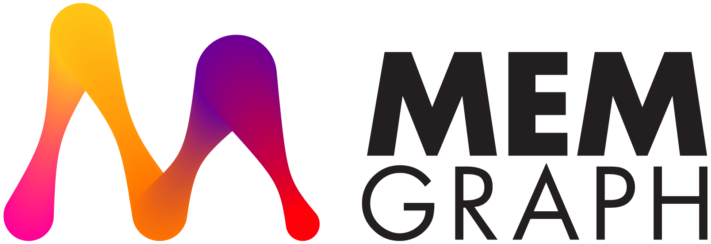

_Open Innovation_ as Career
===========================

&nbsp;&nbsp;

[“_**为世间所有的美好而努力**_” | _"**May you, the beauty of this world, always shine**"_](https://www.bilibili.com/video/BV1Kj411g7Lu)

[![Rapid API](https://img.shields.io/badge/Rapid%20API-brightgreen?style=for-the-badge&logo=data:image/png;base64,iVBORw0KGgoAAAANSUhEUgAAACAAAAAgCAMAAABEpIrGAAAABGdBTUEAALGPC/xhBQAAACBjSFJNAAB6JgAAgIQAAPoAAACA6AAAdTAAAOpgAAA6mAAAF3CculE8AAACMVBMVEUAAAAAVdkAVdkAVdkAVdkAVdkAVdkAVdkAVdkAVdkAVdkAVdkAVdkAVdkAVdkAVdkAVdkAVdkAVdkAVdkAVdkAVdkAVdkAVdkAVdkAVdkAVdkAVdkAVdkAVdkAVdkAVdkAVdkAVdkAVdkAVdkAVdkAVdkAVdkAVdkAVdkAVdkAVdkAVdkAVdkAVdkAVdkAVdkAVdkAVdkAVdkAVdkAVdkAVdkAVdkAVdkAVdkAVdkAVdkAVdkAVdkAVdkAVdkAVdkAU9kAUtgAU9gAVNkDV9knb99WjuZ2pOt9qOxrnOlAf+MPX9srcd+Zu/Dk7fv8/f/////0+P3C1vZVjeYEWNpIheTZ5vn1+P1+qewGWdo4euHg6vr4+/5nmegOXtu3z/T+/v/l7fvx9v3b5/ojbN5SjOX5+/7w9f18qOslbt8YZd0/f+JwoOoBVtmfv/H+//98qOwead3N3vivyfMSYdzP3/jl7vsmb9/M3fcQX9skbd7a5vlnmujS4fgTYtwrct/r8vw8feKXuvC/1PUKW9ro7/ywyvMXZNxNiOTq8fyHr+0bZ93D1/ZunulakeaNs+7o8PwwdeAKXNvA1fbz9/1omumPtO7W4/lVjuYBVdlKh+T3+v7F2PZdk+cFWNr9/v/i7Pusx/NmmegpcN9Xj+b7/f6yzPQNXtsHWtqavPCiwfH8/f7h6/tFg+O0zfR5pesIWtrI2vf2+f6uyfM5e+Kmw/IRYdw1eeFAgOMMXdvU4vlW/OMYAAAAP3RSTlMAAAQweLnl+/zpwIE4BwI8n+T9qkgGG47t8yY3xdNHQdrnVDTZF4WeMpAjYvqgzejyyZlZ9x2EKN90/g+wyjbuVpJQAAAAAWJLR0RQ425MvAAAAAd0SU1FB+cFHgQJME+hDX8AAAJMSURBVDjLZZP3X1NBDMDvUShQVtm0UmllyN4b9N71gYLziYi4QVS0rroFJyquKirureBAFNzzrzOXu/fafsgP73LJt0kuTQjhooBEWCKjrNGUxsTa4uITuIWYApfEJHtyCjUkNjUtPYQANSMzi4aJw+40CVDmZdM54povCThy3MKmMuZlXk0SngVIwCc3T7jb2pcs7ehctlw1CIyhKPk2vGorVq5arev6mq613TKIy4lAgfCv69GlrO/dIGMsTAeg0IPxN27STdm8RYZwpAFQhL/fuo17+vp7tvNzYIckUhNIMb7Au3MX2Ad37/HtRXKfV3YsnpSUcmX/AbAe9Guqxg4dBvVIt6wijpRhhqPHwHr8BH8g84N6ckjmsJFyLHG4H6ynfNzKToN65qwEKoh4w7nzvIQRxi8XQL14SaaIIQ4E2kd5aZevMKZdvQbadaPflFRiDYEBbMCNm2O3bvNq7qgmYMVj/K7sUR//3Ltv/qfRpEo0+kGwj/rDR4/NDFZSjSd78jQIPHs+/ILJHFGkphYjDHWFhHj56vXEZBu3p0SSOpcYhjcixFsDeveep0m2EKVexJr6gPbp6Y94fprBMuwRRGloFGX6Zrnj85eJr4PfRr//QH9WEh+YpmaRJPATBsrP1F+//0xOiRozEznQ0iqSaH87/+m9jGqq8YTsDDG1zkWS0AJjI2YHKHUvNsbaIgmqsRB/Xk5wMZytzXMWx5YbulotTY3h7oqC/PDlVBrqXbWGt9RdVBi+3ojU1VRXWSsdnvKykmLF9P8H4Yjx/OsgFQMAAAAldEVYdGRhdGU6Y3JlYXRlADIwMjMtMDUtMzBUMDM6NTI6MDQrMDA6MDBk0ykuAAAAJXRFWHRkYXRlOm1vZGlmeQAyMDIzLTA1LTMwVDAzOjUyOjAwKzAwOjAw4cG1gQAAACh0RVh0ZGF0ZTp0aW1lc3RhbXAAMjAyMy0wNS0zMFQwNDowOTo0OCswMDowMPW1hS4AAAAASUVORK5CYII=)](https://rapidapi.com/user/jack20220723)

   

 

><a href="https://www.bilibili.com/video/BV1Ca411Q7aK?share_source=copy_web&vd_source=7f40ee8f7150cba61ecdf3d901bbad42">
>    
></a>
>
> I'd like to take this moment to thank Yahoo!, my former employeer, who taught me to love Software Engineering and how to write the best-quality software. 4 years of being her employee nourished my life-long philosophy that the end of Software Development in itself is not about money, but people, passion, and love. Thank you Yahoo! 
>  
>  
> This page is also dedicated to my former colleague [Rick Jensen](https://github.com/cdeszaq), my life-long teacher on Software Engineering. Having been the best tech leader I've seen, he treats software design, programming, and code review a as a work of art. I will [follow his philosophy and, with tremendous sincerity, respect him as my role model in tech area](https://github.com/QubitPi/java-code-review-guide-book)

My Open Source Portfolio
------------------------

I belive in creating software using the open source way, a set of principles built upon an open forum for ideas where communities can form around solving a problem or developing a new technology. This philosophy affects everything my group do in Tech Industry as most of today’s IT leaders, who agree that enterprise open source is important, do

Open source software gains its strength from diverse communities of developers around the world. That’s why I’ve, since the beginning of my career in 2015, kept my eyes and hands dirty on studying and practicing developing open projects and technologies, protecting and defending open source intellectual property, and recruiting developers who actively participate in open projects across the IT stack. This experience helps inform a development model to produce more innovative, iterative, stable, and secure technologies.

By tapping into the collective talent and innovation of open source communities, I believe my team can create better software. This collaboration helps fuel much of the technology we use today

<!--  -->
    

    
### Creator

    

    

### Active Forks (having at least 1 PR merged within the last 5 days)

<!-- ACTIVE-FORKS:START -->

<!-- ACTIVE-FORKS:END -->

### Contributor

## I Learn Technologies Everyday through Open Source

> Because I believe _Open Sourced Information is Closest to Truth_
    

I used to study technologies by [blogging](https://qubitpi.github.io/jersey-guide/) extensively. Since I'm running a company, my obligations right now are more on doing well for _my employees_ and for _my company_, which leave me literally no time for the blogging. I do, however, keep studying techs in a, what I found, more efficient approach below.

Inspired by large enterpeise hosting their own private mirrors of public Maven Central, I forked documentation source codes of all technoloteis I'm interested in and publish them to GitHub Pages, which result in the following curated list. By turning my self-maintained [blog](https://qubitpi.github.io/jersey-guide/) into [GitHub Forks under my account](https://github.com/QubitPi?tab=repositories&q=documentation&type=&language=&sort=), I'm delegating my personal tech blog writing to thousands of developers around the world. In addition, I could also add my own study notes on top of their documentations:

### Machine Learning

- **Libraries**: [scikit-learn](https://qubitpi.github.io/scikit-learn/)
- [**MLOps**](https://neptune.ai/blog/best-open-source-mlops-tools): [MLflow](https://qubitpi.github.io/mlflow/)  | [Metaflow](https://qubitpi.github.io/metaflow-docs/) | [MLReef](https://qubitpi.github.io/mlreef/)
- **Tools**: [Python](https://qubitpi.github.io/cpython/) | [The Hitchhiker’s Guide to Python](https://qubitpi.github.io/hitchhiker-python-guide/) | [PEP's](https://qubitpi.github.io/peps/)
- **Knowledge Graph**: [Knowledge Graphs](https://qubitpi.github.io/Knowledge-Graphs-Book/) | [Data Visualization](https://qubitpi.github.io/data_to_viz/) | [NetworkX](https://qubitpi.github.io/networkx/) | [NetworkX Guides](https://qubitpi.github.io/nx-guides/) | [Memgraph NextworkX Guide](https://qubitpi.github.io/memgraph-networkx-guide/) | [react-force-graph](https://qubitpi.github.io/react-force-graph/) | [spaCy](https://qubitpi.github.io/spaCy)  | [Stanford SNAP](https://qubitpi.github.io/snap/)

### [Immutable Infrastructure](https://qubitpi.github.io/aergia/blog/immutable-infrastructure)

-  [Packer](https://qubitpi.github.io/hashicorp-packer/packer/docs) | [Terraform](https://qubitpi.github.io/hashicorp-terraform/terraform/docs) | [Vault](https://qubitpi.github.io/hashicorp-vault/vault)
-  [Install Guide](https://qubitpi.github.io/openstack-manuals-install-guide/) | [Doc Contrib Guide](https://qubitpi.github.io/openstack-manuals-doc-contrib-guide/) | [Virtual Machine Image Guide](https://qubitpi.github.io/openstack-manuals-virtual-machine-image-guide/) | [API Quick Start Guide](https://qubitpi.github.io/openstack-manuals-api-quick-start/) | [Glossary](https://qubitpi.github.io/openstack-manuals-glossary/) | [Swift](https://qubitpi.github.io/openstack-swift/) | [python-swiftclient](https://qubitpi.github.io/openstack-python-swiftclient/)

  
<b>Why do I care about Software Infrastructure (a lot)?</b>

<table>
  <tr>
    <th colspan="2" scope="colgroup">
      Why do I care about Software Infrastructure (a lot)?
    </th>
  </tr>
  <tr>
    <td>
      
<b>Traditional Software Development</b>
  &nbsp;&nbsp;&nbsp;&nbsp;&nbsp;&nbsp;&nbsp;&nbsp;&nbsp;&nbsp;&nbsp;&nbsp;&nbsp;&nbsp;&nbsp;&nbsp;&nbsp;&nbsp;&nbsp;&nbsp;&nbsp;&nbsp;&nbsp;&nbsp;&nbsp;&nbsp;&nbsp;&nbsp;&nbsp;&nbsp;&nbsp;&nbsp;&nbsp;&nbsp;&nbsp;&nbsp;&nbsp;&nbsp;&nbsp;&nbsp;&nbsp;&nbsp;&nbsp;&nbsp;&nbsp;&nbsp;&nbsp;&nbsp;&nbsp;&nbsp;&nbsp;&nbsp;&nbsp;&nbsp;&nbsp;&nbsp;&nbsp;&nbsp;&nbsp;&nbsp;&nbsp;&nbsp;&nbsp;&nbsp;&nbsp;&nbsp;&nbsp;&nbsp;&nbsp;&nbsp;&nbsp;&nbsp;&nbsp;&nbsp;&nbsp;&nbsp;&nbsp;&nbsp;&nbsp;&nbsp;&nbsp;&nbsp;&nbsp;&nbsp;&nbsp;&nbsp;&nbsp;&nbsp;&nbsp;&nbsp;&nbsp;&nbsp;&nbsp;&nbsp;&nbsp;&nbsp;&nbsp;&nbsp;&nbsp;&nbsp;&nbsp;&nbsp;&nbsp;&nbsp;&nbsp;&nbsp;&nbsp;&nbsp;&nbsp;&nbsp;&nbsp;&nbsp;&nbsp;&nbsp;&nbsp;&nbsp;
    </td>
    <td>
      Because I believe <a href="https://www.infoq.com/presentations/scaling-operations-facebook/">infrastructure is the "home" to softwares</a>. The <em>highest-quality</em> softwares are not possible unless backed by the best-made tech infrustructure, which is what I spend most of my management time on in tech area.   I learned, from years of work experience, that thriving as a Software Engineer with their internal and external engagement demands requires high levels of <em>interpersonal sophistication</em>. It is no doubt then that the <b>single hardest task in teamwork is <em>efficient communication</em></b>. This gets exacerbated in a software development cycle in which a developer has to distribute their communication efforts among <b>3</b> parties, which makes mis-communication frequent
    </td>
  </tr>
  <tr>
    <td>
      
<b>How Big Techs Improve It</b>
  
    </td>
    <td>
      By the time I joined Yahoo at 2016, the company had already made a <a href="https://spectrum.ieee.org/yahoos-engineers-move-to-coding-without-a-net">big move by removing all of its QA teams COMPLETELY</a>. Software developers were required to write automated tests by themselves using open source test frameworks, such as Groovy Spock, Jest, and Cypress. The software testing was then fully automated through <a href="https://screwdriver.cd/">Yahoo's own CI platform</a>, which is developed on top of <a href="https://qubitpi.github.io/jenkins.io/">Jenkins</a> originally.  This brought a big software quality improvements but in terms of communication quality, at least from my experience, was still not optimal. I've had such experience when I finshed implementing a system but waited for extra couple of weeks before DevOps Engineer setup a dedicated server for deployment. This virtually got mis-translated to my boss as "A software developer had his work delayed for couple weeks".
    </td>
  </tr>
  <tr>
    <td>
      
<b>(My Ongoing Effort) Software Development Today and Tomorrow</b>
   
    </td>
    <td>
      The reason we still have DevOps staff is because resource isolation using the ubiquitous Docker, which borns out of the traditional on-premis technology, is <em>manual</em>. With on-demand cloud, resource isolations are assumed NOT managed. We instead <em>manage business logics</em> with efficiency (<a href="https://qubitpi.github.io/hashicorp-packer/packer/docs">Packer</a>) and immutability (<a href="https://qubitpi.github.io/hashicorp-terraform/terraform/docs">Terraform</a>). <b>With HashiCorp + OpenStack Cloud, business no longer needs <s>Docker + k8s</s></b>. Teams and developers as well, with almost no overhead, are able to eliminate human DevOps  This is the picture from which I'm turning into reality in my team. Giving our developer fully <b>automated</b> control over infrastructure brings the following benefits to the team:
      <ol>
        <li> <b>Our developers learn more cutting-edge industry skills compared to their peers which makes our developers more valuable along their career path</b>
        <li> <b>Taking hardware constraint into account causes a paradigm shift in how our engineers thought about problems, which makes our developers better skilled and our software better in terms of quality</b>
	<li> <b>Eventually reduces the labor costs of company</b>
      </ol>
      <b>We achieve this by making  our defacto <a href="https://qubitpi.github.io/aergia/blog/continuous-delivery">continuous delivery</a> as part of products' CI/CD strategy.</b> For example, we make one of our <a href="https://github.com/QubitPi/mlflow/pull/2">MLOps platform completely self-helped</a> with <a href="https://qubitpi.github.io/mlflow/hashicorp.html">well-made documentation</a> so that any one of our team can spawn up a ML playground for fast prototyping an idea
    </td>
  </tr>
</table>

### Frontend    

- **UI Design**: [Component-Driven UI Development](https://qubitpi.github.io/componentdriven.org/) 
- **[React](https://qubitpi.github.io/react.dev/)**: [Monorepo](https://qubitpi.github.io/monorepo.tools/) | [TypeScript](https://qubitpi.github.io/TypeScript-Website/) | [React + TypeScript Cheatsheet](https://qubitpi.github.io/react-typescript-cheatsheet/)| [Babel](https://qubitpi.github.io/babel-website/) | [Jest](https://qubitpi.github.io/jest/) | [testing-library](https://qubitpi.github.io/testing-library-docs/) | [Cypress](https://qubitpi.github.io/cypress-documentation/guides/overview/why-cypress) | [Prettier](https://qubitpi.github.io/prettier/docs/en/index.html) | [TypeDoc](https://qubitpi.github.io/typedoc-site/) | [ExpressJS](https://qubitpi.github.io/expressjs.com/) | [Redux](https://qubitpi.github.io/redux/) | [React Redux](https://qubitpi.github.io/react-redux/) | [Redux Toolkit](https://qubitpi.github.io/redux-toolkit/) | [redux-observable](https://qubitpi.github.io/redux-observable/) | [RxJS](https://qubitpi.github.io/rxjs/) | [InversifyJS](https://qubitpi.github.io/inversify.github.io/) | [Lexical](https://qubitpi.github.io/lexical/)
- **Knowledge Graph**: [GraphQL Relay](https://qubitpi.github.io/relay/) | [Memgraph Orb](https://qubitpi.github.io/memgraph-orb/) | [three.js](https://qubitpi.github.io/three.js/docs/) | [D3-graph-gallery](https://qubitpi.github.io/D3-graph-gallery/)

### Backend    

- **Webservice**: [Jersey](https://qubitpi.github.io/jersey/) | [Groovy Spock](https://qubitpi.github.io/spock-doc/) | [Testcontainers for Java](https://qubitpi.github.io/testcontainers-java/) | [ReactiveX](https://qubitpi.github.io/reactivex-docs/) 
- **GraphQL**: [GraphQL Specification](https://qubitpi.github.io/graphql-spec/draft/) | [GraphQL](https://qubitpi.github.io/graphql.github.io/) | [GraphQL Java](https://qubitpi.github.io/graphql-java-page/) | [Principled GraphQL](https://qubitpi.github.io/principled-graphql/)
- **Database**: [Hadoop](https://qubitpi.github.io/hadoop/hadoop-project/)
- **Security**: [Kong Gateway](https://qubitpi.github.io/docs.konghq.com/gateway/latest/) | [JWT Token](https://qubitpi.github.io/jsonwebtoken.github.io/website)([debugger](https://qubitpi.github.io/jsonwebtoken.github.io/extension/)) | [Keycloak Documentation](https://qubitpi.github.io/keycloak-web/) | [Keycloak Documentation (Extra)](https://qubitpi.github.io/keycloak-documentation/)
- **Graph Database**: [Memgraph Documentation](https://qubitpi.github.io/memgraph-docs/) | [Neo4J Browser](https://qubitpi.github.io/neo4j-browser/) | [Neo4J Developer Guides](https://qubitpi.github.io/neo4j-developer-guides/developer/get-started/) | [ArangoDB Documentation](https://qubitpi.github.io/arangodb-docs/stable/)

### Miscellaneous

[Git](https://qubitpi.github.io/progit2/) | [Changelog](https://qubitpi.github.io/keep-a-changelog/en/1.0.0/) | [Studying Agile](https://qubitpi.github.io/QubitPi/agile/) | [KTX2 File Command Line Utility](https://qubitpi.github.io/KTX-Software/) | [Loeb Classical Library](https://qubitpi.github.io/loebolus/)

---

My 
-----------

### Recent Posts

<!-- BILIBILI-RECENT-ACTIVITIES:START -->
- [【绮良良首战】第一次满星！](https://t.bilibili.com/800754579100663828)
- [打死不玩崩铁[原神_晚安]](https://t.bilibili.com/799833265671241731)
- [巴适得很[原神_点赞]](https://t.bilibili.com/795740136053669891)
- [[原神_撒花]坎蒂丝生日快乐[原神_撒花]](https://t.bilibili.com/791283020854198355)
- [深境螺旋 2023 5月 上半期 第十二层 第三间](https://t.bilibili.com/790965798823788565)
<!-- BILIBILI-RECENT-ACTIVITIES:END -->

 

<h3 align="center">
Recently Liked-Saved-Tipped (一键三连) Videos
</h3>

| **原神** | **隔壁三崩子** |
|------|---------|
| <!-- BILIBILI-TIPPED-VIDEOS:START -->
 <a href=https://www.bilibili.com/video/BV1Ca411Q7aK>【原神/BOFXVI】enchanted love (可莉与嘟嘟可)</a> 
 
 <a href=https://www.bilibili.com/video/BV1cA4y1Q7ux>【4K】可莉 好耶！哒哒哒！全站最好听的原神同人曲！</a> 
 
 <a href=https://www.bilibili.com/video/BV1Lv411G7q5>【原神手书】珊瑚宫心海的千层套路❤</a> 
 
 <a href=https://www.bilibili.com/video/BV15R4y1t76F>【名场景复刻】米哈游总部大门危险运输现象</a> 
 
 <a href=https://www.bilibili.com/video/BV1ZL4y1F7Zh>可 莉 莎 来 啦~~</a> 
 <!-- BILIBILI-TIPPED-VIDEOS:END --> | <!-- BILIBILI-TIPPED-VIDEOS-HONKAI-IMPACT-3:START -->
 <a href=https://www.bilibili.com/video/BV1pi4y1R7um>【崩坏三】德丽莎：同时让三个德丽莎生气会怎么样╰(*´︶`*)╯</a> 
 
 <a href=https://www.bilibili.com/video/BV16P4y1H7SV>【崩坏三】德丽莎：生气了的时候表情好可爱啊！▼へ▼</a> 
 
 <a href=https://www.bilibili.com/video/BV1BT4y1w7vF>【崩坏3动画】攻城记</a> 
 
 <a href=https://www.bilibili.com/video/BV1RR4y1Q7Wk>【你有毛病吧】轮到识宝来给大家洗脑了！！</a> 
 
 <a href=https://www.bilibili.com/video/BV13s411H7Mo>一场崩坏世界的高考</a> 
 <!-- BILIBILI-TIPPED-VIDEOS-HONKAI-IMPACT-3:END --> |

<h3 align="center">
Latest Genshin Impact News (Bilibili)
</h3>

<!-- BILIBILI-GENSHIN-IMPACT-ACTIVITIES-COVER:START --> <!-- BILIBILI-GENSHIN-IMPACT-ACTIVITIES-COVER:END -->

<!-- BILIBILI-GENSHIN-IMPACT-ACTIVITIES:START -->
- [#原神# #决斗召唤之巅# 旅行者们好呀~一起来看看近期即将开启的活动吧！](https://t.bilibili.com/804762625407713331)
- [[原神_哇][原神_哇]](https://t.bilibili.com/804761392748953637)
- [#原神# #神铸赋形# 亲爱的旅行者，「神铸赋形」活动祈愿即将开启，「单手剑·裁叶萃光」「单手剑·苍古自由之誓」概率UP！ 活动期间，旅行者可以在「神铸赋形」...](https://t.bilibili.com/804761332619411609)
- [#原神# #枫原万叶# 亲爱的旅行者，「叶落风随」活动祈愿即将开启，「红叶逐荒波·枫原万叶&lpar;风&rpar;」概率UP！ 活动期间，旅行者可以在活动祈愿中获得更多角色与武器...](https://t.bilibili.com/804760559286222899)
- [#原神# #艾尔海森# 亲爱的旅行者，「敕诫枢谋」活动祈愿即将开启，「诲韬诤言·艾尔海森&lpar;草&rpar;」概率UP！ 活动期间，旅行者可以在活动祈愿中获得更多角色与武器，...](https://t.bilibili.com/804760048167288903)
<!-- BILIBILI-GENSHIN-IMPACT-ACTIVITIES:END -->

 My Coffee-Morning News Central
-----------------------------------

<h3 align="center">
miHoYo News (米忽悠的诈骗日常)
</h3>

#### 

<!-- MIHOYO-NEWS:START -->
- [「决斗！召唤之巅！」3.7版本活动速递第二期](https://bbs.mihoyo.com/ys/article/40125713)
- [《原神》「神工天巧」交流平台教学视频上线](https://bbs.mihoyo.com/ys/article/40124702)
- [「神工天巧·宝录之章」活动贴士——拟想秘境留言簿](https://bbs.mihoyo.com/ys/article/40116679)
- [「七圣召唤主播邀请赛」首日赛事速报！](https://bbs.mihoyo.com/ys/article/40102685)
- [「七圣召唤主播邀请赛」将于今日16:00正式揭幕！](https://bbs.mihoyo.com/ys/article/40082554)
<!-- MIHOYO-NEWS:END -->

#### Genshin Impact (原神) 

<!-- GENSHIN-IMPACT-NEWS:START -->
- [「决斗！召唤之巅！」3.7版本活动速递第二期](https://ys.mihoyo.com/main/news/detail/27861)
- [「神铸赋形」祈愿：「单手剑·裁叶萃光」「单手剑·苍古自由之誓」概率UP！](https://ys.mihoyo.com/main/news/detail/27860)
- [「叶落风随」祈愿：「红叶逐荒波·枫原万叶&lpar;风&rpar;」概率UP！](https://ys.mihoyo.com/main/news/detail/27859)
- [「敕诫枢谋」祈愿：「诲韬诤言·艾尔海森&lpar;草&rpar;」概率UP！](https://ys.mihoyo.com/main/news/detail/27858)
- [「神工天巧」交流平台限时开启，展示奇思妙想，交流秘境心得！](https://ys.mihoyo.com/main/news/detail/27857)
<!-- GENSHIN-IMPACT-NEWS:END -->

#### Honkai Impact 3 (隔壁三崩子)

<!-- HONKAI-IMPACT-NEWS:START -->
- [履海游月之邀丨服装补给限时开启！](https://www.bh3.com/news/27853)
- [封号名单（2023年6月5日）](https://www.bh3.com/news/27846)
- [V6.7作战凭证开启](https://www.bh3.com/news/27844)
- [「歧路星语」6.7版本更新公告](https://www.bh3.com/news/27827)
- [妖精爱莉 | 人偶补给开启](https://www.bh3.com/news/27815)
<!-- HONKAI-IMPACT-NEWS:END -->

---

<h3></h3>

<!-- GOOGLE-AI-BLOG:START -->
- [Evaluating speech synthesis in many languages with SQuId](http://ai.googleblog.com/2023/06/evaluating-speech-synthesis-in-many.html)
- [Visual captions: Using large language models to augment video conferences with dynamic visuals](http://ai.googleblog.com/2023/06/visual-captions-using-large-language.html)
- [AVFormer: Injecting vision into frozen speech models for zero-shot AV-ASR](http://ai.googleblog.com/2023/06/avformer-injecting-vision-into-frozen.html)
- [Retrieval-augmented visual-language pre-training](http://ai.googleblog.com/2023/06/retrieval-augmented-visual-language-pre.html)
- [Large sequence models for software development activities](http://ai.googleblog.com/2023/05/large-sequence-models-for-software.html)
<!-- GOOGLE-AI-BLOG:END -->

<h3></h3>

<!-- GOOGLE-DEEPMIND-BLOG:START -->
- [Optimising computer systems with more generalised AI tools](https://www.deepmind.com/blog/optimising-computer-systems-with-more-generalised-ai-tools)
- [AlphaDev discovers faster sorting algorithms](https://www.deepmind.com/blog/alphadev-discovers-faster-sorting-algorithms)
- [An early warning system for novel AI risks](https://www.deepmind.com/blog/an-early-warning-system-for-novel-ai-risks)
- [DeepMind’s latest research at ICLR 2023](https://www.deepmind.com/blog/deepminds-latest-research-at-iclr-2023)
- [How can we build human values into AI?](https://www.deepmind.com/blog/how-can-we-build-human-values-into-ai)
<!-- GOOGLE-DEEPMIND-BLOG:END -->

### [ML @ Reddit](https://www.reddit.com/r/MachineLearning/)

<!-- REDDIT-ML:START -->
- [[P] &quot;Context is all you need&quot; - Multimodal vector search with personalization](https://www.reddit.com/r/MachineLearning/comments/14453f9/p_context_is_all_you_need_multimodal_vector/)
- [&quot;[Project]&quot; Sequence prediction in Parent - Child dataset](https://www.reddit.com/r/MachineLearning/comments/1443jrz/project_sequence_prediction_in_parent_child/)
- [[D] CycleGAN performance immediately deteriorates](https://www.reddit.com/r/MachineLearning/comments/1443dvq/d_cyclegan_performance_immediately_deteriorates/)
- [[D] Fuse an arbitrary number of images with a transformer.](https://www.reddit.com/r/MachineLearning/comments/14439ia/d_fuse_an_arbitrary_number_of_images_with_a/)
- [[Project] Boost Your Data Science Productivity with Lunar - We Need Your Feedback!](https://www.reddit.com/r/MachineLearning/comments/1441194/project_boost_your_data_science_productivity_with/)
<!-- REDDIT-ML:END -->

###  Study Notes

* [Machine Learning](https://peitho-data.readthedocs.io/en/latest/peitho_data.html#machine-learning)

<h3></h3>

#### Twitter

<!-- NEO4J-TWITTER:START -->
- [RT Google Cloud: Re Big shout out to our partners, @twilio, @typefaceai, @DataStax, and @neo4j, and our customers, @priceline, @MayoClinic, @GATELESIS...](https://twitter.com/googlecloud/status/1666628182345228288)
- [RT Google Cloud: Today at the #GoogleCloudExecForum, we announced new endeavors to bring #generativeAI to enterprises, small businesses, and governmen...](https://twitter.com/googlecloud/status/1666628178033483776)
- [Global healthcare company @novonordisk uses #Neo4j as the backbone of an application that streamlines the process of collecting and reporting clinical...](https://twitter.com/neo4j/status/1666535516039159815)
- [We would listen to @mesirii if we were you! :&rpar; Be part of the biggest online conference dedicated to leveraging connections in data through graph tech...](https://twitter.com/neo4j/status/1666502805459181586)
- [RT Sudhir Hasbe: Super excited to announce various integrations between Neo4j with GenAI features in Vertex AI. Enterprises can now 1. Leverage natura...](https://twitter.com/shasbe/status/1666465509259485186)
<!-- NEO4J-TWITTER:END -->

#### YouTube

<!-- NEO4J-YOUTUBE:START -->
- [#NODES2023](https://www.youtube.com/watch?v=TTQmULACfEw)
- [Going Meta - Ep 17: RDF-ing between OpenAI and Neo4j](https://www.youtube.com/watch?v=w-PwMyzokSw)
- [APAC Training Series - Intermediate Cypher and Data Modelling](https://www.youtube.com/watch?v=H5oeKGLHZwM)
- [Demystifying commas in Cypher statements](https://www.youtube.com/watch?v=F-Bg8t6ZoQI)
- [GraphStuff.fm: Innovation Vertex Interview with Michela Ledwidge &lpar;Founder @MOD&rpar;, Graphie Award 2023](https://www.youtube.com/watch?v=F_rJl5OHiaQ)
<!-- NEO4J-YOUTUBE:END -->

<h3></h3>

#### Twitter

<!-- MEMGRAPH-TWITTER:START -->
- [🎬 Explore real-time movie reviews with @redpandadata &amp; Memgraph! Boost your data-driven recommendations in no time. #Redpanda #Memgraph #RealTimeAn...](https://twitter.com/memgraphdb/status/1666740855036604416)
- [🚀 Learn to calculate the shortest path for flights using Memgraph Lab and optimize travel time. #AviationTech #FlightOptimization ✈️ #memgraph #d...](https://twitter.com/memgraphdb/status/1666705871131353094)
- [💡 Harness the power of Memgraph&#39;s MAGE library for your graph data science needs. Explore optimized graph clustering algorithms for high-performanc...](https://twitter.com/memgraphdb/status/1666691779813339138)
- [🚀 Upgrade your IAM systems! Move from tabular solutions to graph solutions with Memgraph, making data import, analysis, and decision-making drastic...](https://twitter.com/memgraphdb/status/1666677434043826177)
- [🎉 Explore Memgraph MAGE&#39;s easy-to-use, high-performance graph API. Develop powerful graph analytics in C++ or Python. #DataScience #memgraph #datab...](https://twitter.com/memgraphdb/status/1666666614685589504)
<!-- MEMGRAPH-TWITTER:END -->

<h3></h3>

#### [OpenStack News](https://superuser.openstack.org/)

<!-- OPENSTACK-SUPERUSER:START -->
- [Meet the Computing Force Network Working Group at the OpenInfra Summit!](https://superuser.openinfra.dev/articles/meet-the-computing-force-network-working-group-at-the-openinfra-summit/)
- [Collaborate with the StarlingX community at the OpenInfra Summit](https://superuser.openinfra.dev/articles/collaborate-with-the-starlingx-community-at-the-openinfra-summit/)
- [Meet the Premier Sponsor: Okestro](https://superuser.openinfra.dev/articles/meet-the-premier-sponsor-okestro/)
- [China Telecom eSurfing Cloud Showcases openEuler Whitepaper](https://superuser.openinfra.dev/articles/china-telecom-esurfing-cloud-showcases-openeuler-whitepaper/)
- [What Engineers Can Expect at PlatformCon](https://superuser.openinfra.dev/articles/what-engineers-can-expect-at-platformcon/)
<!-- OPENSTACK-SUPERUSER:END -->

### Martin Fowler's Blog (**Building Software Effectively**)

<!-- MARTIN-FOWLER-BLOG:START -->
- [Privacy Enhancing Technologies: An Introduction for Technologists](https://martinfowler.com/articles/intro-pet.html)
- [Dependency Composition](https://martinfowler.com/articles/dependency-composition.html)
- [Emacs xref stopped working on Macs with dumb-jump](https://martinfowler.com/articles/2023-xref-problem.html)
- [Using ChatGPT as a technical writing assistant](https://martinfowler.com/articles/2023-chatgpt-tech-writing.html)
- [What Does a Technical Author Look Like?](https://martinfowler.com/articles/2023-tech-author-portrait.html)
<!-- MARTIN-FOWLER-BLOG:END -->

#### [CSS-Trikcs](https://css-tricks.com/)

<!-- CSS-TRIKCS:START -->
- [Passkeys: What the Heck and Why?](https://css-tricks.com/passkeys-what-the-heck-and-why/)
- [Some Cross-Browser DevTools Features You Might Not Know](https://css-tricks.com/some-cross-browser-devtools-features-you-might-not-know/)
- [Making Calendars With Accessibility and Internationalization in Mind](https://css-tricks.com/making-calendars-with-accessibility-and-internationalization-in-mind/)
- [5 Mistakes I Made When Starting My First React Project](https://css-tricks.com/5-mistakes-starting-react/)
- [Creating a Clock with the New CSS sin&lpar;&rpar; and cos&lpar;&rpar; Trigonometry Functions](https://css-tricks.com/creating-a-clock-with-the-new-css-sin-and-cos-trigonometry-functions/)
<!-- CSS-TRIKCS:END -->

Git Data Analytics - Everything is Datable
------------------------------------------

 

 
 
 
 
 
 
 
 
 
 
 
 
 
 
 
 
 
 
 
 
 
 
 
 
 
 
 
 
 
 
 
 
 
 
 
 
 
 
 
 
 

    

    

    

    

    

