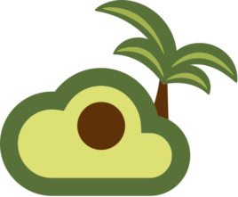

Welome to Jack (Jiaqi)'s Tech World
===================================

 

&nbsp;&nbsp;

><a href="https://www.bilibili.com/video/BV1Ca411Q7aK?share_source=copy_web&vd_source=7f40ee8f7150cba61ecdf3d901bbad42">
>    
></a>
>
> I'd like to take this moment to thank Yahoo!, my former employeer, who fundamentally setup my career and my unperishable passion for data tech. Thank you Yahoo! ❤️
>  
>  
> This page is also dedicated to my former colleague [Rick Jensen](https://github.com/cdeszaq), my life-long teacher on Software Engineering. Having been the best tech leader I've seen, he treats software design, programming, and code review a as a work of art. I will [follow his philosophy and, with tremendous sincerity, respect him as my role model in tech area](https://github.com/QubitPi/java-code-review-guide-book)

My Open Source Portfolio
------------------------

I belive in creating software using the open source way, a set of principles built upon an open forum for ideas where communities can form around solving a problem or developing a new technology. This philosophy affects everything my group do in Tech Industry as most of today’s IT leaders, who agree that enterprise open source is important, do

Open source software gains its strength from diverse communities of developers around the world. That’s why I’ve, since the beginning of my career in 2015, kept my eyes and hands dirty on studying and practicing developing open projects and technologies, protecting and defending open source intellectual property, and recruiting developers who actively participate in open projects across the IT stack. This experience helps inform a development model to produce more innovative, iterative, stable, and secure technologies.

By tapping into the collective talent and innovation of open source communities, I believe my team can create better software. This collaboration helps fuel much of the technology we use today

### Creator

    

### Contributor

### Active Forks

    

&nbsp;
&nbsp;
&nbsp;

    

I used to study technologies by [blogging](https://qubitpi.github.io/jersey-guide/) extensively. Since I'm running a company, my obligations right now are more on doing well for my employees and for my company. This gives me much less time on writing the tech blogs. I do, however, keep studying techs in a what I found more efficient approach.

Since my blogs were essentially paraphrasing their documentations, why not simply fork their entire documentation and add my notes, if any, to it? That basically saves a lot of my time and packs everything in a more giant notebook of forks. So here they are:

#### Software Infrastructure
[Chef](https://qubitpi.github.io/chef-web-docs/)([Chef 101](https://youtu.be/tt9_aWiSW5M)) | [Kubernetes](https://qubitpi.github.io/kubernetes-website/) | [Helm Charts](https://qubitpi.github.io/helm-www/) | [Jenkins](https://qubitpi.github.io/jenkins.io/)

###### OpenStack

- [OpenStack Install Guide](https://qubitpi.github.io/openstack-manuals-install-guide/)([What is OpenStack?](https://youtu.be/locCs2Duk5U))
- [OpenStack Doc Contrib Guide](https://qubitpi.github.io/openstack-manuals-doc-contrib-guide/)
- [OpenStack Virtual Machine Image Guide](https://qubitpi.github.io/openstack-manuals-virtual-machine-image-guide/)
- [OpenStack API Quick Start Guide](https://qubitpi.github.io/openstack-manuals-api-quick-start/)
- [OpenStack Glossary](https://qubitpi.github.io/openstack-manuals-glossary/)
- [OpenStack Swift](https://qubitpi.github.io/swift/)

- [Yahoo Engineering - Operating OpenStack at Scale](https://yahooeng.tumblr.com/post/159795571841/operating-openstack-at-scale)
- [How Yahoo! Uses Neutron for Ironic](https://www.openstack.org/videos/summits/tokio-2015/how-yahoo-uses-neutron-for-ironic)

###### Virtualization

[Docker](https://qubitpi.github.io/docker-docs/) | [Linux Containers](https://qubitpi.github.io/linuxcontainers.org/) | [QEMU](https://qubitpi.github.io/qemu/) ([WIKI](https://qubitpi.github.io/qemu-web/))

###### HashiCorp (Industry Leader of Infrastructure as Code)

- [Packer](http://www.packer.io/)
- [Vault](https://qubitpi.github.io/hashicorp-vault/vault)

#### Data/Knowledge Graph

[Knowledge Graphs](https://qubitpi.github.io/Knowledge-Graphs-Book/) | [Data Visualization](https://qubitpi.github.io/data_to_viz/) | [KTX2 File Command Line Utility](https://qubitpi.github.io/KTX-Software/) | [Graphviz](https://qubitpi.github.io/graphviz.github.io/) | [Python](https://qubitpi.github.io/cpython/)

#### Frontend Technologies

![](https://img.shields.io/badge/REACT-brightgreen?style=for-the-badge&logo=data:image/png;base64,iVBORw0KGgoAAAANSUhEUgAAADAAAAAwCAYAAABXAvmHAAAAAXNSR0IArs4c6QAACQpJREFUaEPtWXtQVOcV/527uywLigosqCgC4mtqmzp2ahJNx5FlDSxoQLBRa2NNa83DJE0ao0k7sc3UJjExMbU2diqTNom1RZAIaERjGdvUV32kTaomCvJGQRzl5T7udzrfhV0BF9hlMa0z/f7ae/d8v3N+3+O8LuEOH3SH24//E/hv76A/O0CW1OypiiLiwDAzs2CiOhcrn5Tuya0fCJE5adkxBuYEBmKYhYFYaSQDfbFvd+55X/H6JZBky7QojMVESGHQSG/ALHBSIfwerpBtJSXvtvalfHb6oki9an8MRA8Q8HWvssyVAO3SCfXNDz8suNgXXq8ErLaMqQLK2wTM9H01uB5QflRSvHNHzzmzZ8/WB4WErxHEzxKUMB8xXSBsaTEpaw7n5rZ7m+OVQHJq5jIQfgNQsHvSWKMR04eGIN4YjGF6HQSAyw4X/t3WhmPNLbgh5Bv34K3O1qbHS0tLXfLN3LnZ4S4D5yrMc9wSQ3U6TB8aismmEIww6KAH4Zqq4vP2dpxsacVlh/MmGuOsTq+keztatxCw2jIfZdBmoMNDTQ4xYVm0GZNCTL0umjR+V2MT8hub4GLukBO8Y+aMry0pPX06zODU/R3AFPk6TK/DwsgIzA0fDj15PwByKY5cb8Y79ZfR4NTWAGC6pOg4aV9h3mddDemGYEnLnkUs/gJAL/9YEmXGAnO4j7sNXGi34xeVVbjqUjvn8HoImg4Fc+WLRFMw1sTGIEKv9wmzTRV4vbpW2xGNA6NKKMo9B4tya9wAHgJJGRkRikM5DWCM/HNVzEjMGT7MJ0VdhWrtDqwur0Cr2vVIAXHBRvwyPhbBiuIXpkMwXq6qwalOEhCidOaMu5LWrVunKfAQsNgythGU5fJlSsRwrBgZ7ZeirsJHr7doSt3DpCjYlBgPs8G3le+p2M6MFy9W4Vxb5z0mPLK/KO9tDwHN4zCdJiJdjDEIGxPiEKT062H7JLi+sgbHm1s0mYeizXgg0vej6A243uHEU+fLIcnI+xCssycUFha2aVYmp2bmgOh78vfa2Bh8c+iQAa++e6JU+EpVDUYGGfDMmNG9XtieinTjE2CwWqCe+xzO0kNAF+/23qVG5DVe0aYQ8HBJcV4OWSzZwyhIrQORSbrKtxLjAjY+EIDgZUuhmzJZg3AdPQ57foEH7qrThRVfXICLAUF08KOinUlksWVlEjhPSi0faUZ6RGBbHYjxcq5uQiKMix8ESbfNjPbXN0E0NHhgf3axCqdb26RPcpp0rghKTluwCYwnpMSvE+Mx2hgUqA0Bz9d/dSqM31mk4dh3fQDXkWMeTHmE5FHShuBZlGzLKgLYZlQU/HHKhP+J/FqJjoLp6Sc1Gx379sN5sNRD4G/XmrXY4L4HcgcOg3F3lMGArRMTAl69wQDQJY5H8A80jw5HwW44Dx/1wJ5tv4G1ZRWdz7SGLKkZh4iU+0YY9MiZOH4w9AeMEZScBIOlI21qf2sLRM3NmFJld+CJ8+UdO8D8U7LYMt8j0BLpT7dPmeB3pAzYWi8AplWPQhkTAzgcaH3xpW6uVKYVL1VUd8xiWim90I8JvEE+D1YMCISUEjsWpsdWahCuU5/AvuPP3eBy6htQeKWp8w4o3yBr+oLJLHBGvrk7bAieGxsTiP6A5wYvfwi6SRM7js+WrRAVlR5MmfV+/1wZWoUqXWzl8FBdghaJLbbMIwSaIR/eGB+HccHGgA0ZCIAMYDKQyaGWlePG1t91g/ngShPeqe+ICcRYXbInb4NGwJq2IJ0Zu+Vvmfevj4+FfznjQMy9dY5+2l0wPrgQcLnQ/ubmbgFMRuHHL5RDptjMaDaScVxx8farnozNasvay+D7JexgJF8DokSkpRF89SpEXfc+wcbqOvz12vWOuwt69kDxzte0nXArss6fP1a4lE9lvWokwsbxcV9eVCYCGYPAN+xeeR+6dh1vVNd1/sefNdVHTjtx4rdazdktZ7baMlcwaKv8QyZ2ryTEQubyt3toCdzkSbDn7YLr+Ilu6mSB9ExZRWfNzU5iuq9kT54nsvVM+mVkLgYjRaJMGxKKF2JjoOuldh0sYiEvPAcKC4Pz8BE4Cgo9sLI0fb68AjI173l03EK3VC1aem1UPwboK1Lo/vDh+OGogVdnvpCUQUumD65jx8GdVVe7EPjJxUqUtXccK2YUHNiTl6ldgS7Da9llTc+OFyyOECNKyi6JNiMrwIrKFyJuGdnZkNH2n1rarJn/D3KGzvbWNOu1bkxKy75HYfWguze0NNqMzC+BhCxWNlbX4vD1ZjefMsXFs/bty3ff4m5r0WfhK+ODELyTiLQi4bvRZmTcRhJOZmyoqvXU0mCuEYRvfVScX9bbDvZbuSfbMucxI9dNYnFUJLLNEf6cCJ9k7ULg5cqazmpLFitUS3pOKinMO9sXQL8E5OSeJGzhI/DwqKhBK35aVBWyi3HG3TYBKlShJh3cW3ChP/Y+EZAgWroh+E+y+JfP94YNxVNjRsEQoIuVPdCfV1ajxu7odJV8HqRLOlCUezOL64OFzwQ0ErasewVEIYG0yn9qaAhWjx0N2agdyLilFUl8SnHC1tuF9abDLwISwGLLmEJQ9gIYJ59l30fWEbFG/zLYj681Y3NtHW6IDrdOwAGdCF6wd+/7HQmPj8NvAtqdmDdvNKuGYvcHCtnvlMdphg8NMdnQ3H65AfkNTV0j0jZn65WV7na8j7a7ifsjflPWal0ayoaWHEBZ2LmCWGiOwLejInu93LLhu7GmFieb3d1mVknB8/uL8l8dmBU9krkBgMi2zGpmsZ6ItKxP3ounY0ZBNgm6DnneX6uuRb3Dc1mbiJRF+4t2lgxAr2fKgI5QT4XW1Kw0Qer77k9H0nhJQpKRJ7zoShP+cKnx5scP4F+qUDN8cZP9kRsUAlLJ3HnZiS5V3aGApstnuR0y4F202yHb7V2W7F1yhDzS38fA/gx3/z9oBCRgSkqK0aULeRWMVT1rDTC3Q6G1+4vyNvlqnC9yg0rArdCSmjUfJHLc8QLAGYJYWFK861NfjPJH5rYQkAZY0rJjSYgnofClFpPuV719JvXHWG+yt41AoIb5Ov+OJ/AfTMNt1BlgzTgAAAAASUVORK5CYII=)  

[React](https://qubitpi.github.io/reactjs.org/) | [Create React App](https://qubitpi.github.io/create-react-app/) | [TypeScript](https://qubitpi.github.io/TypeScript-Website/) | [Component-Driven UI Development](https://qubitpi.github.io/componentdriven.org/) | [Prettier](https://qubitpi.github.io/prettier/docs/en/index.html) | [W3Schools](https://qubitpi.github.io/W3Schools/) | [three.js](https://qubitpi.github.io/three.js/docs/)

#### Backend Dev

![](https://img.shields.io/badge/Jersey-brightgreen?style=for-the-badge&logo=data:image/png;base64,iVBORw0KGgoAAAANSUhEUgAAADAAAAAwCAYAAABXAvmHAAAAAXNSR0IArs4c6QAACQpJREFUaEPtWXtQVOcV/527uywLigosqCgC4mtqmzp2ahJNx5FlDSxoQLBRa2NNa83DJE0ao0k7sc3UJjExMbU2diqTNom1RZAIaERjGdvUV32kTaomCvJGQRzl5T7udzrfhV0BF9hlMa0z/f7ae/d8v3N+3+O8LuEOH3SH24//E/hv76A/O0CW1OypiiLiwDAzs2CiOhcrn5Tuya0fCJE5adkxBuYEBmKYhYFYaSQDfbFvd+55X/H6JZBky7QojMVESGHQSG/ALHBSIfwerpBtJSXvtvalfHb6oki9an8MRA8Q8HWvssyVAO3SCfXNDz8suNgXXq8ErLaMqQLK2wTM9H01uB5QflRSvHNHzzmzZ8/WB4WErxHEzxKUMB8xXSBsaTEpaw7n5rZ7m+OVQHJq5jIQfgNQsHvSWKMR04eGIN4YjGF6HQSAyw4X/t3WhmPNLbgh5Bv34K3O1qbHS0tLXfLN3LnZ4S4D5yrMc9wSQ3U6TB8aismmEIww6KAH4Zqq4vP2dpxsacVlh/MmGuOsTq+keztatxCw2jIfZdBmoMNDTQ4xYVm0GZNCTL0umjR+V2MT8hub4GLukBO8Y+aMry0pPX06zODU/R3AFPk6TK/DwsgIzA0fDj15PwByKY5cb8Y79ZfR4NTWAGC6pOg4aV9h3mddDemGYEnLnkUs/gJAL/9YEmXGAnO4j7sNXGi34xeVVbjqUjvn8HoImg4Fc+WLRFMw1sTGIEKv9wmzTRV4vbpW2xGNA6NKKMo9B4tya9wAHgJJGRkRikM5DWCM/HNVzEjMGT7MJ0VdhWrtDqwur0Cr2vVIAXHBRvwyPhbBiuIXpkMwXq6qwalOEhCidOaMu5LWrVunKfAQsNgythGU5fJlSsRwrBgZ7ZeirsJHr7doSt3DpCjYlBgPs8G3le+p2M6MFy9W4Vxb5z0mPLK/KO9tDwHN4zCdJiJdjDEIGxPiEKT062H7JLi+sgbHm1s0mYeizXgg0vej6A243uHEU+fLIcnI+xCssycUFha2aVYmp2bmgOh78vfa2Bh8c+iQAa++e6JU+EpVDUYGGfDMmNG9XtieinTjE2CwWqCe+xzO0kNAF+/23qVG5DVe0aYQ8HBJcV4OWSzZwyhIrQORSbrKtxLjAjY+EIDgZUuhmzJZg3AdPQ57foEH7qrThRVfXICLAUF08KOinUlksWVlEjhPSi0faUZ6RGBbHYjxcq5uQiKMix8ESbfNjPbXN0E0NHhgf3axCqdb26RPcpp0rghKTluwCYwnpMSvE+Mx2hgUqA0Bz9d/dSqM31mk4dh3fQDXkWMeTHmE5FHShuBZlGzLKgLYZlQU/HHKhP+J/FqJjoLp6Sc1Gx379sN5sNRD4G/XmrXY4L4HcgcOg3F3lMGArRMTAl69wQDQJY5H8A80jw5HwW44Dx/1wJ5tv4G1ZRWdz7SGLKkZh4iU+0YY9MiZOH4w9AeMEZScBIOlI21qf2sLRM3NmFJld+CJ8+UdO8D8U7LYMt8j0BLpT7dPmeB3pAzYWi8AplWPQhkTAzgcaH3xpW6uVKYVL1VUd8xiWim90I8JvEE+D1YMCISUEjsWpsdWahCuU5/AvuPP3eBy6htQeKWp8w4o3yBr+oLJLHBGvrk7bAieGxsTiP6A5wYvfwi6SRM7js+WrRAVlR5MmfV+/1wZWoUqXWzl8FBdghaJLbbMIwSaIR/eGB+HccHGgA0ZCIAMYDKQyaGWlePG1t91g/ngShPeqe+ICcRYXbInb4NGwJq2IJ0Zu+Vvmfevj4+FfznjQMy9dY5+2l0wPrgQcLnQ/ubmbgFMRuHHL5RDptjMaDaScVxx8farnozNasvay+D7JexgJF8DokSkpRF89SpEXfc+wcbqOvz12vWOuwt69kDxzte0nXArss6fP1a4lE9lvWokwsbxcV9eVCYCGYPAN+xeeR+6dh1vVNd1/sefNdVHTjtx4rdazdktZ7baMlcwaKv8QyZ2ryTEQubyt3toCdzkSbDn7YLr+Ilu6mSB9ExZRWfNzU5iuq9kT54nsvVM+mVkLgYjRaJMGxKKF2JjoOuldh0sYiEvPAcKC4Pz8BE4Cgo9sLI0fb68AjI173l03EK3VC1aem1UPwboK1Lo/vDh+OGogVdnvpCUQUumD65jx8GdVVe7EPjJxUqUtXccK2YUHNiTl6ldgS7Da9llTc+OFyyOECNKyi6JNiMrwIrKFyJuGdnZkNH2n1rarJn/D3KGzvbWNOu1bkxKy75HYfWguze0NNqMzC+BhCxWNlbX4vD1ZjefMsXFs/bty3ff4m5r0WfhK+ODELyTiLQi4bvRZmTcRhJOZmyoqvXU0mCuEYRvfVScX9bbDvZbuSfbMucxI9dNYnFUJLLNEf6cCJ9k7ULg5cqazmpLFitUS3pOKinMO9sXQL8E5OSeJGzhI/DwqKhBK35aVBWyi3HG3TYBKlShJh3cW3ChP/Y+EZAgWroh+E+y+JfP94YNxVNjRsEQoIuVPdCfV1ajxu7odJV8HqRLOlCUezOL64OFzwQ0ErasewVEIYG0yn9qaAhWjx0N2agdyLilFUl8SnHC1tuF9abDLwISwGLLmEJQ9gIYJ59l30fWEbFG/zLYj681Y3NtHW6IDrdOwAGdCF6wd+/7HQmPj8NvAtqdmDdvNKuGYvcHCtnvlMdphg8NMdnQ3H65AfkNTV0j0jZn65WV7na8j7a7ifsjflPWal0ayoaWHEBZ2LmCWGiOwLejInu93LLhu7GmFieb3d1mVknB8/uL8l8dmBU9krkBgMi2zGpmsZ6ItKxP3ounY0ZBNgm6DnneX6uuRb3Dc1mbiJRF+4t2lgxAr2fKgI5QT4XW1Kw0Qer77k9H0nhJQpKRJ7zoShP+cKnx5scP4F+qUDN8cZP9kRsUAlLJ3HnZiS5V3aGApstnuR0y4F202yHb7V2W7F1yhDzS38fA/gx3/z9oBCRgSkqK0aULeRWMVT1rDTC3Q6G1+4vyNvlqnC9yg0rArdCSmjUfJHLc8QLAGYJYWFK861NfjPJH5rYQkAZY0rJjSYgnofClFpPuV719JvXHWG+yt41AoIb5Ov+OJ/AfTMNt1BlgzTgAAAAASUVORK5CYII=) 

[Jersey](https://qubitpi.github.io/jersey/) | [GraphQL](https://qubitpi.github.io/graphql.github.io/) | [GraphQL Java](https://qubitpi.github.io/graphql-java-page/) | [Principled GraphQL](https://qubitpi.github.io/principled-graphql/) | [Hadoop](https://qubitpi.github.io/hadoop/hadoop-project/) | [Keycloak Documentation](https://qubitpi.github.io/keycloak-web/) | [Keycloak Documentation (Extra)](https://qubitpi.github.io/keycloak-documentation/)

#### Miscellaneous

[Git](https://qubitpi.github.io/progit2/) | [Changelog](https://qubitpi.github.io/keep-a-changelog/en/1.0.0/) | [sed](https://qubitpi.github.io/sed/) | [My Tech Blogs](https://qubitpi.github.io/jersey-guide/) | [Studying Agile](https://qubitpi.github.io/QubitPi/agile/)

### Archived Projects

---

My 
-----------

### Recent Activities

<!-- BILIBILI-RECENT-ACTIVITIES:START -->
- [深境螺旋 2023 2月 下半期 第十二层 第二间](https://t.bilibili.com/763670152078164084)
- [深境螺旋 2023 2月 下半期 第十二层 第一间](https://t.bilibili.com/763347922186141719)
- [深境螺旋 2023 2月 下半期 第十二层 第三间](https://t.bilibili.com/763345581399605254)
- [【原神】深境螺旋 十二层 2023 2月 上半期](https://t.bilibili.com/761515598917140481)
- [可莉邀请你加入派昂科技](https://t.bilibili.com/760651142283657249)
<!-- BILIBILI-RECENT-ACTIVITIES:END -->

### Columns

<!-- BILIBILI-COLUMNS:START -->
- [孤云阁 F4 初级打法](https://www.bilibili.com/read/cv18323080)
<!-- BILIBILI-COLUMNS:END -->

### Recently Liked-Saved-Tipped (一键三连) Videos

<!-- BILIBILI-TIPPED-VIDEOS:START -->
 <a href=https://www.bilibili.com/video/BV1Gv4y1M7o8>「三氢」点击领取【可莉像素指针Mac版】</a> 
 
 <a href=https://www.bilibili.com/video/BV1KA41167jF>【原神】瑶瑶叫你来一发？瑶瑶动态表情点击就送！</a> 
 
 <a href=https://www.bilibili.com/video/BV1ss4y1h72s>硬吃李素裳大招的阿符</a> (一天不看浑身难受，看了之后难受一天) 
 
 <a href=https://www.bilibili.com/video/BV1JR4y1q7Ki>当你站在风神像的手上抽卡</a> 
 
 <a href=https://www.bilibili.com/video/BV1As4y1Y7re>纳西妲不想淋雨？无所谓，流浪者会出手！| 画画的修酱HUE</a> 
 <!-- BILIBILI-TIPPED-VIDEOS:END -->

---

### Latest Genshin Impact News

#### Bilibili

<!-- BILIBILI-GENSHIN-IMPACT-ACTIVITIES-COVER:START --> <!-- BILIBILI-GENSHIN-IMPACT-ACTIVITIES-COVER:END -->

<!-- BILIBILI-GENSHIN-IMPACT-ACTIVITIES:START -->
- [#必胜客原神联动# #必胜邀约同人征集# 期待旅行者们的创作~](https://t.bilibili.com/765467776283312183)
- [互动抽奖 #原神# #珊瑚宫心海# #生日快乐# 作为海祇岛的领袖，我带领大家逆流前行的日子也过去了许久。 我们能有如今这样和谐安宁的时光，你的努力必不可少。 前...](https://t.bilibili.com/765363236765696033)
- [恭喜@Luckyゾ@柒月酱油哥@阿列夫1-等10位同学中奖，已私信通知，详情请点击互动抽奖查看。](https://t.bilibili.com/765023023853993989)
- [恭喜@啵啵呆桃冰冰乐@白彼岸uhey@战役勇士等10位同学中奖，已私信通知，详情请点击互动抽奖查看。](https://t.bilibili.com/765023023828828208)
- [互动抽奖 #原神# #miHoYo# #璃月食集# 《原神》寻味之旅——「璃月食集」第三期 现已发布~ https://www.bilibili.com/video/BV1zj411P717 松软的面窝窝配上祛湿...](https://t.bilibili.com/764997387171135556)
<!-- BILIBILI-GENSHIN-IMPACT-ACTIVITIES:END -->

### My  Channel

<!-- YOUTUBE-CHANNEL:START -->
- [[GLog] Spiral Abyss Floor 12, Chamber 3, Late Feb. Period](https://www.youtube.com/watch?v=qrrWuqFv16M)
- [[Sangonomiya Kokomi Story Quest] Warriors&#39; Dreams Like Spring Grass Renewing](https://www.youtube.com/watch?v=7LF81N_bBd0)
- [[Trump Part 13 - Medicare and Social Security &amp; Closing Statements] The Third Presidential Debate](https://www.youtube.com/watch?v=e3IqN8mc-0Q)
- [[Trump Part 12 - National Debt] The Third Presidential Debate, October 19, 2016](https://www.youtube.com/watch?v=_R5rasHhHDI)
- [[Trump Part 11 - Syria] The Third Presidential Debate, October 19, 2016](https://www.youtube.com/watch?v=wPOR8K4k9J4)
<!-- YOUTUBE-CHANNEL:END -->

<!-- 

**I'm thriving on creating a future where people never dominate the machine and machines won't slave the human; instead they both become happier together**. -->

---

 My Coffee-Morning Data Tech & Design News Central
-----------------------------------

<h3></h3>

<!-- GOOGLE-AI-BLOG:START -->
- [Google Research, 2022 &amp; beyond: Natural sciences](http://ai.googleblog.com/2023/02/google-research-2022-beyond-natural.html)
- [FRMT: A benchmark for few-shot region-aware machine translation](http://ai.googleblog.com/2023/02/frmt-benchmark-for-few-shot-region.html)
- [FriendlyCore: A novel differentially private aggregation framework](http://ai.googleblog.com/2023/02/friendlycore-novel-differentially.html)
- [Google Research, 2022 &amp; beyond: Robotics](http://ai.googleblog.com/2023/02/google-research-2022-beyond-robotics.html)
- [Google Research, 2022 &amp; beyond: Algorithmic advances](http://ai.googleblog.com/2023/02/google-research-2022-beyond-algorithmic.html)
<!-- GOOGLE-AI-BLOG:END -->

<h3></h3>

<!-- GOOGLE-DEEPMIND-BLOG:START -->
- [Competitive programming with AlphaCode](https://www.deepmind.com/blog/competitive-programming-with-alphacode)
- [AI for the board game Diplomacy](https://www.deepmind.com/blog/ai-for-the-board-game-diplomacy)
- [Mastering Stratego, the classic game of imperfect information](https://www.deepmind.com/blog/mastering-stratego-the-classic-game-of-imperfect-information)
- [DeepMind’s latest research at NeurIPS 2022](https://www.deepmind.com/blog/deepminds-latest-research-at-neurips-2022)
- [Building interactive agents in video game worlds](https://www.deepmind.com/blog/building-interactive-agents-in-video-game-worlds)
<!-- GOOGLE-DEEPMIND-BLOG:END -->

### [ML @ Reddit](https://www.reddit.com/r/MachineLearning/)

<!-- REDDIT-ML:START -->
- [[D] Difference Attention and Self-Attention](https://www.reddit.com/r/MachineLearning/comments/118xk9a/d_difference_attention_and_selfattention/)
- [[D] Why this chatbot&lpar;CharacterAI&rpar; answering question when giving a gibberish input, it seems it&#39;s able to predict question based on previously asked question?](https://www.reddit.com/r/MachineLearning/comments/118x6bc/d_why_this_chatbotcharacterai_answering_question/)
- [[P] Discretization: equal-width trumps equal-frequency?](https://www.reddit.com/r/MachineLearning/comments/118wcki/p_discretization_equalwidth_trumps_equalfrequency/)
- [[R] Need Thai respondents for Situational Analysis](https://www.reddit.com/r/MachineLearning/comments/118ufye/r_need_thai_respondents_for_situational_analysis/)
- [[D] Visualizing layer weights](https://www.reddit.com/r/MachineLearning/comments/118syc4/d_visualizing_layer_weights/)
<!-- REDDIT-ML:END -->

###  Study Notes

* [Machine Learning](https://peitho-data.readthedocs.io/en/latest/peitho_data.html#machine-learning)

<h3></h3>

<!-- SCRUM-DOT-ORG-BLOGS:START -->
- [How Product Owners can maximize value with stakeholder input](https://www.scrum.org/resources/blog/how-product-owners-can-maximize-value-stakeholder-input)
- [Why does Agile focus on values and principles rather than a prescribed set of steps?](https://www.scrum.org/resources/blog/why-does-agile-focus-values-and-principles-rather-prescribed-set-steps)
- [Your Daily Scrum: Applying Flow Metrics to Sprint Planning](https://www.scrum.org/resources/blog/your-daily-scrum-applying-flow-metrics-sprint-planning)
- [ChatGPT Product Owner Job Interview](https://www.scrum.org/resources/blog/chatgpt-product-owner-job-interview)
- [Where can Scrum NOT be Used?](https://www.scrum.org/resources/blog/where-can-scrum-not-be-used)
<!-- SCRUM-DOT-ORG-BLOGS:END -->

<h3></h3>

> [**Infrastructure is the "home" to softwares**](https://www.infoq.com/presentations/scaling-operations-facebook/). Just like, [quoting Donald Trump](https://www.youtube.com/watch?v=f1dVtwfVXx0&t=1077s), "the happiest people are the people that have great families", the "happiest" softwares are backed by the best-made tech infrustructure, and that's what I spend most of my time on in software engineering area

####  Study Notes

* [OpenStack Basics](https://qubitpi.github.io/jersey-guide/finalized/2021/08/20/openstack.html)
* [Building Enterprise Security](https://qubitpi.github.io/jersey-guide/finalized/2022/10/09/enterprise-security.html)

#### [OpenStack News](https://superuser.openstack.org/)

<!-- OPENSTACK-SUPERUSER:START -->
- [VGPU Management by OpenStack Nova and Cyborg | OpenInfra Live Recap](https://superuser.openstack.org/articles/vgpu-management-by-openstack-nova-and-cyborg/)
- [Software Deployment Options in OpenStack: A Quick Guide](https://superuser.openstack.org/articles/software-deployment-options-in-openstack-a-quick-guide/)
- [Georgia Cyber Center | An OpenStack Case Study](https://superuser.openstack.org/articles/georgia-cyber-center-an-openstack-case-study/)
- [Inside Open Infrastructure: The OpenInfra Summit Schedule is Live!](https://superuser.openstack.org/articles/openinfra-newsletter-52-2/)
- [We Wish You a Happy Year of the Rabbit!](https://superuser.openstack.org/articles/we-wish-you-a-happy-year-of-the-rabbit/)
<!-- OPENSTACK-SUPERUSER:END -->

<h4><a href="https://www.docker.com/blog/">Docker Blogs</a></h4>

<!-- DOCKER-BLOG:START -->
- [Secure Your Kubernetes Clusters with the Kubescape Docker Extension](https://www.docker.com/blog/secure-kubernetes-with-kubescape-extension/)
- [5 Developer Workstation Security Best Practices](https://www.docker.com/blog/developer-workstation-security-best-practices/)
- [Enable No-Code Kubernetes with the harpoon Docker Extension](https://www.docker.com/blog/no-code-kubernetes-harpoon-docker-extension/)
- [Docker Compose: What’s New, What’s Changing, What’s Next](https://www.docker.com/blog/new-docker-compose-v2-and-v1-deprecation/)
- [January Extensions: Deploy Kubernetes and Develop Cloud Apps Locally](https://www.docker.com/blog/new-docker-extensions-january-2023/)
<!-- DOCKER-BLOG:END -->

#### [Docker Documentation](https://docs.docker.com/) Updates

<!-- DOCKER-DOC-CHANGES:START --><li>Tue Feb 21 2023 7:17 PM <a href=https://github.com/docker/docs/commit/c576fb602c37f8b983f94523ff6da20e8d3a6d1d>Merge pull request #16757 from dvdksn/engine/patch-v23-changelog-buildx</a></li><li>Tue Feb 21 2023 6:13 PM <a href=https://github.com/docker/docs/commit/d507981303139ef372fa693fae67b3e9719db443>engine: add note about separate buildx package</a></li><li>Tue Feb 21 2023 12:25 PM <a href=https://github.com/docker/docs/commit/9762aecc4198d092842ba5042c0a6b2c44fdb71c>housekeeping &lpar;#16754&rpar;</a></li><li>Mon Feb 20 2023 7:50 PM <a href=https://github.com/docker/docs/commit/30fa3f8d53c5057fc6722b8da55369cb540389be>Merge pull request #16751 from dvdksn/build/fix-git-ctx-ref</a></li><li>Mon Feb 20 2023 7:49 PM <a href=https://github.com/docker/docs/commit/c3865c66044df3f1d6045cd6550f79aa70001f23>Merge pull request #16742 from docker/dependabot/go_modules/_releaser…</a></li><!-- DOCKER-DOC-CHANGES:END -->

<h4><a href="https://kubernetes.io/blog/">Kubernetes Blogs</a></h4>

<!-- KUBERNETES-BLOG:START -->
- [Blog: Free Katacoda Kubernetes Tutorials Are Shutting Down](https://kubernetes.io/blog/2023/02/14/kubernetes-katacoda-tutorials-stop-from-2023-03-31/)
- [Blog: k8s.gcr.io Image Registry Will Be Frozen From the 3rd of April 2023](https://kubernetes.io/blog/2023/02/06/k8s-gcr-io-freeze-announcement/)
- [Blog: Spotlight on SIG Instrumentation](https://kubernetes.io/blog/2023/02/03/sig-instrumentation-spotlight-2023/)
- [Blog: Consider All Microservices Vulnerable — And Monitor Their Behavior](https://kubernetes.io/blog/2023/01/20/security-behavior-analysis/)
- [Blog: Protect Your Mission-Critical Pods From Eviction With PriorityClass](https://kubernetes.io/blog/2023/01/12/protect-mission-critical-pods-priorityclass/)
<!-- KUBERNETES-BLOG:END -->

<h4></h4>

<!-- LETS-ENCRYPT-BLOG:START -->
- [Thank you to our 2023 renewing sponsors](https://letsencrypt.org/2023/01/19/renewing-sponsors.html)
- [A Look into the Engineering Culture at ISRG](https://letsencrypt.org/2023/01/12/eng-culture-at-isrg.html)
- [Let’s Encrypt improves how we manage OCSP responses](https://letsencrypt.org/2022/12/15/ocspcaching.html)
- [A Year-End Letter from our Executive Director](https://letsencrypt.org/2022/12/05/ed-letter-2022.html)
- [Remembering Peter Eckersley](https://letsencrypt.org/2022/09/12/remembering-peter-eckersley.html)
<!-- LETS-ENCRYPT-BLOG:END -->

<h4></h4>

<!-- OPENID-CONNECT-BLOG:START -->
- [Final Version of “Open Banking and Open Data: Ready to Cross Borders?” Whitepaper Published](https://openid.net/2023/02/06/final-version-of-open-banking-and-open-data-ready-to-cross-borders-whitepaper-published/)
- [2023 OpenID Foundation Board of Directors Election Results](https://openid.net/2023/02/03/2023-openid-foundation-board-of-directors-election-results/)
- [Second Implementer’s Drafts of Two FAPI 2.0 Specifications Approved](https://openid.net/2023/01/24/second-implementers-drafts-of-two-fapi-2-0-specifications-approved/)
- [Notice of Vote for Proposed Second Implementer’s Drafts of Two FAPI 2.0 Specifications](https://openid.net/2023/01/08/notice-of-vote-for-proposed-second-implementers-drafts-of-two-fapi-2-0-specifications/)
- [Announcing the 2023 OpenID Foundation Individual Community Board Members Election](https://openid.net/2023/01/03/2023-board-members-election/)
<!-- OPENID-CONNECT-BLOG:END -->

<h3></h3>

####  Study Notes

* [GraphQL Reference Guide](https://qubitpi.github.io/jersey-guide/finalized/2022/04/26/graphql.html)
* [React - The GraphQL Frontend](https://qubitpi.github.io/jersey-guide/finalized/2022/08/30/react-basics.html)

#### [GraphQL Specification](https://graphql.org/foundation/join/#graphql-specification) Significant Changes

<ul>
<!-- GRAPHQL-SPEC-SIGNIFICANT-CHANGES:START --><li>Sat Feb 11 2023 12:20 AM <a href=https://github.com/graphql/graphql-spec/commit/afc0a35d271ba9502c3c68aeda6e6c6fbc223774>Add links to contributed custom scalar specs at scalars.graphql.org &lpar;#1009&rpar;</a></li><li>Thu Feb 09 2023 7:26 PM <a href=https://github.com/graphql/graphql-spec/commit/4e93488096479c3fcfcc905126c8d157ad2e8c4c>Fix ambiguity around when schema definition may be omitted &lpar;#987&rpar;</a></li><li>Thu Feb 02 2023 7:08 PM <a href=https://github.com/graphql/graphql-spec/commit/12b7ad7f0fe6ac3996fd5a2bc564357cd2dcb0bc>add explanation about argument name uniqueness. &lpar;#891&rpar;</a></li><li>Thu Jan 12 2023 10:18 PM <a href=https://github.com/graphql/graphql-spec/commit/559063cb37c14ed74050f73efd3971ee13ff134d>Change &#39;server&#39; to &#39;service&#39; &lpar;#1005&rpar;</a></li><li>Thu Jan 12 2023 8:35 PM <a href=https://github.com/graphql/graphql-spec/commit/cbb83545cf8eeb5106856dda8f9d0b750f553124>Fix broken license link &lpar;#1007&rpar;</a></li><!-- GRAPHQL-SPEC-SIGNIFICANT-CHANGES:END -->
</ul>

#### [GraphQL Java](https://www.graphql-java.com/) Significant Changes

##### [ANTLR Grammar](https://github.com/graphql-java/graphql-java/tree/master/src/main/antlr) Changes

<ul>
<!-- GRAPHQL-JAVA-SIGNIFICANT-CHANGES-ANTLR:START --><li>Sat Jan 14 2023 2:42 AM <a href=https://github.com/graphql-java/graphql-java/commit/94aadfee1a1aa8d78da57d15492174ef39e0e65d>Fix extend schema directives</a></li><li>Mon Dec 20 2021 4:02 AM <a href=https://github.com/graphql-java/graphql-java/commit/4a82b0bbd1483d148f3abf575fe705be6d2b0f70>Allow leading pipe in directive SDL, and add leading union pipe tests &lpar;#2650&rpar;</a></li><li>Wed Jul 14 2021 1:54 AM <a href=https://github.com/graphql-java/graphql-java/commit/dd290eabdc219ba5e725e0364cddcd2210fa169b>Update ANTLR grammar with new SourceCharacter definition</a></li><li>Tue Jun 29 2021 1:10 AM <a href=https://github.com/graphql-java/graphql-java/commit/5b12cbeff757c7280177375814b92a4387db152f>Add full Unicode to parser, the happy path</a></li><li>Sun Jun 27 2021 12:19 PM <a href=https://github.com/graphql-java/graphql-java/commit/f6460192969fdd87d3dcc12c3801e095ca58e90c>Fix extend type parsing issue &lpar;#2393&rpar;</a></li><!-- GRAPHQL-JAVA-SIGNIFICANT-CHANGES-ANTLR:END -->
</ul>

<h3></h3>

#### Twitter

<!-- ARANGO-TWITTER:START -->
- [Everything you need to know about graph analytics and big data. 🥑 Learn more about graph databases, graph analytics, and their complex use cases to...](https://twitter.com/arangodb/status/1627276836878123008)
- [Get started with the ArangoGraph Insights Platform with our guided tour! ✨ Register today and have a 14-day free trial on us. 🥑](https://twitter.com/arangodb/status/1626914451105411072)
- [Learn how easy it is to switch from SQL to ArangoDB today. Check out our brand new Coming from #SQL tutorial on ArangoDB University! 🥳 Register tod...](https://twitter.com/arangodb/status/1626687949667549184)
- [Graph databases are made to solve your supply chain use cases. 🔥 Join the CTO of @Altana_AI, Ian Cadieu, to learn how they use a knowledge graph to...](https://twitter.com/arangodb/status/1626552063000805378)
- [Learn how @FiniteStateInc uses ArangoDB to trace security vulnerabilities across software supply chains. Join Gün Akkor as he explores his experience...](https://twitter.com/arangodb/status/1626325563919958016)
<!-- ARANGO-TWITTER:END -->

#### Official Blogs

<!-- ARANGO-BLOGS:START -->
- [December 2022: What&#39;s the Latest with ArangoDB? ArangoDB Newsletter: December 2022](https://rss.app/articles/cb4e791f6f6d729c1f5d4e4732d7a78a05191f251d28a2afd2e3890e8d8368c9f116b15977818177f1a2687fc0150d8c319739bf954d2f4696659024c29e1f78d7e327ffa4b778ad)
- [December 2022: What&#39;s the Latest with ArangoDB? ArangoDB Newsletter: December 2022](https://rss.app/articles/cb4e791f6f6d729c04434f0c7ec4b4850c111423513cbdec8db0d748d7c93695ad1eb75d378f813ca1bf3428985753c624913da3df137f1c94)
- [October 2022: What&#39;s the Latest with ArangoDB? ArangoDB Newsletter: August 2022](https://rss.app/articles/cb4e791f6f6d729c04434f0c7ec4b4850c111423513cbdec8db0d748d7c93696ad1eb75d378f813ca1bf3428985753c624913da3df137f1394)
- [August 2022: What&#39;s the Latest with ArangoDB? ArangoDB Newsletter: August 2022](https://rss.app/articles/cb4e791f6f6d729c04434f0c7ec4b4850c111423513cbdec8db0d748d7c9379fad1eb75d378f813ca1bf3428985753c624913da3df137f1294)
- [August 2022: ArangoDB Cloud Monthly Newsletter August 2022: Oasis Monthly Newsletter](https://rss.app/articles/cb4e791f6f6d729c04434f0c7ec4b4850c111423513cbdec8db0d748d7c9379fad10a44f309bc336a6e529218a504bc622c86ae9dd)
<!-- ARANGO-BLOGS:END -->

####  Study Notes

* [Graph Analytics and Machine Learning through ArangoDB](https://qubitpi.github.io/jersey-guide/finalized/2022/09/03/ml-arango.html)
* [ArangoDB Query Language (AQL)](https://qubitpi.github.io/jersey-guide/finalized/2022/09/02/arango-aql.html)
* [ArangoDB Java Driver](https://qubitpi.github.io/jersey-guide/finalized/2022/09/05/arango-java-driver.html)
* [ArangoDB Graphs](https://qubitpi.github.io/jersey-guide/finalized/2022/09/03/arango-general-graphs.html)
* [ArangoDB Reference Guide](https://qubitpi.github.io/jersey-guide/finalized/2022/08/19/arangodb.html)
* [ArangoDB Architecture](https://qubitpi.github.io/jersey-guide/finalized/2022/09/05/arango-architecture.html)

<h3></h3>

#### Twitter

<!-- MEMGRAPH-TWITTER:START -->
- [Check out our blog post 📰 Best Databases For Streaming Analytics ➡️](https://twitter.com/memgraphdb/status/1628368258633007106)
- [Check out our blog post 📰 Introduction to Real-time Data ➡️](https://twitter.com/memgraphdb/status/1628350136165302276)
- [When we’re building demo applications to showcase #Memgraph, we always use #Docker Compose. This allows us to fire up the application on any system, ...](https://twitter.com/memgraphdb/status/1628344347514093568)
- [❗️ Making data useful is not an easy job. The main problem is that the gathered data is too diverse, dispersed, and stored at different volumes for ...](https://twitter.com/memgraphdb/status/1628332268639948800)
- [🔎 Each modern application needs an appropriate database that has basic datastore capabilities or strong analytical capabilities. There is a variety...](https://twitter.com/memgraphdb/status/1628293766946729986)
<!-- MEMGRAPH-TWITTER:END -->

#### Links

* [Newsletter](https://memgraph.com/newsletter/)
* [Blogs](https://memgraph.com/blog)
* [Community Forum](https://discourse.memgraph.com/)

<h3></h3>

#### Twitter

<!-- NEO4J-TWITTER:START -->
- [Thank you for attending our &quot;Graph Frontier - Exploring the Boundaries of Data Interconnectivity&quot; Meetup in #Singapore!! &lpar;Remember joining the Graph D...](https://twitter.com/neo4j/status/1628364133149163522)
- [Software testing with Testcontainers #Neo4j👇 @meistermeier will show how Testcontainers relates to other forms of providing an external system for ...](https://twitter.com/neo4j/status/1628116372235362304)
- [The &quot;Full Stack GraphQL Applications&quot; e-book is available! 🤓 Download it for FREE and learn how to use GraphQL with React, Node.js, and Neo4j to bu...](https://twitter.com/neo4j/status/1628062215659036675)
- [Yes! We are getting ready for our upcoming GraphSummit Series! 👏 We will be announcing dates and cities very soon: Stay tuned to find out when Neo4...](https://twitter.com/neo4j/status/1627986634074464256)
- [SUSTAINGRAPH: A Knowledge Graph for Tracking Sustainable Development Goals👇 🍃 #sustainability #Neo4j](https://twitter.com/neo4j/status/1627783168861298690)
<!-- NEO4J-TWITTER:END -->

#### YouTube

<!-- NEO4J-YOUTUBE:START -->
- [Neo4j Live: Infrastructure Mapping](https://www.youtube.com/watch?v=2F-xx4LcTng)
- [Discovering Neo4j AuraDB Free with Michael and Alexander](https://www.youtube.com/watch?v=9vbdS5n_ccs)
- [Neo4j Live: Neo4j VS Code Extension](https://www.youtube.com/watch?v=kSH4eqNARAw)
- [TED Talks - Discovering Neo4j AuraDB Free with Michael and Alexander](https://www.youtube.com/watch?v=t52Q9wbwuFA)
- [Going Meta - Ep 13: Creating &lpar;and RDF-izing&rpar; virtual graphs over external data](https://www.youtube.com/watch?v=FoHAyBhcH4s)
<!-- NEO4J-YOUTUBE:END -->

<h3></h3>

<!-- JANUSGRAPH-TWITTER:START -->
- [As a preparation of the upcoming 1.0.0 release, we have just deployed the release candidate 1.0.0 RC1: We encourage everyone to try it out and provide...](https://twitter.com/JanusGraph/status/1600822620542451712)
- [RT ScyllaDB: Learn how @JanusGraph leverages ScyllaDB &amp; explore potential use cases for the integration #graph #NoSQL #ScyllaDB #OpenSource #DEVCommun...](https://twitter.com/ScyllaDB/status/1565384501559279616)
- [RT gdotv: G.V&lpar;&rpar; 0.9.25 is out! Highlights: - Gremlin Query Debugging for all 🪲 - Query Editor UX Improvements - Various bug fixes - more! Free to d...](https://twitter.com/gdotv_ltd/status/1561777125383966726)
- [RT ScyllaDB: Learn about the broader #ScyllaDB ecosystem: #ApacheSpark, #ApacheKafka, @datadoghq @iota Chronicle, @JanusGraph @opennms Newts &amp; more �...](https://twitter.com/ScyllaDB/status/1561775885463818241)
- [RT Anant Corporation: In Data Engineer&#39;s Lunch #65, Ryan Quey will discuss the Graph Notebook tool put out by the @AWS team on @JanusGraph.](https://twitter.com/anantcorp/status/1546947807055077378)
<!-- JANUSGRAPH-TWITTER:END -->

<h3></h3>

> "Users own their own data, not corporations"
> 
> \- [Web3 Foundation](https://web3.foundation/about/)

**I'm not a fan of Blockchain, but a fan of Blockchain linked to _Data_ through Web3.0**

#### Twitter

<!-- WEB3-FOUNDATION-TWITTER:START -->
- [Today at 4pm CET, join @BillLaboon of Web3 Foundation in the discussion of the latest @ink_lang update, and what it means for the @Polkadot ecosystem....](https://twitter.com/Web3foundation/status/1628014270221897729)
- [W3F continues to support the expansion of the Web 3.0 ecosystem. Learn about a unique Web3 Incubation Program by Sony Network Communications and @Asta...](https://twitter.com/Web3foundation/status/1626549182528999426)
- [What is the state of Web3 today and what are its technical implications and advantages? Hear the Foundation&#39;s @DrW3RK explaining blockchain &amp; decentra...](https://twitter.com/Web3foundation/status/1626155082357133312)
- [Re 5/ To explore more information about staking on Polkadot, and start your staking journey, visit the Polkadot website or check the support page on a...](https://twitter.com/Web3foundation/status/1625552337002430464)
- [Re 4/ With many new features arrived in the short time since the launch of the dashboard, learn about the latest updates as well as what&#39;s next for th...](https://twitter.com/Web3foundation/status/1625552334766936067)
<!-- WEB3-FOUNDATION-TWITTER:END -->

#### Study Notes

* [Web3 X](https://qubitpi.github.io/jersey-guide/finalized/2022/09/08/web-3-dot-0.html)
* [Blockchain 101](https://qubitpi.github.io/jersey-guide/finalized/2022/09/08/blockchain-101.html)

### Martin Fowler's Blog (**Building Software Effectively**)

<!-- MARTIN-FOWLER-BLOG:START -->
- [Shaky Twitter Two-Factor Authentication Interaction](https://martinfowler.com/articles/202302-twitter-auth.html)
- [Modularizing React Applications: fixing Shotgun Surgery](https://martinfowler.com/articles/modularizing-react-apps.html#TheShotgunSurgeryProblem)
- [Retrospectives Antipatterns](https://martinfowler.com/articles/retrospective-antipatterns.html)
- [Modularizing React Applications: adding a new feature](https://martinfowler.com/articles/modularizing-react-apps.html#NewRequirementDonateToACharity)
- [An example of modularizing a React application](https://martinfowler.com/articles/modularizing-react-apps.html#IntroductionOfThePaymentFeature)
<!-- MARTIN-FOWLER-BLOG:END -->

<h3></h3>

<!-- DRIBBBLE-TRENDING:START -->
- [jor 23](https://dribbble.com/shots/20684849)
- [Notification Dark Modal](https://dribbble.com/shots/20680454)
- [Peacock](https://dribbble.com/shots/20677427)
- [Mecha Website](https://dribbble.com/shots/20683741)
- [CVMaker - CV Builder 3](https://dribbble.com/shots/20686359)
<!-- DRIBBBLE-TRENDING:END -->

### My 

<!-- DESIGN-POST-LIST:START -->
- [[Color Palette] 雷电将军](https://www.behance.net/gallery/151020177/Color-Palette-)
- [[Design Practice] Vector Donut](https://www.behance.net/gallery/150426875/Design-Practice-Vector-Donut)
- [[Design Practice] Vector Peach](https://www.behance.net/gallery/150091831/Design-Practice-Vector-Peach)
- [[Design Practice] Paper Cut Out Effect](https://www.behance.net/gallery/149929601/Design-Practice-Paper-Cut-Out-Effect)
- [[Design Practice] 3D Isometric Illustration](https://www.behance.net/gallery/149824473/Design-Practice-3D-Isometric-Illustration)
<!-- DESIGN-POST-LIST:END -->

### Frontend

#### [CSS-Trikcs](https://css-tricks.com/)

<!-- CSS-TRIKCS:START -->
- [An Approach to Lazy Loading Custom Elements](https://css-tricks.com/an-approach-to-lazy-loading-custom-elements/)
- [Different Ways to Get CSS Gradient Shadows](https://css-tricks.com/different-ways-to-get-css-gradient-shadows/)
- [Healthcare, Selling Lemons, and the Price of Developer Experience](https://css-tricks.com/healthcare-selling-lemons-and-the-price-of-developer-experience/)
- [Moving Backgrounds](https://css-tricks.com/moving-backgrounds/)
- [The truth about CSS selector performance](https://css-tricks.com/the-truth-about-css-selector-performance/)
<!-- CSS-TRIKCS:END -->

Git Data Analytics - Everything is Datable
------------------------------------------

 

 
 
 
 
 
 
 
 
 
 
 
 
 
 
 
 
 
 
 
 
 
 
 
 
 
 
 
 
 
 
 
 
 
 
 
 
 
 
 
 
 

